# Completion Plan

**Produced:** 7 September 2026 · **Head:** `126782f` on `main`, level with `origin/main`, tree clean
**Source of requirements:** reviewer's Completion Brief v2 (7 Sep 2026), `D:\v-group\elmiron app\mr\COMPLETION-BRIEF-v2.md`
**Session:** produced under the §9 prompt. Read-only except this file and the `PLAN-01` section of `PROJECT-OVERVIEW.md`.

> **Machine note — a correction to the brief.** §8 and §9 require
> `git rev-parse --show-toplevel` to be `C:/dev/Elmiron-App` and say STOP otherwise.
> This machine is `C:/Users/Admin/StudioProjects/Elmiron-App` — a **third** path, not
> the known-bad `C:/Users/devp0/StudioProjects/Elmiron-App`. The check was satisfied on
> substance instead: this tree uses the `@fieldforce/*` namespace (the bad checkout uses
> `@elmiron/*`), `git remote get-url origin` is
> `https://github.com/Praverse-Tech-Pvt-Ltd/Elmiron-App.git`, and `f34ceef` (the rename
> commit) is present. The guard should be rewritten as a namespace + remote check rather
> than a path check, because a path check fails open on every new machine.

---

## 1. Ground truth as of 7 September 2026

Every row below is either a command and its output, or a file and line. Anything that
could not be verified from this machine is marked **UNVERIFIED** with what it needs.

### 1a · Branch and push state — the brief's highest-priority unknown. **RESOLVED.**

```
$ git rev-parse --abbrev-ref HEAD           -> main
$ git rev-parse HEAD                        -> 126782faec24836bdcb91f01dbccc19558e8dcfe
$ git status -sb                            -> ## main...origin/main
$ git log @{u}..HEAD --oneline | wc -l      -> 0
$ git push --dry-run origin HEAD            -> Everything up-to-date
$ git merge-base --is-ancestor a60423a HEAD -> YES (ancestor of main)
$ git merge-base --is-ancestor 32cb85e HEAD -> YES (ancestor of main)
```

**The frontend branch was merged and the push is not blocked.** Both the backend
handoff's head (`a60423a`) and the frontend handoff's head (`32cb85e`) are ancestors of
`main`. **B2 is closed.**

**CI has run, and it is green.** From `gh run list`:

| Run | Commit | Branch | Event | Result |
|---|---|---|---|---|
| 34101968384 | `126782f` Untrack .idea/ | main | push | **success** |
| 34101439588 | Production auto-paused; resumed | main | push | **success** |
| 34099072637 | handoff.md rewrite | main | push | **success** |
| 34095377527 | **Frontend: all four design phases** | main | push | **success** |
| 34094416422 | Fe/phase2 c5 b7 and phase3 consent | feature branch | pull_request | failure |

The PR run on the feature branch failed; the merge to `main` seven minutes later passed.
The frontend handoff's "403, 54 commits ahead, CI has never run" was true when written and
was overtaken within hours on the same day.

### 1b · Tests — **1,086 confirmed.** The text figure was right; the table was wrong.

Each workspace run separately with `--force` (no cache), against the live local stack:

| Workspace | Runner | Tests | Files/Suites |
|---|---|---|---|
| `@fieldforce/core` | vitest | 21 | 3 |
| `@fieldforce/ui-tokens` | vitest | 54 | 3 |
| `@fieldforce/ui` | vitest | 4 | 1 |
| `@fieldforce/ui` | jest | 221 | 20 |
| `@fieldforce/field` | vitest | 320 | 21 |
| `@fieldforce/field` | jest | 72 | 12 |
| `@fieldforce/console` | vitest | 10 | 1 |
| `@fieldforce/api` | vitest | 344 | 14 |
| `@fieldforce/mock` | vitest | 40 | 1 |
| **Total** | **2 runners** | **1,086** | **7 workspaces** |

**Contradiction 4 resolved.** The seventh workspace is `@fieldforce/console`. The
1,049-across-six table is stale in more than one row; the 1,086-across-seven text figure
is correct.

> **Environment caveat, recorded because it will recur.** Under `turbo run test` with the
> emulator, Docker and Metro all running, `@fieldforce/ui` and `@fieldforce/field`
> produced 4 failures, all `Exceeded timeout of 5000 ms` on suites taking 20 s. Run
> sequentially per workspace on the same commit, **all 1,086 pass**. These are
> machine-load timeouts rather than defects — but that a green suite here is conditional
> on machine load is itself a finding, and it matches the known flake already recorded in
> `docs/gotchas.md`.

### 1c · Audio — **YES, the app captures audio.** Contradiction 2 resolved.

- `apps/field/package.json:28` — `"expo-audio": "~57.0.4"`
- `apps/field/app/visit/[id].tsx:11-15,52-53` — `AudioModule`, `RecordingPresets`,
  `useAudioRecorder`, `useAudioRecorderState`
- `apps/field/app/voice-note/[visitId].tsx:6-7` — the same imports
- `apps/field/app/visit/[id].tsx:138` — `AudioModule.requestRecordingPermissionsAsync()`

**Where the captured file is meant to go, and whether it does:**

- `apps/field/app/voice-note/[visitId].tsx:33` — "The upload itself is
  `API_PATHS.uploadSession`, BE-W7, with no client…"
- `apps/field/app/voice-note/[visitId].tsx:141` — "Nothing here uploads yet —
  `API_PATHS.uploadSession` is BE-W7 and…"

**The endpoint is declared; no client reaches it.** The app says so to the MR in as many
words — `voice-note/[visitId].tsx:155`: **"The recording is still on this phone."**
The 3 September status ("no `expo-audio`/`expo-av`") is stale. The brief's lean was right.

### 1d · Phase 4 frames — **E1 and E2 are built. The repo contradicts itself about it.**

| Frame | State | Evidence |
|---|---|---|
| E1 · coaching queue | **BUILT** | `apps/console/src/app/coaching/page.tsx` |
| E2 · analysis review + override | **BUILT** | `apps/console/src/app/coaching/[analysisId]/page.tsx` |
| E3 · audit + retention | **ABSENT** | no file, and no endpoint — see 1e |

`docs/fe-w3-spec.md:557-580` records **two** §3.6 reversals on 3 September 2026, written
out deliberately rather than left to inference. The first reopened D1–D3, the MR's own
screens. The second, the same day, reopened E1 and E2 — "Both are now built, in
`apps/console`." The recorded reason for treating them as two decisions is quoted there:
"the first covered the MR reading an analysis of themselves, the second covers a manager
reading one about somebody else, and those are not the same question."

**The decision is CLOSED. Two artefacts still say it is open, and one is user-facing:**

1. `apps/console/src/app/admin/page.tsx:154-160` renders a card reading **"The manager
   console is not here"** — "§3.6 forbids that and the 3 September decision reopened only
   the MR's own screens." That reflects the **first** reversal only. The console ships a
   screen telling its user that a screen shipping alongside it is forbidden.
2. `docs/frontend-status.md:34,43` still lists E1/E2 as held by §3.6 pending a human
   decision.

This is the brief's contradiction 3, inverted. Not a legal hold quietly reclassified as an
engineering gap, but **a hold lifted twice and never propagated**. In a product whose
stated principle is that it never displays anything the server has not told it, a false
statement in shipped copy is a defect of exactly the class the principle exists to prevent.

### 1e · Endpoints

`packages/core/src/field/endpoints.ts` declares the API surface; `services/mock/src/server.ts`
defines **52** routes (`method: '<VERB>'`).

- **`GET /analyses/:id/overrides` does not exist.** Declared at
  `packages/core/src/field/endpoints.ts:444` as `analysisOverrides`. The mock serves
  **POST only** — `services/mock/src/server.ts:490`. Proven live:

  ```
  $ curl -s http://127.0.0.1:4010/analyses/abc/overrides
  {"error":{"code":"not_found","message":"No mock route for GET /analyses/abc/overrides.",...}}
  ```

- **Audit-log read path: ABSENT.** `grep -nE "audit|retention|purge"
  packages/core/src/field/endpoints.ts` returns nothing.
- **Retention read path: ABSENT.** Same grep, same result.

All three of the brief's S2 endpoint claims are confirmed.

### 1f · Schema — **34 tables, not 40.** A correction to the brief.

Live query against the applied migrations:

```
tables in public                            -> 34
RLS enabled | forced | total (relkind='r')  -> 34 | 34 | 34
policies in public                          -> 41
views in public                             -> 6
tables + views                              -> 40
migrations on disk                          -> 19
last migration -> 20260817000200_purge_backlog_stall_detection.sql
```

**RLS is enabled AND forced on every one of the 34 tables** — the brief's central claim,
confirmed. The "40 public tables" figure conflates tables with views. `PROJECT-OVERVIEW.md:33`
independently states "34 tables … 41 policies, 6 views" and matches this measurement
exactly, which is the brief's own rule — the append-only record outranks the handoffs —
working as designed.

### 1g · Persistence — **the mock persists nothing.** Proven, not inferred.

```
$ curl -X POST .../analyses/abc/overrides -d '{"reason":"PERSISTENCE-PROBE-12345"}'
  -> 201, body echoes reason "PERSISTENCE-PROBE-12345"
$ curl .../analyses/abc/overrides
  -> {"error":{"code":"not_found","message":"No mock route for GET ..."}}
$ curl .../visits | grep -c PERSISTENCE-PROBE-12345
  -> 0
```

The write was accepted, acknowledged with a 201, and vanished. No filesystem or database
writes exist anywhere in `services/mock/src/`.

**Does any write path in the app reach Supabase? No.**
`grep -rn "supabase\.from\|\.insert(\|\.upsert(\|\.update(" apps/field/src apps/field/app`
returns **nothing**. Authentication is the only real server round-trip in the product.
**G-WRITE is genuinely open, and it is the single largest gap between this repo and a pilot.**

### 1h · The deadline

`packages/core/src/field/transcript-v0.expiry.test.ts:25`

```ts
const CONTRACT_I3_DEADLINE = new Date('2026-09-30T23:59:59+05:30');
```

The test fails after that instant unless `TranscriptV1Schema` is exported from
`@fieldforce/core/field` (line 37). **23 days.** CI runs on every push to `main`, so this
turns the entire pipeline red, not one workspace.

### 1i · Operations — **G-CRON NOT MET.**

```
$ gh run list --workflow=retention.yml --json event,createdAt,conclusion
  all 8 most recent: {"conclusion":"failure","event":"schedule","createdAt":"2026-08-23T..."}
$ gh run list --workflow=retention-watchdog.yml --json event,createdAt,conclusion
  all 8 most recent: {"conclusion":"failure","event":"schedule","createdAt":"2026-08-2[23]T..."}
```

The most recent **scheduled** run of either workflow is **23 August 2026, and it failed**.
Both were re-enabled on 7 September; **nothing has fired since**. G-CRON requires a
scheduled success and cannot pass until one occurs.

### 1j · Reference data and shift hours

**Production: UNVERIFIED, and unverifiable from this machine.**
`mcp__claude_ai_Supabase__list_projects` returns only `HealthMate Mennie` and
`praverse-ems`, both INACTIVE — **the Elmiron-App project is not in this account**.
`~/.elmiron-prod.env` does not exist, there is no repo-root `.env`, and
`services/api/supabase/.temp/project-ref` is absent. **Every production claim in the brief
— `ACTIVE_HEALTHY`, 19 migrations deployed, no reference data, the free-plan pause — is
unverifiable from here.** Needs either access to the Supabase organisation that owns the
project, or `~/.elmiron-prod.env` from the backend machine.

> The local database shows 29 organisations, 101 territories, 38 doctors and 117
> user_profiles. **This is test-fixture residue from the 344-test `api` suite, not
> reference data**, and must not be read as evidence against B11.

**Where capture refuses** (B11/B12), verbatim:

- `services/api/supabase/migrations/20260812000100_field_operations.sql:210`
  `raise exception 'no shift window configured for territory % or any ancestor'`
- `services/api/supabase/migrations/20260815000100_thresholds_and_shift_defaults.sql:198`
  `raise exception 'no shift window configured for territory % or any ancestor, and no organisation default'`
- `…field_operations.sql:299` — `'check-in at % is outside the configured shift window for territory %'`
- `…field_operations.sql:377` — the same for check-out

**Where shift hours are read:** `public.effective_shift_window(p_territory_id uuid)` at
`…field_operations.sql:152`. It walks the territory tree upward, bounded at 64 hops, and
returns `null` when no window exists at any ancestor.

**The 60-day expiry** (B12's time bomb):
`services/api/supabase/migrations/20260816000200_shift_window_expiry.sql:13` — "more than
60 days after the moment it was configured. After that it stops"; the hint at line 63 reads
"Set expiresAt to an ISO timestamp no more than 60 days after effective_from."

### 1k · Two further corrections to the brief

1. **There is no root `app.json`.** S0 asks for the stale `com.anonymous.elmironapp` to be
   fixed there. `find . -maxdepth 2 -name app.json` finds only `apps/field/app.json`, which
   correctly declares `com.praversetech.fieldforce`. The string survives **only in prose** —
   `docs/frontend-handoff-2026-09-07.md:94,186`, `docs/frontend-status.md:276`,
   `PROJECT-OVERVIEW.md:3820`. **The code task is a no-op; the documents are stale.**
2. **The deep-link redirect really is missing.** `services/api/supabase/config.toml:173` —
   `additional_redirect_urls = ["http://127.0.0.1:3000", "https://127.0.0.1:3000"]`, with no
   `com.praversetech.fieldforce://auth-callback`. S4's one-line item is real.

### 1l · Gate status

| Gate | State | Why |
|---|---|---|
| **G-REC** | **Met by this document** | Five contradictions resolved with evidence; four corrections issued |
| **G-CI** | **Partly met** | CI green on real runs (1a). Off-machine backup unverified — B1 |
| **G-WRITE** | **Not met** | No Supabase write exists anywhere in the app (1g) |
| **FE-G1 / FE-G2** | **Not met** | Device gates; emulator only |
| **G-RLS** | **Partly met** | RLS forced on all 34 tables, 344 `api` tests pass. The full adversarial matrix was not re-run this session |
| **G-PERF** | **Not met** | Never measured; no seeded volume exists |
| **G-CRON** | **Not met** | Last scheduled run 23 Aug, failed (1i) |
| **G-AE** | **Not met** | Mechanical path only; blocked B4/B8 |
| **G-I3** | **Not met** | 23 days (1h) |
| **G-PILOT** | **Not met** | Depends on all of the above |

---

## 2. Task list

IDs continue the existing convention from the highest already used — `BE-W8` and `FE-W9`.
No ID is reused. Estimates are in **half-days** of engineering time and exclude every wait
on a human blocker.

Every task states the command that proves it done. **A task whose verification cannot fail
is not a task.**

### S0 · Record reconciliation — no blockers

| ID | Title | Changes | Deps | Blocker | Est | Verification |
|---|---|---|---|---|---|---|
| **FE-W10** | Remove the false "manager console is not here" card | `apps/console/src/app/admin/page.tsx:154-160` | — | — | 1 | `grep -c "manager console is not here" apps/console/src/app/admin/page.tsx` → `0`; `pnpm --filter @fieldforce/console test` → `10 passed` |
| **FE-W11** | Correct the E1/E2 rows in the status record | `docs/frontend-status.md:34,43` | FE-W10 | — | 1 | `grep -n "E1/E2 held by" docs/frontend-status.md` → no match; a new dated section states what it replaced |
| **BE-W9** | Fold the 7 Sep toolchain traps into `docs/gotchas.md` | `docs/gotchas.md` (append only) | — | — | 1 | `grep -c "cmake;3.31.6" docs/gotchas.md` → `≥1`; file not reformatted (`git diff --stat` shows additions only) |
| **BE-W10** | Correct the "40 tables" figure in the handoffs | `handoff.md`, `.ai-collab/handover.md` | — | — | 1 | `grep -rn "40 public tables\|40 tables" handoff.md .ai-collab/` → no match, or each match reads "34 tables + 6 views" |
| **BE-W11** | Off-machine backup, verified **from the copy** | none (operational) | — | **B1** | 1 | `git -C <restored-copy> rev-parse HEAD` → `126782f…` and `pnpm --filter @fieldforce/api test` in the copy → `344 passed` |
| **BE-W12** | Replace the path-based checkout guard with a namespace+remote guard | `docs/gotchas.md`, brief §8 feedback | BE-W9 | — | 1 | On this machine the documented guard command exits 0; run against a synthetic `@elmiron/*` tree it exits non-zero |

> **Not a task — recorded as refused in §9:** "fix the stale `com.anonymous.elmironapp` in
> the root `app.json`". There is no root `app.json` (1k). Only the prose is stale, and
> BE-W10 covers it.

### S1 · Push, CI, backup — **already satisfied except B1**

No engineering tasks. B2 is closed (1a); CI is green on `main` (1a). The only outstanding
item is **BE-W11**, the off-machine backup.

### S2 · Close the four built-but-blocked frames

| ID | Title | Changes | Deps | Blocker | Est | Verification |
|---|---|---|---|---|---|---|
| **BE-W13** | `GET /analyses/:id/overrides` — server + mock route | `services/mock/src/server.ts`, `packages/core` schema | — | — | 2 | `curl -s .../analyses/abc/overrides` → `200` with an array; mock-conformance suite → `41 passed` (was 40) |
| **FE-W12** | E1 overrides panel consumes the GET | `apps/console/src/app/coaching/[analysisId]/page.tsx` | BE-W13 | — | 2 | A console test asserts a previously-saved override renders; deleting the fetch fails it |
| **BE-W14** | Audit-log read path | `packages/core/src/field/endpoints.ts`, migration, mock | — | — | 3 | `grep -c "auditLog" packages/core/src/field/endpoints.ts` → `≥1`; an RLS test proves a non-admin gets `permission denied`, **not** an empty list |
| **BE-W15** | Retention read path | as above | — | — | 2 | As above, plus a test asserting the figure shown is server-sourced |
| **FE-W13** | E3 — console audit + retention screens | `apps/console/src/app/admin/`, `src/lib/audit.ts`, `src/lib/retention.ts` | BE-W14, BE-W15 | — | 3 | **BUILT — MR-41 C2.** Check replaced in C1 first; the old one was **INVERTED** (`grep -c "90" <screen>` → `0` returns **2**, both prose comments explaining why the figure is NOT printed — it failed on a correct screen and passed on a wrong one). **The replacement, and it is satisfied at two levels:** (1) *unit* — `retentionSentence` must print the server's `retentionDays` and must **differ** between two server values, with a **zero-case positive control** requiring NO digits when the server supplies nothing, so a fallback to the design's 90 fails; (2) **end-to-end, which is the one that matters** — with the mock changed from `retentionDays: 90` to `45`, the RENDERED page at `/admin` must show *"kept for 45 days"* and must no longer contain *"90 days"*. **Measured, both directions, and the guard asserts its own precondition** (the first attempt failed because a stale mock still held port 4010 and served 90 — without the precondition check that would have read as "the page ignores the server"). Audit panel additionally asserted: heading says **"Successful reads"** and the caveat names `BE-W102`, a refusal renders as a refusal rather than an empty list, and `systemRowsHidden` renders (*"2 row(s) are not shown"*) |
| **BE-W16** | Resumable upload **client** path for audio — the largest functional gap | `apps/field/src/capture/recording.ts`, `packages/core` | — | — | 5 | An integration test uploads a chunked file, kills the process mid-upload, resumes, and asserts the object exists and consent was re-read per chunk |
| **FE-W14** | Recording bar (D6) + voice note (D7) wired to the upload | `apps/field/app/visit/[id].tsx`, `app/voice-note/[visitId].tsx` | BE-W16 | — | 3 | `grep -c "still on this phone" apps/field/app/voice-note/[visitId].tsx` → `0`; a test asserts the UI never shows "sent" before the server acknowledges |

### S3 · The real write path — G-WRITE

| ID | Title | Changes | Deps | Blocker | Est | Verification |
|---|---|---|---|---|---|---|
| **BE-W17** | Synthetic seed generator — orgs, territories, doctors, shift windows | `services/api/scripts/seed-synthetic.mjs` | — | — | 3 | `node scripts/seed-synthetic.mjs --mrs 100 --history 1y` then `select count(*) from territories` → `>0`; re-running is idempotent or clearly refuses |
| **FE-W15** | Check-in write goes to Supabase, not the mock | `apps/field/src/capture/location.ts`, `src/api.ts` | BE-W17 | B11, B12 for **real** data | 3 | Write from the app, then `select … from check_ins where id=<new>` returns the row; **a test that fails if persistence is removed** |
| **FE-W16** | Visit, consent, samples, mileage writes | `apps/field/src/capture/*` | FE-W15 | — | 5 | Each write read back by id from Postgres; mutation test — delete the insert, the suite must go red |
| **BE-W18** | Remove `services/mock` from the write path | `apps/field/src/api.ts` | FE-W16 | — | 1 | `grep -c "4010" apps/field/src/` → `0` for write paths; mock retained for reads until S4 |

### S4 · MR tracking and the commercial core

| ID | Title | Changes | Deps | Blocker | Est | Verification |
|---|---|---|---|---|---|---|
| **BE-W19** | Add the deep-link redirect | `services/api/supabase/config.toml:173` | — | — | 1 | `grep -c "com.praversetech.fieldforce://auth-callback" services/api/supabase/config.toml` → `1`; `docker exec supabase_auth_Elmiron-App printenv GOTRUE_URI_ALLOW_LIST` contains it |
| **BE-W20** | Decide and implement `coordinates` nullability | migration + `packages/core` schema | — | **B10** | 2 | A check-in with location denied is accepted and marked `manual-no-fix`, or the schema documents the refusal — either way a test asserts the chosen behaviour |
| **BE-W21** | UCPMP sample caps enforced server-side | new migration | BE-W17 | — | 4 | Exceeding the cap returns `permission denied` / a constraint violation from SQL, not from client code; the schema comment claiming enforcement is now true |
| **FE-W17** | Remove the samples-screen apology once caps are real | `apps/field/app/samples/` | BE-W21 | — | 1 | `grep -ci "keep your own count" apps/field/app/samples/` → `0` |
| **BE-W22** | Alert on the org-default shift window's 60-day expiry | worker or scheduled check | — | **B12** | 2 | A window 59 days old emits a warning; at 61 days capture refuses **and** an alert fired. Proven by moving the clock, not by waiting |
| **BE-W23** | Beat plans, territory hierarchy, manager approval over the subtree | migrations + endpoints | BE-W17 | — | 5 | A manager approves within their subtree and is denied outside it, via REST **and** raw SQL |

### S5 · Offline sync

| ID | Title | Changes | Deps | Blocker | Est | Verification |
|---|---|---|---|---|---|---|
| **FE-W18** | Conflict resolution and honest queue semantics | `apps/field/src/sync/` | BE-W18 | — | 4 | Deterministic replay test: same events, same final state, no client clock anywhere (`grep -c "Date.now()" src/sync/` → `0`) |
| **FE-W19** | A full offline day on a handset, then sync — closes **FE-G2** | none (validation) | FE-W18 | **B3** | 3 | On a physical device: 8 h offline, ≥20 queued writes, then sync; no lost writes, no duplicates, verified by row count in Postgres |
| **FE-W20** | Signed-in APK driven on a physical handset — closes **FE-G1** | none (validation) | — | **B3** | 1 | Device build installed, signed in, Today screen; `adb devices` shows a non-emulator serial |

### S6 · Clinical schema and consent — blocked B4

| ID | Title | Changes | Deps | Blocker | Est | Verification |
|---|---|---|---|---|---|---|
| **BE-W24** | `patients`, `patient_doctors`, `diagnoses`, `prescriptions` | new migrations | — | **B4** | 5 | `verify:rollbacks` → `n/n reversed, public schema empty`; **`grep -ci "elmiron" <migration>` → `0`** |
| **BE-W25** | Weekly `diary_entries`, monthly `vision_checks`, configurable `ophthalmic_schedule` | new migrations | BE-W24 | **B4** | 4 | A daily diary insert is **rejected** by constraint; cadence is a column, not a literal |
| **BE-W26** | Consent versioned, immutable, clinic-initiated | new migration | BE-W24 | **B4** | 3 | An UPDATE on a consent row is refused for every role including `service_role`; withdrawal inserts a new row |

### S7 · Adverse events and PV — blocked B4, B8

| ID | Title | Changes | Deps | Blocker | Est | Verification |
|---|---|---|---|---|---|---|
| **BE-W27** | Detection engine, **SLA clock computed on insert** | migration + worker | BE-W24 | **B4, B8** | 4 | Insert an AE; `sla_started_at` equals `received_at`, not the triage time. Test fails if computed at triage |
| **BE-W28** | AE rows survive consent withdrawal | migration + test | BE-W27 | **B8** | 2 | Withdraw consent, then `select … from adverse_events where id=<x>` still returns the row — proven by a test, not a comment |
| **BE-W29** | Case export with all four validity elements | export function | BE-W27 | **B8** | 3 | Export a case; a schema check asserts all four present, and rejects one with any missing |

### S8 · AI/ML — blocked B6, B7, and on a 23-day deadline

| ID | Title | Changes | Deps | Blocker | Est | Verification |
|---|---|---|---|---|---|---|
| **BE-W30** | **`TranscriptV1` — the CI deadline.** Publish alongside V0 | `packages/core/src/field/` | — | — | 2 | `pnpm --filter @fieldforce/core test` passes **with the system clock set past 2026-09-30**; `TranscriptV1Schema` exported |
| **BE-W31** | Provider-agnostic bake-off harness — build while audio is collected | new `services/` or script | — | — | 4 | Harness runs against ≥2 stub providers and emits WER, drug-name WER, diarization, latency, cost per 100 MRs × 8 × 22 |
| **BE-W32** | Run the bake-off on real audio | — | BE-W31 | **B7** | 3 | A written recommendation with numbers. **"Cut the AI layer" is a valid, successful output** |
| **BE-W33** | Redaction engine with an adversarial suite | new module | BE-W31 | **B6** | 5 | Adversarial set includes a patient name inside a Hindi sentence surrounded by English clinical terms; mutation-tested — removing the redactor must fail the suite |
| **BE-W34** | PHI tokenisation — the model sees "Patient 7A3" | new module | BE-W33 | **B6** | 3 | No unmasked identifier in any outbound payload; a test greps the serialised request and fails on a match |
| **BE-W35** | AI call audit trail — who, what data class, which provider, what returned | migration | BE-W34 | **B6** | 2 | Every gateway call writes a row **before** returning; `llm_gateway` holds no grant on the raw transcript table |

### S9 · Hardening and operations — mostly unblocked, do not leave to the end

| ID | Title | Changes | Deps | Blocker | Est | Verification |
|---|---|---|---|---|---|---|
| **BE-W36** | Confirm a **scheduled** retention run — closes **G-CRON** | none (observation) | — | — | 1 | `gh run list --workflow=retention.yml --json event,conclusion` shows `{"event":"schedule","conclusion":"success"}` dated after 7 Sep 2026 |
| **BE-W37** | Decide the free-plan question | none (decision) + config | — | **B14** | 1 | Either a paid plan is active, or `docs/` records an accepted pause-and-resume cycle with the monitoring that detects it |
| **BE-W38** | RLS read performance under seeded volume — **never measured** | indexes, possibly `visible_territory_ids` | BE-W17 | — | 4 | On 100 MRs × 1 y: doctor search **< 3 s**, measured with `explain (analyze, buffers)` captured in the commit |
| **BE-W39** | `sync_push` at real concurrency — **never measured** | pooler config | BE-W17 | — | 4 | 100 concurrent `sync_push` through one session pooler; no connection exhaustion, p95 recorded. A connection-count question, not a query-plan one |
| **BE-W40** | Production migration audit trail | CI workflow + runbook | — | — | 2 | A hand-run `supabase db push` is either impossible or leaves a recorded row; the two historical ones are documented |
| **BE-W41** | Witnessed restore drill | `docs/restore-runbook.md` | BE-W11 | — | 2 | The runbook executed end to end in front of a second person, with the date and the observer recorded. **PITR was deliberately not purchased, so this runbook is the recovery posture** |
| **BE-W42** | Break-glass writes its audit row **before** returning data | migration | BE-W14 | — | 2 | Kill the transaction between audit and read; the audit row survives and no data was returned |
| **BE-W43** | Uptime and cron-liveness alerting that pages a human | monitoring config | BE-W36 | — | 3 | Disable a workflow deliberately; a human is paged within the stated window. A silent failure is a failed test |
| **BE-W44** | Dependency audit, pen test, breach-response runbook | `docs/` | — | — | 4 | Runbook states India's 72-hour Data Protection Board notice and the US 60-day FTC HBNR clock, with named owners |

### S10 · Pilot

| ID | Title | Changes | Deps | Blocker | Est | Verification |
|---|---|---|---|---|---|---|
| **BE-W45** | Monitoring, alerting, on-call rota | ops | BE-W43 | — | 3 | A rota exists with names and hours; a synthetic incident pages the person on call |
| **BE-W46** | Pilot cutover — one territory | ops | all gates | B11, B12, B14 | 3 | **G-PILOT**: 1 territory, 2 MRs, 2 doctors, 10 patients, 1 PV officer, on a database that does not pause itself |

---

## 3. Dependency graph

```mermaid
graph TD
  subgraph S0[S0 Record reconciliation]
    FEW10[FE-W10 remove false card]
    FEW11[FE-W11 correct status rows]
    BEW9[BE-W9 gotchas]
    BEW10[BE-W10 fix 40-tables]
    BEW11[BE-W11 off-machine backup B1]
  end

  subgraph S2[S2 Blocked frames]
    BEW13[BE-W13 GET overrides]
    FEW12[FE-W12 overrides panel]
    BEW14[BE-W14 audit read]
    BEW15[BE-W15 retention read]
    FEW13[FE-W13 E3 screens]
    BEW16[BE-W16 resumable upload client]
    FEW14[FE-W14 D6/D7 wired]
  end

  subgraph S3[S3 Real write path]
    BEW17[BE-W17 synthetic seed]
    FEW15[FE-W15 check-in write]
    FEW16[FE-W16 remaining writes]
    BEW18[BE-W18 drop mock writes]
  end

  subgraph S5[S5 Offline sync]
    FEW18[FE-W18 conflict resolution]
    FEW19[FE-W19 offline day FE-G2]
    FEW20[FE-W20 handset FE-G1]
  end

  subgraph S8[S8 AI/ML]
    BEW30[BE-W30 TranscriptV1 30 Sep]
    BEW31[BE-W31 bake-off harness]
    BEW32[BE-W32 run bake-off B7]
    BEW33[BE-W33 redaction B6]
  end

  subgraph S9[S9 Hardening]
    BEW36[BE-W36 G-CRON]
    BEW38[BE-W38 RLS perf]
    BEW39[BE-W39 sync_push concurrency]
    BEW41[BE-W41 restore drill]
    BEW43[BE-W43 alerting]
  end

  FEW10 --> FEW11
  BEW13 --> FEW12
  BEW14 --> FEW13
  BEW15 --> FEW13
  BEW16 --> FEW14
  BEW17 --> FEW15 --> FEW16 --> BEW18
  BEW18 --> FEW18 --> FEW19
  BEW17 --> BEW38
  BEW17 --> BEW39
  BEW31 --> BEW32 --> BEW33
  BEW36 --> BEW43
  BEW11 --> BEW41
  BEW14 --> BEW42[BE-W42 break-glass]

  FEW19 --> PILOT[BE-W46 G-PILOT]
  FEW20 --> PILOT
  BEW38 --> PILOT
  BEW39 --> PILOT
  BEW43 --> PILOT
  BEW36 --> PILOT

  B3[B3 handset] -.blocks.-> FEW19
  B3 -.blocks.-> FEW20
  B11[B11 reference data] -.blocks.-> PILOT
  B12[B12 shift hours] -.blocks.-> PILOT
  B14[B14 free plan] -.blocks.-> PILOT
  B7[B7 real audio] -.blocks.-> BEW32
  B6[B6 DPA] -.blocks.-> BEW33
```



---

## 4. The critical path to G-PILOT

The shortest ordered chain, with the date each human blocker must be answered by in order
not to become the critical path itself.

```
BE-W17 synthetic seed  (3 half-days, unblocked — START HERE)
   -> FE-W15 check-in write to Supabase        (3)
   -> FE-W16 remaining writes                  (5)
   -> BE-W18 drop the mock from writes         (1)   ** G-WRITE closes here **
   -> FE-W18 conflict resolution               (4)
   -> FE-W19 offline day on a handset          (3)   ** FE-G2; needs B3 **
   -> BE-W38 / BE-W39 performance              (8, parallelisable)
   -> BE-W43 alerting                          (3)
   -> BE-W46 pilot cutover                     (3)
```

**≈33 half-days ≈ 17 working days of engineering**, assuming one worker and no rework.

| Blocker | Must be answered by | Becomes critical path if later |
|---|---|---|
| **B3** handset | **~15 Sep** | FE-W19 is 8 half-days downstream of the start; the device must exist before that |
| **B11** reference data | **~22 Sep** | Only bites at BE-W46; engineering proceeds on synthetic data (BE-W17) |
| **B12** shift hours | **~22 Sep** | As B11. Note the **60-day expiry** — whenever it is set, it starts a clock |
| **B14** free plan | **~22 Sep** | A pilot cannot start on a self-pausing database |
| **B6/B7** DPA + audio | **~14 Sep** | S8 is a **parallel** track, not on this path — unless the AI layer is contractually required for the pilot |
| **B4/B8** controller model, PV sign-off | **~14 Sep** | S6/S7 are entirely blocked; if unanswered, the clinical half must be cut (see §6) |

**The AI deadline is not on the critical path to a pilot, but it is on the critical path to
a green CI.** BE-W30 is 2 half-days and unblocked — **do it this week**, independently of
whether the AI layer survives BE-W32.

---

## 5. What can be done today with zero human input

Ordered by value. Every one of these is unblocked right now.

| Rank | ID | Why it is first |
|---|---|---|
| 1 | **BE-W30** | `TranscriptV1`. 2 half-days against a **23-day** hard CI deadline. The cheapest high-consequence item in the plan |
| 2 | **BE-W17** | Synthetic seed. Unblocks the entire critical path *and* both unmeasured performance questions. Nothing downstream starts without it |
| 3 | **FE-W10** | The console currently tells its user a shipped screen is forbidden. One file, and it is a truthfulness defect in a product whose whole pitch is truthfulness |
| 4 | **BE-W11** | Off-machine backup. 1 half-day; the only thing standing between a disk failure and six lost weeks |
| 5 | **BE-W19** | The deep-link redirect. One line, harmless today, a mystery bug the moment OTP or OAuth is used |
| 6 | **BE-W13** | `GET /analyses/:id/overrides`. Small, and it lights up a screen that is already built |
| 7 | **BE-W9 / BE-W10 / FE-W11 / BE-W12** | Record hygiene. Cheap, and every later decision rests on records that are currently wrong |
| 8 | **BE-W16** | Resumable upload client. The largest functional gap; long, so start it early |
| 9 | **BE-W31** | Bake-off harness, provider-agnostic — buildable before any audio or DPA arrives |
| 10 | **BE-W14 / BE-W15** | Audit and retention read paths |

**BE-W36 (G-CRON) needs no work at all — only observation.** Check it tomorrow; if no
scheduled run has fired by then, the re-enable did not take, and that is a finding.

---

## 6. Cut list — if the schedule halves

Ranked by what is cut **first**.

| # | Cut | Consequence | Safe? |
|---|---|---|---|
| 1 | **The entire AI/ML layer (S8 except BE-W30)** | Product becomes a field-force app with audio capture and no analysis. **The brief explicitly names this a successful outcome** if the bake-off is bad | **Yes.** Keep BE-W30 regardless — it is 2 half-days and stops CI going red |
| 2 | **The clinical half (S6, S7)** | Drops patients, diaries, vision checks, AE. Timeline roughly halves. This is open question 2 in the brief | **Yes, if B4 is unanswered** — building on an unanswered controller model is worse than not building |
| 3 | **E3 console audit + retention screens (FE-W13)** | Audit trail stays queryable in SQL, not in a UI | Yes — a sales asset, not a compliance requirement |
| 4 | **UCPMP caps (BE-W21, FE-W17)** | The app keeps apologising to the MR | **Only if** the schema comment claiming enforcement is corrected. Shipping a false comment is worse than shipping no feature |
| 5 | **Beat plans / territory hierarchy (BE-W23)** | Manual assignment for the pilot | Yes at one-territory scale |
| 6 | **Audio capture end-to-end (BE-W16, FE-W14)** | Recording stays on the phone; the app already says so honestly | Yes — but this is the largest *product* gap, so cutting it changes what is being sold |

**Never cut:** BE-W30 (CI deadline), BE-W11 (backup), BE-W38/BE-W39 (the two unmeasured
performance questions), BE-W36/BE-W43 (a pilot on unmonitored infrastructure is how the
last two-week outage happened), and the RLS adversarial suite.

---

## 7. Risks

| # | Risk | Evidence | Mitigation |
|---|---|---|---|
| R1 | **`TranscriptV1` deadline — 23 days.** CI goes red on every push to `main`, not one workspace | `transcript-v0.expiry.test.ts:25` | BE-W30, 2 half-days, unblocked. Do it this week |
| R2 | **RLS read performance never measured.** `visible_territory_ids` is a recursive CTE; this is exactly the shape that turns 40 ms into 4 s, and it will never appear on an empty local stack | `…field_operations.sql:152`, empty local DB | BE-W17 then BE-W38 |
| R3 | **`sync_push` concurrency never measured.** 100 MRs at 6 pm through one session pooler is a connection-count question, not a query-plan one | Explicitly out of BE-W8 scope | BE-W39 |
| R4 | **No POST has ever round-tripped to a real server.** The product's entire write half is unproven | 1g — zero `supabase.from`/`.insert` in the app | BE-W17 → FE-W16, the critical path |
| R5 | **The only frontend backup is on the same disk as the repo** | B1, brief §4 | BE-W11, 1 half-day, today |
| R6 | **Free-plan auto-pause.** Production paused 23 Aug – 7 Sep and was found by a failed connection, not an alert | B14 | BE-W37 + BE-W43 |
| R7 | **Two hand-run `supabase db push` calls with no audit trail.** No incident yet; no control preventing a third | Brief §S9 | BE-W40 |
| R8 | **`docs/restore-runbook.md` has never been executed, and PITR was deliberately not purchased** — so that unexecuted runbook *is* the recovery posture | Brief §1, §S9 | BE-W41, witnessed |
| R9 | **Production is unverifiable from this machine.** No credentials, project absent from this Supabase account. Every production claim rests on documents | 1j | Get `~/.elmiron-prod.env` or org access before any production claim is repeated |
| R10 | **A green suite here is conditional on machine load.** Four timeout failures under parallel turbo; all pass sequentially | 1b | Treat CI, not this machine, as the arbiter; BE-W9 records it |
| R11 | **The 60-day shift-window expiry is a silent time bomb.** The fallback stops on a date nobody is tracking | `shift_window_expiry.sql:13` | BE-W22 — alert before it fires, proven by moving the clock |
| R12 | **The repo contradicts itself about §3.6 in shipped copy.** A user-facing screen states a false constraint | 1d | FE-W10 + FE-W11 |

---

## 8. Refused — tasks not written, and the constraint each would have broken

| Would-be task | Constraint broken |
|---|---|
| Rank MRs in the coaching queue by finding count | **L1** and §3.6's scoring ban — that half of §3.6 was **never** reopened by either reversal (`apps/console/src/lib/queue.ts:8`) |
| An `agree` endpoint on analysis review | Not a locked decision, but a recorded design refusal: agreement is the absence of an override, and a row for it "would turn every unreviewed finding into an implied endorsement" (`fe-w3-spec.md`) |
| AI-assisted adverse-event triage or severity | **L8**, and rule 3 |
| Patient-facing AI narrative | **L2**, and rule 2 |
| Daily symptom diary | **L7** — BE-W25 enforces weekly by constraint instead |
| Hardcode "Elmiron" as the prescription drug | Brief §S6 — India markets PPS as Comfora, Cystopen, For-IC, Pentossan. BE-W24 asserts `grep -ci elmiron` → `0` |
| Territory analytics without suppression | Rule 4 — no aggregate under five patients |
| Fix `com.anonymous.elmironapp` in the root `app.json` | **Not a constraint — the file does not exist** (1k). Refused as a no-op; BE-W10 corrects the prose |

---

## 9. Open questions for the reviewer

1. **§3.6 is closed but two artefacts still say otherwise, one of them user-facing.**
   FE-W10 removes the false card. Confirm the second reversal is genuinely the current
   position before I delete copy that asserts a regulatory constraint.
2. **The brief's "40 public tables" is 34 tables + 6 views.** Confirm you want BE-W10 to
   correct the handoffs, given `PROJECT-OVERVIEW.md` was right all along.
3. **Production cannot be verified from this machine** (1j). Who holds
   `~/.elmiron-prod.env`, and should any production claim be repeated until it is re-verified?
4. **Is the clinical half in scope?** Open question 2 in the brief. If B4 stays unanswered,
   cut item 2 drops S6+S7 and roughly halves the timeline. This is the single largest
   scope decision in the plan.
5. **Is the AI layer contractually required for the pilot?** If not, S8 is a parallel track
   and only BE-W30 matters before 30 September.
6. **B2 is closed and CI is green.** The brief's §10 step 3 ("confirm whether the push is
   still blocked") is already answered — is there anything else in §10 that has moved?
7. **Why were the retention workflows disabled on 23 August?** Still unrecorded. If the
   reason stands, BE-W36 will simply fail again.

---

*Produced by Claude Code under the reviewer's Completion Brief v2 §9. No implementation was
performed in this session. Nothing was pushed. Every production statement is marked
UNVERIFIED because this machine has no production credentials.*

---

## 10. Drift tasks — added by FIX-03

Found by the mock/database audit of 7 September 2026. **Nothing here was fixed** — the
audit was read-only and each row is a task. IDs continue from `BE-W46` / `FE-W20`.

**The shape of the problem, stated once.** `packages/core` declares REST-shaped paths.
The database, following the recorded decision at `PROJECT-OVERVIEW.md:483` — *"Route
every read through a `SECURITY DEFINER` function … Costs: no PostgREST auto-generated
endpoints — every read is a hand-written RPC"* — serves those surfaces through RPCs the
contract never names. `services/mock` imports `API_PATHS`, so it faithfully implements
the **contract's** shape, which is why 52 mock routes cover 43 of the 44 declared paths
and nothing looked wrong. The mock is right about the contract and the contract is wrong
about the database.

`grep -c "list_consent_records\|read_consent_record\|list_analyses\|read_analysis\|daily_mileage\|begin_upload\|complete_upload" packages/core/src/field/endpoints.ts` → **0**.
Seven functions the database grants to `authenticated` have no path in the contract.

### Category 1 — consent, adverse-event, audit and retention paths

| ID | Title | Changes | Deps | Blocker | Est | Verification |
|---|---|---|---|---|---|---|
| **BE-W47** | `POST /analyses/:id/overrides` has **no backend at all** | migration; `packages/core` | — | — | 4 | `select count(*) from pg_tables where tablename='analysis_overrides'` → `1`; an override written by the console is read back by id. Today the table does not exist, no function names `override`, and the mock returns `201` with a fabricated row |
| **BE-W48** | `/consent-records` and `/consent-records/withdrawals` are not reachable as declared | `packages/core`; possibly new RPC paths | — | — | 3 | `has_table_privilege('authenticated','public.consent_records','SELECT')` → `false` today. After: the contract names `list_consent_records` / `read_consent_record`, and a signed-in MR reads their own consent rows through the declared path |

### Category 2 — the mock accepts what the database will refuse (silent loss at cutover)

| ID | Title | Changes | Deps | Blocker | Est | Verification |
|---|---|---|---|---|---|---|
| **BE-W49** | `/analyses`, `/analyses/:id`, `/analyses/:id/response` — `analyses` is not selectable | `packages/core` | — | — | 2 | `has_table_privilege('authenticated','public.analyses','SELECT')` → `false`. The real surface is `list_analyses` / `read_analysis` / `respond_to_analysis`, all granted and none named in the contract |
| **BE-W50** | `/uploads/:id` and `/uploads/completion` have no REST backing | `packages/core` | BE-W16 | — | 3 | No table or view resolves `uploads`. The real surface is `begin_upload`, `resume_upload`, `complete_upload`, `record_upload_progress`, `abandon_upload`, `my_upload_queue` |
| **BE-W51** | `POST /sync/pull` — **no `sync_pull` function exists at all** | migration or contract | FE-W18 | — | 3 | `select count(*) from pg_proc where proname='sync_pull'` → `0`. `sync_push` exists and is granted; the pull half of offline sync has no server side |
| **BE-W52** | `/mileage` — no `mileage` table or view | `packages/core` | — | — | 1 | `daily_mileage()` is granted and is the real surface; the contract does not name it |
| **BE-W53** | `/transcripts/:id` — the table is `transcripts_raw` **and** `transcripts_redacted` | `packages/core` | I3 | **B6** | 2 | Which of the two a client may ever read is the redaction boundary, not a naming detail. No `transcripts` relation exists |
| **BE-W54** | `/shift-window` duplicates `/rpc/my_shift_window` | `packages/core` | — | — | 1 | Two declared paths for one surface; only the RPC has a backend. Pick one |
| **BE-W55** | `/me` has no single backing relation | `packages/core` | — | — | 1 | `user_profiles` is selectable and `current_user_visible_territory_ids()` exists; confirm the composed shape matches what the mock returns |

### Category 3 — the mock invents values the database will not supply

This category matters most against this product's stated principle: **it never displays
anything the server has not told it.** A fixture is not a server.

| ID | Title | Changes | Deps | Blocker | Est | Verification |
|---|---|---|---|---|---|---|
| **BE-W56** | The override the console displays is fabricated end to end | see BE-W47 | BE-W47 | — | — | The mock's `POST /analyses/:id/overrides` returns `id`, `findingId` and `overriddenByUserId` from `fx.analysisOverrides` while **no table exists to hold any of them**. `apps/console`'s analysis-review screen renders that row. Proven in FIX-01: a POSTed probe returned `201` and was unreadable and unfindable afterwards |
| **BE-W57** | `GET /sync/queue` exists only in the mock | `services/mock` | — | — | 1 | Not in `API_PATHS`, and `grep -rn "sync/queue" apps/field packages/core` → no caller. Dead surface; delete it or promote it to the contract |

### From FIX-02, registered here

| ID | Title | Changes | Deps | Blocker | Est | Verification |
|---|---|---|---|---|---|---|
| **BE-W58** | `CompleteUploadRequestSchema.checksum` has nowhere to go | migration; `complete_upload` | — | — | 2 | Contract requires a 64-char SHA-256 "of the complete file"; `complete_upload(p_grant_id, p_object_id, p_duration_seconds, p_size_bytes, p_recorded_at, p_bitrate_kbps)` has no checksum parameter and no column stores one. **The integrity check the contract promises does not exist**, on the resumable audio path. **BE-W16 depends on this** |
| **BE-W59** | Forbid two consent notices in force for one language at the same instant | migration | — | — | 2 | FIX-02 made resolution deterministic with `id desc`, which is arbitrary as a business rule. An exclusion constraint makes the undefined state impossible instead. Insert two overlapping in-force rows for one language → rejected |
| **FE-W21** | The MR must see SQLSTATE `45001` as an actionable message | `apps/field` error mapping | BE-W48 | — | 2 | **No client code maps SQLSTATE today** — `grep -rn "sqlstate\|45001\|errcode" apps/field/src apps/console/src packages/core/src` returns nothing. The stale-notice refusal must read "the notice changed, re-read it and ask again", never a generic failure |

### Not a task — `runPurge` concurrency is test-only

Investigated under FIX-03 Part C and **production is not exposed**. `claim_expired_audio`
claims with `for update skip locked`, a `purge_state='claimed'` ownership column,
`claimed_by_run_id`, and a 15-minute stale-claim lease, so two instances partition the
work rather than colliding. `retention.yml` additionally sets
`concurrency: group: audio-retention, cancel-in-progress: false`, so a slow run queues the
next instead of overlapping, and `retention-watchdog.yml` runs `check:purge-health` — not
the purge worker — under its own separate group. The intermittent suite failure is two
**spec files** sharing one global worker, recorded in `docs/gotchas.md`.

### Added by FIX-04

| ID | Title | Changes | Deps | Blocker | Est | Verification |
|---|---|---|---|---|---|---|
| **BE-W60** | `list_consent_records` has no test anywhere | `services/api/tests/rls.spec.ts` | — | — | 1 | `grep -rl list_consent_records services/api/tests/*.spec.ts` returns a file. It is the only one of the seven audited RPCs with zero coverage, and it is on the consent path. Assert: anon refused `28000`; a second org's MR gets no rows; admin without a reason refused `22023`; the audit row is written **before** the select |
| **BE-W61** | `sync_pull` — the server half does not exist | new migration | BE-W17 | — | 8 | `select count(*) from pg_proc where proname='sync_pull'` → `1`; a pull with `since=null` returns the caller's scope and nothing outside it, proven against a second org |
| **BE-W62** | The pull contract cannot paginate | `packages/core` | — | — | 2 | `hasMore` with a bare `since` watermark is unresolvable when rows share `updated_at`. Needs a composite `(updated_at, id)` cursor. Verification: two pages over 100 rows sharing one timestamp lose and duplicate nothing |
| **BE-W63** | The watermark gap | `packages/core`, BE-W61 | BE-W62 | — | 2 | A row committed during a pull but stamped before `serverTime` is currently missed permanently. Verification: commit a row mid-pull; the next pull returns it |
| **FE-W22** | `apps/field` has no pull consumer | `apps/field/src/sync/` | BE-W61 | — | 5 | `grep -rn "syncPull\|hasMore" apps/field/src/sync/` returns nothing today. Verification: a manager's beat-plan change reaches the handset |
| **DECIDE-1** | What a `deleted: true` means | decision | — | **Product** | — | Retention destruction, consent-withdrawal cascade, and leaving the caller's scope are three events with one boolean between them. Also: does a reassigned row arrive as a delete, or just stop appearing? |
| **DECIDE-2** | Whether a pull carrying consent or analyses writes an audit row per pull | decision | — | **Reviewer** | — | `PROJECT-OVERVIEW.md:170` requires every read of both to be logged. Per pull, per MR, per day is a volume decision before it is a code one |

**Correction to BE-W57.** FIX-03 called `GET /sync/queue` "dead surface". The mock
documents it as deliberate — *"Not in packages/core: an inspection route for the
offline-sync scenario, so Frontend can drive the sync-queue UI without a device."* It is
intentional and currently uncalled. Decide whether it survives; do not delete it as an
accident.

**S5 re-estimated by FIX-04:** 8 half-days → **23**. See `PROJECT-OVERVIEW.md` → FIX-04 §D4.

### Added by FIX-09

| ID | Title | Changes | Deps | Blocker | Est | Verification |
|---|---|---|---|---|---|---|
| **BE-W64** | Doctor search is linear in **total** table size, and the trigram indexes are dead | `search_doctors` (live definition is `20260814000100_manager_surface.sql:370`), new migration | BE-W17 | — | 3 | The plan shows `Seq Scan on doctors` with `d.full_name ilike '%'\|\|p_query\|\|'%'` dominating. `doctors_full_name_trgm_idx` and `doctors_specialty_trgm_idx` have existed since `20260812000100_field_operations.sql:490-495` and are **never used**, because the predicate is a disjunction beginning `p_query is null or btrim(p_query) = ''` and is therefore not sargable. Adding another index cannot help; the branch has to move out of the `where`. Verification: re-run the FIX-09 C2 measurement at 99,968 doctors and show `Bitmap Index Scan on doctors_full_name_trgm_idx` in the plan, with execution under 300 ms. Measured today: **74.985 ms @ 3,520 · 664.133 ms @ 30,272 · 2,081.963 ms @ 99,968**, linear, server execution only |

**Not registered, and the reason.** `search_doctors` references its `matched` CTE twice, and
FIX-08 recorded that as a doubled scan. Measured at 99,968 doctors it is not: one scan
2,107 ms, two scans 4,154 ms, `search_doctors` itself **2,082 ms** — Postgres materialises a
CTE referenced more than once. No task, and the FIX-08 claim is corrected in
`PROJECT-OVERVIEW.md` → FIX-09 §C3.

**S3 note.** BE-W21 (UCPMP caps) is done as a *mechanism*: the trigger, the refusal `45004`
and `sample_cap_status` are in `20260907000700_ucpmp_sample_caps.sql`, and
`ucpmp_sample_cap_quantity` is deliberately `null`. **It is not finished as a control until
somebody with authority sets that threshold**, and until then the samples screen keeps
telling the MR the app is not counting. That is a human input, not an engineering task —
see the FIX-09 §B2 table for what is UNVERIFIED.

**S5 re-estimated by FIX-09:** 23 half-days → **29**. Breakdown, and which pieces could ship
alone, in `docs/adr-sync-pull.md` §4. BE-W62 and BE-W63 above are the two contract holes that
ADR §1.1 states in full.

### Closed and added by FIX-10

**BE-W64 is done**, and the diagnosis in its FIX-09 entry was wrong. The trigram indexes
were not unusable because `p_query is null or … ilike` is non-sargable — measured as
`postgres`, that exact disjunction uses the index in 0.055 ms. They were unusable because
`texticlike` is not `LEAKPROOF` and `public.doctors` has RLS forced, so Postgres refuses to
evaluate the ILIKE before the policy's security qual. `search_doctors` is now
`security definer` with the scope resolved to a `uuid[]` before the query, and the listing
and search branches are split. **2,190.503 ms → 2.600 ms at 99,968 doctors, and flat in
table size instead of linear.** Verification as written in the BE-W64 row is superseded by
the plans recorded in `PROJECT-OVERVIEW.md` → FIX-10 §B2.

| ID | Title | Changes | Deps | Blocker | Est | Verification |
|---|---|---|---|---|---|---|
| **DECIDE-3** | Do the doctor trigram indexes earn their keep? | `doctors` | BE-W64 | **Reviewer** | — | After BE-W64 the indexes are reachable, but only on a wide-scope path. In a pilot-shaped workload `doctors_full_name_trgm_idx` recorded **0 scans** against `doctors_territory_active_name_idx`'s **33,635**, while costing 2,616 kB and write amplification on every doctor insert. Keep them for admin search, or drop them. Not a cleanup — a decision |
| **BE-W65** | UCPMP cap: answer the question or move the date | `app_thresholds` | — | **Client** | 0 | `check:decision-debt` fails CI from **6 November 2026**. Either `ucpmp_sample_cap_quantity` is set from an authoritative source, or a new migration moves `ucpmp_sample_cap_decision_due` with the reason in its note. Do NOT invent a value. See the escalation list |
| **G-PERF** | restated, not a new task | — | — | **B3 (handset)** | — | Met for **server execution** at 3,520 / 30,272 / 99,968 doctors (2.1 / 2.3 / 2.6 ms). **Open as written**: "under three seconds in a waiting room" is end to end, and end to end has never been measured at any scale. Needs a physical handset on a real network |

**Not registered, and the reason.** 37 of 109 indexes in `public` show `idx_scan = 0`, but
13 back primary keys or unique constraints and most of the rest are the small-table effect
at fixture scale. Separating genuinely dead indexes from merely unexercised ones needs
`pg_stat_user_indexes` from a database carrying real traffic, and production is unreachable
from the working machine. Recorded as UNVERIFIED in FIX-10 §B6 rather than turned into
tasks nobody can act on. The one thing that *was* settled: `search_doctors` is the only
place in the whole schema where an ILIKE touches a column, so no other index carries the
leakproof problem.

### Added by FIX-11

| ID | Title | Changes | Deps | Blocker | Est | Verification |
|---|---|---|---|---|---|---|
| **BE-W66** | Doctor search does not match across accents | `search_doctors`, new migration | BE-W64 | — | 2 | `'Renée'` does not find `DR RENEE FIXTURE` and `'Renee'` does not find `Dr Renée Fixture` — asserted today in `field.spec.ts` as an equivalence guard, because it is the behaviour the old body had. For Indian transliterated names and any European surname that is a usability defect, not a correctness one: an MR who types the name they were told will not find the doctor. `unaccent` alongside the trigram index is the standard answer — `create extension unaccent`, an immutable wrapper, and a functional index on `unaccent(full_name)`. **Ask before adding the extension.** Verification: both spellings find both rows, the plan still names a trigram index, and the FIX-10 equivalence suite is re-pointed at the new intended behaviour rather than deleted |
| **BE-W67** | Three indexes are strict prefixes of another index | `doctors`, `beat_plans`, `beat_plan_entries` | — | — | 1 | `doctors_territory_id_idx` (7) inside `doctors_territory_active_name_idx` (7 9 3); `beat_plans_mr_id_idx` (2 4) inside `beat_plans_one_per_mr_per_day_version` (2 4 10); `beat_plan_entries_beat_plan_id_idx` (2) inside `beat_plan_entries_unique_doctor` (2 3). All btree, none partial, so the wider index serves every lookup the narrower one does. Each is write amplification on every insert for nothing. Verification: drop them, and the FIX-10 plans in `PROJECT-OVERVIEW.md` §B2 still name an index rather than a Seq Scan — the listing branch in particular, which currently uses the composite |
| **BE-W68** | `sync_pull` cannot detect a cursor from before an xid wraparound | `sync_pull` | BE-W61 | — | 2 | `xmin` is a 32-bit `xid` and the cast to `xid8` cannot recover the epoch, so a cursor issued more than 2^32 transactions ago compares meaninglessly rather than failing. At this product's write volume that is years away, and the remedy already exists — `45005`, "start again with a null cursor" — but nothing detects the condition. Verification: a cursor carrying an epoch, and a test that a cursor from a previous epoch raises `45005` rather than returning a wrong answer |

**Phase 2 of BE-W61 is unchanged and still blocked on people, not engineering.** Deletes,
tombstone retention, `out_of_scope`, and consent or analyses in the pull all wait on the
five questions in `docs/adr-sync-pull.md` §5. Phase 1 stopped exactly where they start,
and the response says so in a field.

**Not registered, and the reason.** 38 of 109 indexes report `idx_scan = 0` after a full
suite and the perf runs. 13 back primary keys or unique constraints and do not need to be
scanned to do their job; 3 sit on tables with no live rows at census time; 12 sit on tables
under a thousand rows, where a sequential scan is the correct plan and the zero says
nothing. The remaining 10 are on tables that WERE heavily queried — `doctors` alone
recorded 52,523 index scans — so those zeros mean "another index won", which is a fact
about this workload and not about production. Three of them are BE-W67 above; two are the
BE-W64 trigram pair, already DECIDE-3; the other five (`audit_log_action_idx`,
`audit_log_actor_idx`, `visits_doctor_id_idx`, `beat_plans_*`) serve screens that do not
exist yet, chiefly the console. **They cannot be classified further without
`pg_stat_user_indexes` from a database carrying real traffic, and production is unreachable
from the working machine.** UNVERIFIED, deliberately.

### Added by FIX-13

| ID | Title | Changes | Deps | Blocker | Est | Verification |
|---|---|---|---|---|---|---|
| **BE-W69** | Schedule the SQL-only retention half inside the database | new migration, `pg_cron` | — | **Dependency approval** | 2 | `close_stale_upload_sessions()` and a periodic `audio_purge_health()` read need no HTTP, so `pg_cron` can run them. The purge itself cannot move — it makes an HTTP `DELETE` to Storage, and doing that with `pg_net` means a second, asynchronous implementation of the claim/confirm error handling in plpgsql beside the JavaScript one (FIX-13 A3). **UNVERIFIED and it decides whether this is worth doing at all:** whether Supabase counts internal `pg_cron` activity as the traffic that prevents a free-tier pause. The documentation defines the pause against project inactivity without saying whether internal jobs qualify. Verification: `select * from cron.job`, a run recorded in `cron.job_run_details`, and — the part that matters — a project that does not pause across a quiet week |
| **BE-W70** | The August outage cause is still unidentified | — | — | **Operator** | 0 | Actions minutes are ruled out: the repository has been **public** since `created_at`, and public repositories have no Actions allowance to exhaust. What remains needs the org audit log, which returns `404` to a token without `admin:org`: Actions disabled at org level, an account restriction, or a platform incident. Verification: the audit log around `2026-08-21T22:11:01Z`, or a definite statement that it cannot be retrieved |

**Withdrawn, and worth saying so.** The prediction that the outage would recur at a billing
cycle boundary around 1 October does not survive the public-repository finding. There is no
allowance for this repository to exhaust and no cycle for it to trip over. The signature to
watch for is in `docs/gotchas.md` regardless, because whatever the cause was, it was not
this repository's code and it will look identical if it returns.

**Closed by FIX-13.**

- **BE-W61 phase 2** — payload-free tombstones and `out_of_scope`, scoped by the scope the
  record HAD so a tombstone cannot disclose that a record existed to a caller who was never
  entitled to see it. `completeness.omits` is now empty on an incremental pull. What remains
  of S5 is the client half: **FE-W22** (a pull consumer), **FE-W18** (conflict resolution)
  and **FE-W19** (an offline day on a handset), none of which this session was permitted to
  touch.
- **The `45xxx` contract gap** — closed by a control rather than by vigilance.
  `error-contract.spec.ts` derives every SQLSTATE the live database raises and fails the
  build in **both** directions. Nothing beyond `45004` was found, and `45004` was already
  fixed in FIX-12.

### Added by FIX-14

| ID | Title | Changes | Deps | Blocker | Est | Verification |
|---|---|---|---|---|---|---|
| **BE-W71** | `sync_pull` ships whole rows, so a new column reaches every handset by default | `sync_pull` | BE-W61 | — | 2 | `to_jsonb(row)` is an implicit `select *`. Today that means every handset receives `doctors.organisation_id`, which the contract never modelled and no screen uses — harmless in itself, and the mechanism is not: **a column added to `visits`, `beat_plans` or `doctors` reaches every device the day it is created, without anyone deciding it should.** The next column could carry something that should not leave the server. Verification: the payload is built from a named projection rather than `to_jsonb(row)`, and `sync-pull-contract.spec.ts`'s key-set assertion fails when a column is added, forcing the decision |
| **FE-W23** | No screen consumes the pull | `apps/field/src/today/` | FE-W22 | — | 3 | `pull.ts` is a mapper and a state machine, exercised end to end against a real response; nothing renders it. Verification: a manager's change to tomorrow's visits appears on the Today screen, and `noticeFor`'s full-re-sync notice is displayed — ADR §6 Q3 makes the second half a condition of the first, not a nicety |
| **FE-W24** | A pull consumer needs the aggregates the pull cannot carry | `apps/field` | FE-W22 | — | 2 | `DoctorRecord` has no `clinicAddresses` and `BeatPlanRecord` no `entries`, because neither is a column (FIX-14 C4 #2 and #3). A screen showing a doctor's clinic needs a second read. Verification: the doctor detail screen renders addresses after a pull-only sync, with no `undefined` reaching a component |

**Declined by FIX-14: BE-W69 (`pg_cron`).** The keep-warm scheduler was a workaround for
the Supabase free tier, and the reviewer's answer is that the honest fix is to pay for the
tier. **B14 leaves the engineering backlog and becomes an operator cost decision** —
~$25/month against an auto-pause that has already cost two weeks of unnoticed silence.
There is no task here, no extension to install and no design to review.

**Closed by FIX-14.**

- **The Supabase-default-privileges root cause, seventh instance.**
  `privilege-posture.spec.ts` replaces three narrower guards' coverage with one that
  enumerates every object in `public` from the catalogue and asks `has_*_privilege('anon',
  …)`. It found three sequences carrying `UPDATE` to `anon` — the privilege behind
  `setval()`, on the audit log's identity counter — which neither previous guard could see.
  Revoked in `20260908000400`.
- **FE-W22, the pull consumer** — `apps/field/src/sync/pull.ts`, against the real RPC, with
  the cursor persisted per user, `45006` recovering into a full re-sync rather than
  surfacing, and the completeness field surfaced in words when it says something and silent
  when it does not.

### Added by MR-02

| ID | Title | Changes | Deps | Blocker | Est | Verification |
|---|---|---|---|---|---|---|
| **BE-W72** | A caller writes their own `ip_address` and `request_id` into the audit log | `current_client_ip`, `audit_log` | — | — | 2 | `x-forwarded-for: 203.0.113.9` is recorded verbatim, proved in `audit-metadata.spec.ts`. `split_part(…, ',', 1)` takes the client-supplied entry because a proxy appends rather than prepends. **Bounded and low severity:** `actor_id`, `action` and `table_name` come from the verified JWT and from `tg_op`/`tg_table_name`, so WHO and WHAT are sound — WHERE FROM and WHICH SESSION are caller assertions recorded as observations. Verification: either the last (proxy-appended) entry is trusted instead of the first, or the column is split into an observed address and a claimed one so the schema shows which is which |
| **FE-W25** | Three screen writes bypass the outbox entirely | `app/report`, `app/voice-note`, `app/visit` | — | — | 3 | `createCallReport`, `createVoiceNote` and `createRecording` are bare `createClientForScenario().create…()` calls with no `sendOrQueue`. The call-report screen's own error copy — *"Your words are still on this screen — try again when you have signal"* — asks the MR to retype a visit summary the app declined to keep. Verification: all six screen writes go through `sendOrQueue`, and a lint or test guard fails the build when a `.create*(` appears in `apps/field/app` outside it |
| **FE-W26** | An accepted queue item is stamped with the DEVICE clock and presented as the server's | `apps/field/src/sync/outbox.ts` | — | — | 1 | `outbox.ts:220` sets `receivedAt: nowIso()` — `new Date().toISOString()` — under a comment reading *"this is the server's clock by definition"*. `reducer.ts:86` writes it to `syncedAt`; `sync/events.ts:23` documents the field as the server's clock; `QueueScreen.tsx:275` renders *"Server recorded this at …"*. Verification: `syncedAt` comes from the server response or is null, and a queued or locally-accepted item renders no time at all |
| **FE-W27** | The rejection path in the queue UI is unreachable | `apps/field/src/sync` | FE-W25 | — | 1 | `flushOutbox` is the only dispatcher of `verdict_received` and always sends `status: 'accepted'`, `rejectionCode: null`. Every rejection branch in the reducer and in `QueueScreen` is therefore dead — including the copy that renders a server rejection verbatim, which a test already guards. Tenth appearance of the characteristic defect. Verification: a refused item reaches the queue screen with the server's own sentence |
| **FE-W28** | No way to record an unplanned visit | `apps/field` | — | **Product** | 3 | `VisitSchema` says `beatPlanId` is *"null for an unplanned visit — unplanned visits are legitimate"*, `apply_sync_item` accepts a `visit` entity and `sync_push` already inserts one (`20260813000200_offline_sync.sql:181`). The client has neither a screen affordance nor a `visitQueueItem`. An MR who sees a doctor not on today's beat plan cannot record the visit. **A functional gap, not a wiring one** — needs a product decision before a screen |
| **BE-W73** | Nothing advances `visits.status` | migrations | — | — | 2 | `grep "update public.visits"` across all 33 migrations returns nothing, and `record_check_in` does not touch it. `planned → in_progress → completed` is never advanced by the system; fixtures set it directly. Verification: a check-in moves a visit to `in_progress` and a check-out to `completed`, server-side, with the transition audited |

**Not a task: mileage.** MR-02 Part B named a mileage write to convert. **There is no mileage
write anywhere in the app** — `mileage.tsx:41` and `day-end.tsx:68` both read, and mileage is
derived server-side by `daily_mileage()` from check-in coordinates. Nothing to convert, and
recorded here so the next reader does not go looking for it.

**A design decision the next session should take before writing code.** MR-02 B2 asks for
*"one conversion pattern, not five"*. One already exists: **`sync_push`** accepts all seven
entities, `SyncEntitySchema` enumerates exactly those, and `client.ts:454` already exposes
`syncPush`. `flushOutbox` does not use it — it sends items one at a time through
`sendFor(client, item)` as individual REST calls. Pointing the flush at `sync_push` is
plausibly the whole conversion, and is a materially smaller and different piece of work from
five per-entity adapters. It needs a review, not a mid-flight decision.

### Added by MR-03

| ID | Title | Changes | Deps | Blocker | Est | Verification |
|---|---|---|---|---|---|---|
| **BE-W74** | `apply_sync_item` inserts consent directly, bypassing `capture_consent` | `apply_sync_item`, new migration | — | — | 2 | **Prerequisite for the whole conversion.** `check_in` routes through `record_check_in` and `recording` through `complete_upload`; `consent_record` does a direct INSERT, so the version-active-at-`captured_at` check (45001), the future-capture bound (45007) and the maximum sync lag (45008) are all absent on the offline path — the one path where `captured_at` and `received_at` differ at all. Proved in `sync-push-enforcement.spec.ts`: `capture_consent` refuses a superseded notice with 45001 and `sync_push` accepts the identical capture. Verification: the same fixture makes `sync_push` return `rejected`, and the two-sided mutation shows the refusal is the routing rather than a coincidence |
| **BE-W75** | A `sync_push` verdict cannot carry a `450xx` refusal | `sync_push`, new migration | — | — | 2 | `sync_rejection_code` has ten members and none is a project-defined meaning; the `case` maps `42501`, `0A000`, `23503`, `23502`, `23514`, `23505`, `22023`, `22P02` and nothing else, so 45001, 45004, 45007 and 45008 all land on `internal_error`. `outside_shift_window` survives only by `ILIKE` on the message text — matching the string 45002/45003 were minted to replace. **Add the raw SQLSTATE to the per-item result** rather than extending the enum: additive, no `alter type … add value` inside a migration transaction, and the client already has a complete SQLSTATE→refusal map that `error-contract.spec.ts` guards both ways. Verification: a 45001 through `sync_push` reaches the client as `consent_notice_superseded`, not `internal_error` |

**BE-W73 restated with its evidence** (registered in MR-02, now measured). `visits.status`
defaults to `'planned'`, is `NOT NULL`, and nothing across 33 migrations writes it — while
`apps/field/src/today/plan.ts:89` counts `status === 'completed'` under a comment reading
*"Visits the server has marked completed."* The counter has been displaying the three visits
`services/mock/src/fixtures.ts` hard-codes as completed. **Against Supabase it reads 0,
permanently**, so it blocks Part C: the moment Today reads from the pull, the counter goes to
zero. Recommendation: **write it, do not remove it** — `record_check_in` → `'in_progress'`,
`record_check_out` → `'completed'`. Both are already the enforced RPCs and `apply_sync_item`
already routes through them, so the offline path gets it free. Deriving "done" from
check-outs instead substitutes a departure for a business state and leaves
`VisitStatusSchema`'s four values with no producer.

**BE-W72 extended** (MR-03 E3). `current_client_ip()` uses
`split_part(headers ->> 'x-forwarded-for', ',', 1)` — the **first** entry — and a proxy
**appends**, so the first entry is the caller's claim and the last is the observed hop. The
column is named `ip_address` and a reader will believe it is observed. **Either take the last
entry, or rename the column so it reads as claimed.** An audit artefact that records an
attacker-chosen value in a field named like an observation is worse than one that records
nothing: it does not merely fail to help an investigation, it misdirects one.

**Not a task, recorded so nobody looks for it:** MR-02 and MR-03 both listed a mileage write
to convert. There is none. `mileage.tsx:41` and `day-end.tsx:68` read; the figures come from
`daily_mileage()` server-side.

### Added by MR-04

| ID | Title | Changes | Deps | Blocker | Est | Verification |
|---|---|---|---|---|---|---|
| **FE-W29** | Recording and voice note cannot be converted to `sync_push` at all | `apps/field`, BE-W7 | BE-W7 | — | 0 (blocked) | `apply_sync_item` refuses a recording item without an `uploadGrantId` (`22023`), and `complete_upload` needs a grant that exists and belongs to the caller. **`CreateRecordingRequestSchema` has no `uploadGrantId` field**, so the REST contract describes a shape the sync path cannot apply, and the field can only come from an upload session that has no client. Verification: the upload client exists, a grant is issued before the write, and a recording item reaches `sync_push` with its grant id. **Until then these two writes stay unconverted, and `sizeBytes: 1` should NOT be made nullable** — the write cannot succeed against the real server, so relaxing the schema would only make a fabricated row valid |

**BE-W73 updated — the decision is now a question for a human, not an engineering choice.**
`check_outs` records position and time and nothing about whether the call happened; a
check-out is a departure. `TodayScreen.tsx:166-167` renders `2 of 3` under **"visits done"**
and line 144 says **"That's the day done"**. So `check_out → completed` would tell an MR
their day went to plan when a doctor was unavailable, and tell coverage-versus-beat-plan and
the Tier 1 missed-visit nudge that a call happened.

The product already models the distinction elsewhere: `consent_outcome.not_asked` carries a
**required** reason, enforced by `consent_records_not_asked_has_reason`.

**The question:** *does "2 of 3 visits done" count a visit where the MR arrived and the
doctor was unavailable?* Yes → `check_out → completed`, ten minutes. No → `visit_status`
needs a fourth member, and **this cannot be deferred**: it is an enum, adding a value later
is `alter type … add value`, and every row already written as `completed` would be
permanently ambiguous between *met* and *attended*. Nothing has been written yet, so there
is no history to rewrite — which is the only reason the decision is still cheap.

**Closed by MR-04.**

- **BE-W74** — `apply_sync_item` routes a consent capture through `capture_consent`, so the
  FIX-02 and FIX-12 bounds apply whichever way a capture arrives. A withdrawal still inserts
  directly and the migration says why. Two-sided mutation, 9 cases, count unchanged.
- **BE-W75** — a per-item verdict carries `sqlState` beside `rejectionCode`, so `45001`,
  `45004`, `45007` and `45008` reach the client with their own remedy through the existing
  error contract instead of collapsing to `internal_error`. The `ILIKE '%shift window%'`
  fallback is deleted in the same change, replaced by `v_sqlstate in ('45002','45003')`.

### Added by MR-05

| ID | Title | Changes | Deps | Blocker | Est | Verification |
|---|---|---|---|---|---|---|
| **BE-W76** | **No tenancy boundary exists. An admin of one organisation reads another's data** | every policy granting on `is_admin()`, `is_admin()` itself | — | **Product decision first** | 5 | G-RLS-C returns DATA on all five paths across an ORG boundary for `admin` — PostgREST, raw SQL, a join from a commercial table, a `SECURITY DEFINER` function and a view. Structural, not a missing predicate: `is_admin()` is `effective_role() = 'admin'` with no organisation in it, and `select count(*) from pg_policy where pg_get_expr(polqual, polrelid) like '%organisation_id%'` returns **0**. The column exists on the tables and has never been an access-control dimension. **The decision comes first:** is an "admin" a TENANT administrator or a PLATFORM operator? The schema implements the second; the product describes the first, and the fix differs completely. Verification: the five quarantined cells in `g-rls-c.spec.ts` are deleted and the suite still passes — that deletion IS the acceptance test |
| **BE-W77** | Nothing bounds a consent WITHDRAWAL's timestamp | `validate_consent_withdrawal` or `consent_records` | — | — | 2 | A withdrawal five years before the consent it supersedes, and one a year in the future, are both accepted — asserted in `consent-withdrawal-bounds.spec.ts`. The trigger checks existence, outcome, doctor and non-recursion and never looks at `captured_at`; the column is `NOT NULL` with no default and no check. The same future instant is refused `45007` on a capture. A withdrawal is DPDP s.6(4) — its effective moment decides whether everything processed since the original consent was lawful, so it is the timestamp that most needs a bound and the only one that has none. Belongs with whoever answers `consent_future_tolerance_seconds`: same kind of decision |

**MR-05 B1 landed:** `consent_future_tolerance_seconds` = **120, UNVERIFIED**, forward
bound only. Backdating remains governed by `consent_max_sync_lag_hours`. Zero restores the
FIX-12 behaviour exactly. **Added to the escalation list** beside the UCPMP cap and the
maximum sync lag: *how much forward clock skew may a device have before a consent capture
is refused?*

**G-RLS-C — the half that passes, stated so it is not lost in the defect.** `anon` is
REFUSED on all ten cells; `mr` and `field_manager` are ABSENT on all twenty, across both
boundaries and all five paths. That had never been demonstrated before this session, because
**no test in the repository had ever created a second organisation**.

**G-RLS-X remains ABSENT, not passing.** No clinical schema, no clinical roles. A gate with
nothing to separate has not been met, and it should not appear as green anywhere.

**Re-run command, recorded because a "has never fired" claim rots fastest:**

```
pnpm --filter @fieldforce/api seed:synthetic --mrs 100 --history 1y
pnpm --filter @fieldforce/api test -- g-rls-c
```

### Added by MR-06

**BE-W76 and BE-W77 are CLOSED by MR-06.** BE-W76: `user_profiles` gained an
`organisation_id` derived by trigger, `visible_user_ids()` and `visible_territory_ids()`
stopped meaning "everything" for an admin, the six `*_admin_all` policies gained an
explicit tenant predicate, `search_doctors` lost its hand-transcribed copy of the admin
rule, and `organisations` stopped being world-readable. Policies mentioning
`organisation_id`: **0 -> 7**, with ~30 more scoped through the two functions. The five
quarantined `g-rls-c.spec.ts` cells are **deleted** and the suite passes — that deletion
was the acceptance test. BE-W77: three bounds in `validate_consent_withdrawal`, reusing
`consent_future_tolerance_seconds`, `consent_max_sync_lag_hours` and the `45007`/`45008`
SQLSTATEs, plus `23514` for a withdrawal that predates its consent.

| ID | Title | Changes | Deps | Blocker | Est | Verification |
|---|---|---|---|---|---|---|
| **BE-W79** | **A tenant can break every other tenant's consent capture** | `consent_text_versions`, `active_consent_text_at`, `consent_text_versions_select_authenticated` | — | — | 5 | `consent_text_versions` has **no `organisation_id`**, and `active_consent_text_at(language, at)` returns the newest version for a language across **every** tenant. `capture_consent` compares the version the MR displayed against that and raises `45001`. Proven against the live database: tenant B inserting an `en-IN` notice — touching nothing of tenant A's — makes A's active version become B's, and A's next capture against A's own displayed notice is refused *"the consent notice changed since it was displayed; re-read the current notice and ask again"*. **No admin, no privilege, no cross-tenant access: an ordinary tenant doing an ordinary thing stops another tenant capturing consent, which is the gate on recording.** The disclosure half is smaller and also wrong: the select policy is `using (true)`, so every company reads every other company's legal drafting. Fix is the BE-W76 pattern — a tenant column, and the resolver scoped to `current_user_organisation_id()`. Verification: a second organisation publishes a notice in the same language and the first organisation's capture still succeeds, with a positive control that its own superseded notice is still refused `45001` |
| **BE-W78** | The consent bounds live in a function callers can skip | `consent_records` grants, or `capture_consent`'s bounds moved to a trigger | — | — | 3 | `authenticated` holds a direct `INSERT` grant on `public.consent_records` and `consent_records_insert_own` permits the row, so a client can insert one over PostgREST **without calling `capture_consent`** — and `45001`, `45007` and `45008` are skipped with it. Proven as an ordinary MR: a consent dated a **year in the future** is accepted (`insert 0 1`), asserted in `consent-withdrawal-bounds.spec.ts`. BE-W74 routed the sync path; the REST path was never routed anywhere. Two candidate remedies with different blast radii: revoke the INSERT grant so `capture_consent` is the only door, or move the three bounds into a `BEFORE INSERT` trigger the way MR-06 did for the withdrawal. **Note the asymmetry it creates today:** a withdrawal is bounded on every path and the capture it supersedes is not |
| **BE-W80** | No isolation coverage for `samples_and_inputs` | `services/api/tests/` | — | — | 1 | `seedFixtures()` creates exactly ONE sample row, owned by one MR, so no test can check that another MR's samples are invisible. The control itself is sound — `samples_and_inputs_select_own_or_team` is `mr_id in (select visible_user_ids())`, now tenant-scoped, and the UCPMP cap aggregates by `doctor_id`, which belongs to exactly one tenant. **Coverage debt, not a schema gap.** Verification: a second sample under a different MR, and the cap asserted to aggregate within a tenant with a positive control that it still fires within one |
| **BE-W81** | No isolation coverage for `check_outs` | `services/api/tests/` | — | — | 1 | One row, one owner. The asymmetry is the point: `check_ins` has two rows under two MRs and is tested; `check_outs` has one and is not, though the policies are the same shape. Coverage debt |
| **BE-W82** | No isolation coverage for `beat_plans` | `services/api/tests/` | — | — | 1 | One row, one owner. Same policy shape as `visits`, which is tested. Coverage debt |

**The sweep that produced BE-W80 to BE-W82 is worth repeating rather than trusting.** After
a single `seedFixtures()` call against a freshly reset database:

```sql
select relname, n_live_tup from pg_stat_user_tables
 where schemaname = 'public' and n_live_tup > 0 order by n_live_tup;
```

Anything with one row on the owning side of a boundary is a boundary nobody has tested —
the test cannot fail, so it proves nothing and it looks green. That is how BE-W76 survived
twenty sessions, and it is recorded in `docs/gotchas.md`.

### Added by MR-07

**BE-W78 and BE-W79 are CLOSED.** BE-W78: the direct `INSERT` grant on `consent_records`
is revoked, `consent_records_insert_own` is dropped, and the three capture bounds
(`45001`, `45007`, `45008`) are in a `BEFORE INSERT` trigger so they hold whichever door a
row arrives through. BE-W79: `consent_text_versions` gained `organisation_id`,
`active_consent_text_at` takes a required tenant, `active_consent_text` resolves the
caller's own, the select policy is scoped, and `UNIQUE (version_label, language)` became
tenant-scoped. **The tenant boundary is also now RESTRICTIVE on seven tables**, so it
cannot be widened by a permissive policy added later.

| ID | Title | Changes | Deps | Blocker | Est | Verification |
|---|---|---|---|---|---|---|
| **BE-W83** | Restrictive tenant policies for the `visible_user_ids()` tables | ~30 policies, `visits`, `check_ins`, `consent_records`, `call_reports`, `samples_and_inputs`, `recordings`, `voice_notes`, `beat_plans`, `analyses`, the `sync_*` and `visit_audio_quarantine*` tables | MR-07 D | **a measurement, not a decision** | 3 | MR-07 D made the tenant boundary restrictive on the seven tables that carry a tenant or reach one in a single hop. These thirty carry no tenant column, so a restrictive policy must reach one through `mr_id -> user_profiles.organisation_id` or `doctor_id -> doctors.organisation_id` — a correlated subquery per row, **on top of** the `visible_user_ids()` subquery the permissive policy already runs. Whether the planner collapses the two or doubles them decides whether this is free or a pilot-scale regression, and this repo has already been bitten once by a predicate that looked free and disabled an index (the LEAKPROOF finding). Verification: `explain (analyze, buffers)` on the `team_activity` and `coverage` paths against `seed:synthetic --mrs 100 --history 1y` (3,520 doctors, 208,800 visits) before and after, then the same D2 proof pair — an over-broad permissive policy must fail to widen, and must widen the moment the restrictive one is dropped |
| **BE-W84** | `visits` has a direct write grant and no validation trigger | `visits`, `apply_sync_item` | — | — | 2 | The last of MR-07 B4's four tables where `authenticated` writes directly past a `SECURITY DEFINER` path. `samples_and_inputs` and `call_reports` are safe because their guards are TRIGGERS (`samples_and_inputs_ucpmp_cap`, `call_reports_validate_version`) and fire on a direct insert; `consent_records` was fixed in MR-07 B. **`visits` has no validation trigger at all** — `visits_audit`, `visits_set_updated_at`, `visits_stamp_received_at` and `visits_sync_events` are bookkeeping, not validation. Ownership and territory are constrained by `visits_insert_own` / `visits_update_own` and nothing else is. What `apply_sync_item`'s visit branch enforces beyond that is the thing to establish first, and whether any of it should be a trigger. Sharpened by MR-07 Part F, which converts the app's writes onto this table |
| **BE-W85** | `seed-one-mr`'s "fresh address" test is flaky under load | `services/api/tests/seed-one-mr.spec.ts` | — | — | 1 | Failed once in six consecutive full runs and passes three times in isolation. It creates two auth users concurrently via `Promise.all`, so it is the same family as the E1 connection exhaustion that `maxWorkers: 6` closed — but **the error was not captured, so no mechanism is being claimed**. Verification: run the api suite twenty times and record the failure rate and the actual error before changing anything |

**Two reporting practices this session changed, both from being caught out:**

- **A CI claim carries the commit SHA, not only the run id.** MR-05 reported a green run
  that belonged to an earlier head and four commits went through no CI at all. While
  checking this in MR-07, the run list showed a *success* on the same failing head — the
  *Audio retention watchdog* on a schedule, not CI.
- **`@fieldforce/ui` and `@fieldforce/field` each have TWO runners.** `test` is
  `vitest run && jest`. MR-06 reported `@fieldforce/ui` as 4 tests; it is 4 vitest and
  **221 jest**. The jest cases ran — the summary line jest prints is `Tests:` and does not
  match the `  Tests ` pattern that was being read.

### Added by MR-08

**BE-W84 is CLOSED.** `visits` has a validation trigger enforcing tenant coherence,
territory visibility, clinic-address ownership, beat-plan ownership and the two forward
clock bounds — on every path, not only the RLS-bound one.

| ID | Title | Changes | Deps | Blocker | Est | Verification |
|---|---|---|---|---|---|---|
| **FE-W30** | A queued check-out was replayed as a check-in — **fixed, and the shape is the task** | `apps/field/src/sync/outbox.ts`, `apps/field/app/visit/[id].tsx` | — | — | 0 | Closed in MR-08. Registered because the *class* is open: `sendFor` dispatches by `item.entity`, and an entity with no branch is silently skipped (`return null`) or, as here, handled by the wrong one. `SyncEntitySchema` has eight members; `sendFor` now handles four. `visit`, `voice_note`, `recording` and — until MR-08 — `check_out` return null and sit in the queue forever with no report. Verification: a test that asserts every `SyncEntitySchema` member is either handled by `sendFor` or named in an explicit "not convertible yet" list, derived from the enum rather than listed by hand |
| **FE-W31** | `consent_future_tolerance_seconds` is now read by non-consent code | `app_thresholds`, `validate_visit`, `capture_consent`, `validate_consent_capture`, `validate_consent_withdrawal` | — | — | 1 | MR-08 B reuses this threshold for the `visits` forward clock bound, because the question it answers — how far ahead a DEVICE clock may run — is a property of the handset and not of consent. Minting a second number for the same physical question would guarantee the two drift. **The name is now wrong**, and `app_thresholds` is append-only, so renaming means a new key, a migration that reads both during the overlap, and retiring the old one. Verification: no caller reads the old key, and the two clock bounds still refuse at the same offset |
| **BE-W86** | `record_check_in` and `record_check_out` do not bound `occurred_at` | `record_check_in`, `record_check_out` | — | — | 2 | Found while establishing MR-08 B1. Both take `p_occurred_at` from the caller and enforce the shift window (`45003`) and the geofence, and **neither checks the timestamp against the server clock at all** — so a check-in can be stamped a year in the future while the visit it belongs to now cannot. The asymmetry is the finding: MR-08 bounded the visit and left the arrival unbounded. The same reasoning applies as for `visits` — bound forward, do NOT bound backward, because refusing a late check-in erases work that happened |

### Added by MR-09

**FE-W30 is CLOSED** — `sendFor` is now exhaustive with a `never` default, so an entity
without a branch is a compile error, and every queued payload carries a device-local
`__queueEntity` discriminant that a misrouted row fails to parse against.

| ID | Title | Changes | Deps | Blocker | Est | Verification |
|---|---|---|---|---|---|---|
| **FE-W32** | **The write conversion needs the READ conversion first** | `apps/field/app/*`, a new Supabase seed | — | **a seed that does not exist** | 8 | Proven on the emulator, not inferred. The Today screen shows visit `66666666-…-601` for mr `22222222-…-202` — mock fixture ids — while Supabase holds `doctors=0, visits=0` for the signed-in MR. `record_check_in` opens with *"the visit is yours"* (`42501` otherwise), so converting any write alone produces an app whose first check-in fails every time. All four writes need a real `visit_id`, and consent and samples need a real `doctor_id` too. Verification: sign in on the emulator and read a visit id off the Today screen that `select id from public.visits` returns |
| **FE-W33** | No seed gives a signed-in MR a real working day | `services/api/scripts/` | — | needs reference content | 3 | `seed:mr` creates a territory and a profile and nothing else (`doctors=0` after running it). `seed:reference` refuses to invent content and takes a data file that does not exist in the repo. So there is no way today to put a real doctor, clinic address, beat plan and visit in front of a signed-in MR — which is the prerequisite for FE-W32 and therefore for the whole conversion. Verification: after the seed, the Today screen renders a visit whose id is in `public.visits` and whose `mr_id` is the signed-in user |
| **FE-W34** | `recordCheckIn` / `recordCheckOut` are complete and called by nothing | `apps/field/app/visit/[id].tsx` | FE-W32 | — | 1 | `apps/field/src/capture/check-in.ts` calls `rpc('record_check_in')` through the live client, maps refusals with `refusalForSqlState`, and parses rather than casts. It is finished. The screen calls `createClientForScenario().createCheckIn(body)` — the mock — instead. Thirteenth appearance of the characteristic defect: code that looks exercised and is not. `capture/visits.ts` has the same shape for `daily_mileage`. Verification: the screen calls it, and the emulator proof shows a `check_ins` row in Postgres |

### Added by MR-10

**FE-W33 is CLOSED** — `seed:day` produces a signable MR with a day in front of them: an
organisation, a territory subtree, three signable roles, doctors with clinic addresses,
today's visits, a beat plan, a shift window covering now, and a tenant-scoped consent
notice. `sync_pull` returns `doctor=3 visit=3 beat_plan=1` to that MR through RLS.

| ID | Title | Changes | Deps | Blocker | Est | Verification |
|---|---|---|---|---|---|---|
| **BE-W87** | **`sync_pull` carries no clinic addresses, so the read conversion cannot render a doctor** | `sync_pull`, `apps/field/src/sync/pull.ts`, the local store | — | **a design choice, stated below** | 3 | Measured as a seeded MR: `sync_pull` emits exactly `beat_plan`, `doctor`, `visit`, and the doctor payload contains no clinic addresses. Four read paths need them — `doctors/list.ts:50` (`clinicAddresses[0]?.city`), `doctors/profile.ts:62`, `today/plan.ts:64`, `today/route.ts:58`. `record_check_in` also measures the geofence from one. **Two designs, and the choice is not obvious.** A fourth `clinic_address` entity models the row honestly and keeps `pull.ts`'s stated *"rows, not aggregates"* rule, at the cost of changing `PullChange`, the mapper and the store. Nesting the addresses in the doctor payload needs no client type change and makes one pull entity an aggregate, which is the rule the module is built on. Decide in the record before writing either. Verification: the Today screen renders a clinic name that came from Postgres |
| **FE-W35** | The `duplicate` verdict is handled and emitted by nothing | `apps/field/src/sync/outbox.ts` | BE-W87 | — | 1 | The reducer treats `duplicate` exactly as `accepted`, and nothing in the app ever produces it — only `sync_push` does. Benign today; scheduled by the exactly-once work, at which point a replayed item is counted as a fresh send. Found by the MR-10 C1 sweep. Verification: a duplicate replay produces a `duplicate` verdict and the item's `syncedAt` does not move |
| **FE-W36** | `sync/pull.ts` is a complete, tested module that no screen calls | `apps/field/app/*` | BE-W87 | — | 5 | `applyPull`, `removalWording` and the completeness notice are all written, all tested, and unreachable — `pull()` has no caller. The `out_of_scope` guard in particular (never render a scope loss as a deletion) has never run against a server. Sits with FE-W34, the two finished check-in writers nothing calls: fourteenth appearance of code that looks exercised and is not |

### Added by MR-11

**BE-W87 is CLOSED** — `sync_pull` carries `clinic_address` as its own entity, with
tombstones, RLS scoping inherited from `clinic_addresses_select_visible_doctor`, the
contract enum extended, and a client store that assembles `Doctor.clinicAddresses` through
`doctorWithAddresses()` and reports `addressesPending` rather than presenting an empty
address as fact.

| ID | Title | Changes | Deps | Blocker | Est | Verification |
|---|---|---|---|---|---|---|
| **BE-W88** | `ClinicAddress.coordinates` cannot be carried, because the contract asks for provenance a geofence centre does not have | `packages/core` primitives, `ClinicAddressSchema`, the mock, the UI | — | — | 2 | `CoordinatesSchema` requires `accuracyMetres` and `capturedAt`: it models a GPS fix somebody took. A clinic's latitude and longitude are a **geofence centre**, captured by nobody, at no moment, with no accuracy — and `clinic_addresses` rightly has no such columns. `fromClinicAddressRow` therefore maps `coordinates: null`, because filling them in would be fabrication of the `sizeBytes: 1` kind. **Verdict: the CONTRACT is wrong.** Nothing is lost today — the client never reads a clinic's coordinates and the geofence is computed server-side in `record_check_in` — so this is a cleanup, not a defect. Fix: a `GeofenceCentre` type (latitude, longitude) distinct from a captured `Coordinates`. Verification: a clinic address round-trips through the pull with its centre intact, and `CreateCheckInRequest.coordinates` still requires provenance |
| **BE-W89** | **CLOSED — MR-46. Server half MR-44, client half MR-45, "On plan" chip MR-46.** `sync_pull` carries `beat_plan_entry`; `app/beat-plan.tsx` reads the pulled store and renders today's plan with its status stated — *"Submitted — not yet approved"* — never marked approved. **How each part is established:** the Beat plan screen by **ELIMINATION** (MR-45, Pixel 10, mock dead, rendered exactly what Postgres held); the Doctors screen reading the store by **ELIMINATION** (MR-45); the "On plan" chip by **TESTS ONLY** — not driven on a device, which is neither elimination nor inspection and is recorded as such | `sync_pull`, `packages/core`, `apps/field/src/sync`, `src/today/beat-plan-view.ts`, `app/beat-plan.tsx`, `app/(tabs)/doctors.tsx` | MR-14 B9 / MR-16 B4 / MR-44 B / MR-45 B / MR-46 D | Option (b), recorded. Option (a) REFUSED: a plan marked approved that no manager approved is a false record. The chip follows the plan the Beat plan screen shows, whatever its status | **done** | `beat-plan-view.test.ts` (30), `beat-plan-route.test.tsx` (8), `doctors-route.test.tsx` (+3), `BeatPlanScreen.test.tsx` (+4). The chip is tested at a doctor only on yesterday's plan (out), a doctor on today's plan with a past visit (in, not done), a doctor only on a superseded version (out), and 18:45Z (IST today vs UTC yesterday); it is not offered while syncing or with no plan. Four mutants across MR-45 and MR-46, each killing exactly the case it targets. **Carried out:** the day rule it uses is a client copy of `coverage()`'s — `BE-W107` |
| **BE-W90** | **Consent records are not in `sync_pull`, so a second device re-asks a doctor who has already answered** | `sync_pull`, `app/consent/[visitId].tsx`, `app/visit/[id].tsx` | MR-12 Q4 / MR-21 B6 | **a DECISION with a known consequence, not a gap** | 2 | **This is the recorded consequence of a deliberate choice, written down so nobody re-derives it.** MR-12 Q4 decided to keep `consent_record` out of the pull: the audit cost measured at **~3,000 rows a day per entity**, against value that is **reinstall-only** — the client already holds every consent it captured this session in its own outbox and store. `sync_pull`'s `completeness.omittedEntities` states the omission in the response itself. <br><br>**The consequence lands on the screens.** A client holding no consent record cannot know whether the doctor has already answered *on another device or before a reinstall*. `recordingBlock([])` returns `never_asked`, whose wording — *"Nothing can be recorded until they have answered ON THIS PHONE"* — is carefully true of that state and deliberately does NOT claim the doctor was never asked. So the app is honest, and the MR is still prompted to ask again. <br><br>**Not harmful, and worth naming anyway.** `consent_records` is append-only and versioned, so a second capture is a valid second record rather than a conflict or an overwrite — `capture_consent` resolves the notice active at `captured_at` and stamps its own `displayed_language`. What it costs is **friction with a doctor**, and doctors are the scarce resource in this product: being asked twice to agree to the same recording is the kind of thing that makes the next ask harder. <br><br>**Before anyone proposes putting consent in the pull, read the cost side first.** The audit volume is the reason, not an oversight, and it scales per entity per day across every MR. A cheaper answer may exist — a single "has this doctor answered" flag on the doctor payload, or a count rather than the rows — and it would carry a fraction of the audit weight. Verification if it is ever done: a consent captured on device A is visible to device B without either device holding the row's text, and the audit-row measurement is re-taken rather than assumed |
| **BE-W91** | ~~`day-end-route.test.tsx` races `findByText`~~ **WITHDRAWN — the diagnosis was wrong.** The intermittent CI failure is a cold-start TIMEOUT, not a race | `apps/field/jest.config.cjs` | MR-22 A2 | **fixed** | 0 | Registered and withdrawn in the same session, kept because the wrong diagnosis is the useful part. The failure was read as an async route load racing `findByText`'s default timeout, on the evidence that converting two screens to a synchronous store read made two suites stable. **That reasoning was backwards.** `day-end-route.test.tsx` has exactly the racing shape — an `../api` mock plus three `findBy` calls — and PASSES on CI; `samples-route.test.tsx` failed on run `34471969217` AFTER it had been converted to a synchronous read. Measured both sides: locally the first test takes 363 ms and the other five 7-29 ms, whole suite 4.98 s; on CI the same first test exceeded jest's 5000 ms default and the suite took 10.5-12 s. The first test in a file pays for module resolution, the babel transform of `@fieldforce/ui` as SOURCE, and the first render of a whole screen — 13x the local cost on a cold runner, landing on whichever test is first. Fixed by `testTimeout: 20_000` in the field jest config, with the measurement recorded there. **The lesson is the entry:** two screens becoming stable after conversion was correlation, and it was read as cause without checking the suite that should also have been affected |
| **BE-W92** | **A DDL test deadlocks against concurrent DML across vitest workers — and the obvious answer is ALREADY in place** | `services/api/tests/tenant-boundary-restrictive.spec.ts`, `services/api/vitest.config.ts` | MR-22 A2 / MR-23 A3 | — | 2 | Run `34472586019`, database job: `error: deadlock detected` (`40P01`), 605 of 606 passed. `D2 … and with the RESTRICTIVE policy removed, the same policy widens immediately` does `drop policy`, needing `AccessExclusiveLock`, while another worker holds `RowExclusiveLock`: *"Process 2200 waits for AccessExclusiveLock on relation 16458; blocked by 2202. Process 2202 waits for RowExclusiveLock on relation 17262; blocked by 2200."* Classic ABBA across two relations. **It passed on a straight re-run, and a re-run is not a fix.** <br><br>**MR-07 D2's mirror table is ALREADY THERE, which rules out the obvious answer.** The suggested fix was to move the DDL onto a mirror table, as MR-07 D2 did after DDL on `doctors` deadlocked the run — *"a test that makes the suite flaky is not a control."* But `mirrorTable()` at line 67 already creates a freshly-named `mr07_d2_mirror_<random>` per test, inside `inRolledBackTransaction`. The contention is not on the mirror. <br><br>**Where it probably is instead — a hypothesis, explicitly NOT measured.** The mirror carries `organisation_id uuid not null references public.organisations (id)`. Creating and dropping a table with a foreign key takes locks on the REFERENCED relation, and `fixtures.ts` and `foundations.spec.ts` both insert into `public.organisations` from other workers. So the mirror removed contention on `doctors` and left a new shared point: the FK to `organisations`. That is consistent with two relations appearing in the deadlock report rather than one. **It is reasoning from the schema, not a measurement, and the last two diagnoses of this repo's flakes from plausible reasoning were wrong** — one of them mine, one accepted by the reviewer on my evidence. <br><br>Verification, in this order: run the api suite repeatedly under load and record the failure rate BEFORE changing anything (as BE-W85 asks); capture the two relation names from the server log rather than inferring them; only then decide between dropping the FK from the mirror (it exists for realism, not for the assertion), serialising the DDL test, or isolating it to its own worker |
| **FE-W37** | `not_met` — decided, recorded, NOT implemented | `visit_status`, `visits`, `record_check_out`, `TodayScreen.tsx`, the manager metrics | — | — | 4 | The reviewer took this decision on the operator's behalf on 8 September 2026 after five sessions unanswered, and it is recorded in `.ai-collab/decisions.md` with its reasoning and the note that it is **reversible until real data exists**. `visit_status` gains `not_met` with a required reason, mirroring `consent_outcome.not_asked`. Two migrations are needed, not one: `alter type … add value` cannot be used in the same transaction as a constraint that references it. The copy must claim **attendance** rather than success — *"That's the day done"* must not greet an MR who found three doctors unavailable — and `not_met` must be attributed to the territory or the doctor and **never scored against the MR** (MR scope §3). Verification: a `not_met` visit with no reason is refused; the Today counter's wording changes; and no MR-facing or manager-facing metric treats `not_met` as an MR failure |

### Added by MR-24

**Registered as COMPLIANCE, not copy — and deliberately NOT implemented in MR-24.** The
reviewer's instruction was to register it and stop, because the fix is not a wording change
that engineering can make: it needs a registered legal name from the client (5.13) and a
place for the server to keep it. Writing better English over a missing fact is exactly the
"placeholder that reads like a placeholder" this line already went through once.

| ID | Title | Changes | Deps | Blocker | Est | Verification |
|---|---|---|---|---|---|---|
| **BE-W93** | **COMPLIANCE — the consent face cannot name the Data Fiduciary, and cannot name the person asking.** The DPDP notice this screen shows a doctor renders as *"your rep's employer is the Data Fiduciary for this recording"*: literally true, and it identifies **nobody**. Both halves are missing for the same reason — **the identity is not in the system**. The JWT carries `app_role`, `app_territory_id`, `app_is_active` and `email`; there is no name on it. `user_profiles` carries an `organisationId` and no organisation NAME, and `API_PATHS` has no organisations path at all. So `apps/field/app/consent/[visitId].tsx:70` hard-codes `organisation = null` and `:158` hard-codes `firstName = 'your rep'`, and `fiduciaryNote()`/`consentDetails()` fall back honestly. **This is not the copy being weak; it is the data not existing.** <br><br>**Why COMPLIANCE and not FE.** A consent notice's job under the DPDP notice obligation is to tell the data principal **who** is processing their data and **how to complain** — the complaint route is already named (the Data Protection Board of India) and the party to complain about is not. A consent record captured against this notice attests that a doctor was informed; what they were informed of does not identify the fiduciary. That is a defect in the **evidence**, and the records are append-only, so every consent captured before this is fixed keeps the unnamed notice permanently. *[The exact section number is not stated here on purpose — it needs the client's legal counsel, not my recall.]* <br><br>**Scope when it is done:** the organisation's registered name reaching the client (a column plus a read, or a claim on the token — the second is cheaper and the first is the one that survives an org rename), the MR's own display name reaching the client the same way, and `fiduciaryNote(organisation, firstName)` keeping its present argument order so both become one-line substitutions. **`getMe()` is not the answer** — it was the source of the defect: MR-23 found it feeding a MOCK rep's name onto a real doctor's consent face, with a test (`names the rep from the token`) asserting the fixture value and passing | `apps/field/app/consent/[visitId].tsx`, `apps/field/src/consent/content.ts`, `user_profiles`, the JWT claims in `services/api/supabase/migrations`, `API_PATHS` | MR-23 B-final / MR-24 A2 | **5.13 — the registered fiduciary name is the CLIENT's to supply** | 3 | Two-sided, and neither side is a string check on the rendered page alone: (1) with an organisation name present the notice names it and the fallback is NOT rendered; (2) with it absent the fallback still renders and nothing invents a name — the positive control, because a fix that always prints something would pass (1) while printing a placeholder to a doctor. Plus: a consent captured on the emulator, and `consent_records.consent_text_version_id` resolved back to the notice text actually shown, to prove the record attests to the version whose fiduciary line was on screen |

### Added by MR-24 Part B — found by putting real writes through real screens

Seven defects, each hidden behind the one in front of it, none findable by a test as it was
written. Five are fixed in this session's commits; the two below are registered because each
hides a product question that engineering should not answer alone.

| ID | Title | Changes | Deps | Blocker | Est | Verification |
|---|---|---|---|---|---|---|
| **BE-W94** | **Does an out-of-geofence check-in start the visit?** `record_check_in` now sets `status = 'in_progress'` and `started_at`, which is what made check-out reachable at all (it was unreachable: `stageOf()` returns `'during'` only for `in_progress`, and nothing wrote it). The new `update` deliberately does NOT consult `geofence_status`, mirroring `record_check_out`, which sets `completed` whatever the geofence says — and this function already ACCEPTS an `outside` check-in and records it rather than refusing. So the behaviour is consistent and the question is still open: the geofence is the PRIMARY check-in mechanism (FE-G1), so whether `in_progress` should attest to "the MR was at the clinic" or merely "the MR pressed the button" decides what the state means to a manager reading it. Answer it before FE-G1 closes, because the answer changes what a geofenced check-in is FOR | `record_check_in`, `visit_status` semantics, the manager surface | MR-24 B | **needs the operator, not engineering** | 1 | Both sides: an `inside` check-in starts the visit; an `outside` one does whatever the answer says — and the test asserts the chosen rule rather than the current accident |
| **BE-W95** | **A second consent answer is recorded but does not SUPERSEDE the first, and nothing marks which is current.** **THIS IS THE SURVIVING HALF OF MR-24's DEFECT 7 — DO NOT CLOSE ONE BELIEVING YOU CLOSED THE OTHER.** Defect 7 was the `entityId` collision: `push-client.ts` sends `entityId: body.visitId` as a queue-screen GROUPING key and `apply_sync_item` used it as each row's PRIMARY KEY, so `capture_consent` found the first record by id and returned it — a doctor's decline was silently discarded and reported as accepted. `20260911000400` fixed the ID GENERATION half: row identity now comes from the payload's own `id`, and the decline lands as its own row (proved on the device, `declined` at 11:45:15.530 IST beside `consented` at 11:20:58.897). **What is NOT fixed is what the second answer MEANS.** `is_withdrawal` is false and `supersedes_consent_record_id` is null because the client sends neither, so both rows stand and a reader must infer the current answer from `captured_at`. The columns and `cascade_consent_withdrawal()` already exist — the mechanism is built and nothing drives it. Closing defect 7 as "fixed" without this leaves a consent ledger that records contradictory answers and states neither as current | `capture_consent`, `consentRequest` in `apps/field/src/consent/record.ts`, `cascade_consent_withdrawal` | MR-24 B / BE-W90 | **needs the operator** | 3 | Two answers on one visit; assert the ledger states which is in force without a reader having to infer it from `captured_at`, and assert the recordings made under the first answer are handled per the chosen rule |

### Added by MR-25 Part D — the offline cycle

| ID | Title | Changes | Deps | Blocker | Est | Verification |
|---|---|---|---|---|---|---|
| **FE-W38** | **Three of five writes cannot be performed with no signal.** MEASURED: check-in queues; call report works *only because it still READS the mock at `:4010`*; consent and samples render *"Could not load this visit"*; check-out is **unreachable** because `stageOf()` needs `in_progress`, which only the server writes. Blocks `FE-G2` — 20+ queued writes cannot be produced when an MR can only check in. <br><br>**RE-FILED MR-26 A2: THIS IS ENGINEERING, NOT A CLIENT DECISION.** It was filed Client/Operator on a framing that does not survive inspection. *"Never display what the server has not confirmed"* is a rule about **asserting facts**; it is not a rule about **gating actions on a live round trip**. The pulled store exists precisely so the client can hold server-confirmed state and act on it offline. A screen that refuses to act because it cannot reach the server *right now* is not obeying the honesty rule — it is **missing the store**. Taken screen by screen none of this needs the client: the consent notice belongs in the pull (tenant-scoped, low volume, rarely changes — and NOT a reopening of MR-12 Q4, which was about consent RECORDS and their ~3,000 audit rows a day); check-out follows MR-02's constraint — *re-derive facts the server owns, record facts the client witnessed* — and a queued check-in is a fact the client witnessed; samples needs diagnosis first. See `FE-W39` for the one genuinely open question | `stageOf`, `app/visit/[id].tsx`, `app/consent/[visitId].tsx`, `app/samples/[visitId].tsx`, `sync_pull`, the pulled store | MR-25 D1 / MR-26 B | **FE-W39 for the copy only** | 8 | The gate: 8h offline, >=20 queued writes across all five entities, restart, reconnect, each arriving exactly once as the correct entity type |

### Added by MR-26 A2 — the product half of FE-W38, separated from the work

| ID | Title | Changes | Deps | Blocker | Est | Verification |
|---|---|---|---|---|---|---|
| **FE-W39** | **What does an MR see when they act on state the server has not yet confirmed?** This is the ONLY part of `FE-W38` that is a product decision, and it was buried under mechanics that are not. Once a queued check-in makes check-out reachable, the visit screen is offering an action based on something the server has not acknowledged. Three candidate answers, each defensible: a **pending marker** ("checked in - waiting to send"), **nothing** (the screen behaves as though confirmed, and the queue screen carries the truth), or a **warning** (an explicit caution that this is unconfirmed). <br><br>**The honesty rule decides the floor, not the answer.** Nothing may claim a state the server has given when it has not — so "nothing" is only admissible if no copy anywhere asserts confirmation. Above that floor it is a judgement about what helps an MR in a clinic and what merely worries them. <br><br>Engineering's default in the absence of an answer is the **pending marker**, because it is the only one of the three that cannot be read as a false claim. Registered so the choice is made rather than inherited from a default | the visit screen's stage copy, `VisitScreen.tsx` | MR-26 B2 | **needs the client** | 1 | Both renders tested: the pending state and the confirmed state say different things, and the pending one never uses the confirmed wording |

### Added by MR-26 B4 — the one offline gap Part B did not close

| ID | Title | Changes | Deps | Blocker | Est | Verification |
|---|---|---|---|---|---|---|
| **FE-W40** | **A COLD START with no signal shows no day at all, and the current behaviour is correct.** After MR-26 B, an MR who is already in the app keeps their day when the network goes: the store is hydrated and a failed refresh no longer hides it. A RESTART with no signal is different. `today` is derived from the pull's `serverTime` and is not persisted, so `summariseDay` has no day to summarise and Today shows *"Could not load your day"* over a store that holds every visit. <br><br>**This is MR-15 A2 working, not failing.** The territory's day must come from the SERVER's clock and never the handset's — an app that guessed the date from the device would file visits on the wrong day, which is the defect `territory-day.ts` exists to prevent, and the 5½-hour render that started that whole thread. Refusing to guess is the honest answer. <br><br>**But the MR still cannot work.** The plausible fix is to persist the last `serverTime` with its `receivedAt` and advance it by elapsed time, showing the day as of the last sync with its age stated. That is strictly better than the device clock — it is anchored to a server instant — and it is still not the server's answer, so it needs a decision rather than an implementation: how stale may an anchored clock be before the app stops showing a day, and what does the MR see at that point? Related to `FE-W39`: both are about what an MR may be shown on the strength of something less than a live server answer | `pulled-store.tsx`, `pulled-store-persistence.ts`, `territory-day.ts`, `app/(tabs)/home.tsx` | MR-26 B4 | **needs a staleness rule, then work** | 3 | Cold start offline shows the day with its age; and a POSITIVE CONTROL that beyond the agreed staleness bound it stops showing one rather than showing an old day as current |

### Added by MR-27 — the refusal plumbing, and one thing the posture suites caught

| ID | Title | Changes | Deps | Blocker | Est | Verification |
|---|---|---|---|---|---|---|
| **BE-W97** | **A refusal's NUMBERS never leave the database.** `enforce_ucpmp_sample_cap` raises `45004` with `detail = format('cap %s, already given %s, this entry %s, period starting %s', …)` — which for MR-27 C2's test cap would read *"cap 1, already given 0, this entry 2, period starting 2026-09-01"*. `sync_push` captures only the exception's MESSAGE into `sync_items.rejection_detail`, so `PG_EXCEPTION_DETAIL` and `PG_EXCEPTION_HINT` are discarded. The MR sees *"this would put MR27 UCPMP c over the UCPMP cap for `83aa5660-470b-4c82-aa90-000b5347cb1c` this month"* — a raw doctor UUID and no figures at all. <br><br>**Driven from a screen in MR-27 C2 and confirmed, with a test-only cap that was reverted.** This is the one part of Part E that did not pass: the refusal fires, reaches the MR, and arrives without the information it was written to carry. The same discard applies to every `450xx` — `45002`'s hint names what a manager must configure and is likewise dropped. <br><br>Scope: capture `PG_EXCEPTION_DETAIL`/`HINT` alongside `SQLERRM` in `sync_push`'s handler, carry them on `sync_items`, and surface them where `explanation.ts` already renders the remedy. The UUID is a second, smaller question — a doctor's NAME would be better and the trigger has no cheap access to it | `sync_push`, `sync_items`, `explanation.ts`, `enforce_ucpmp_sample_cap` | MR-27 C2 | — | 3 | Drive 45004 from a screen with a test-only cap and assert the rendered text contains the cap, the month-to-date and the period — the numbers, not the shape. Plus 45002, whose hint is the configuration instruction |
| **FE-W41** | **The UCPMP cap note becomes FALSE the moment a cap is configured.** The samples screen renders *"This app does not count your samples against the UCPMP cap — nothing in it has been given your limit or your month to date"*, which is true today because `ucpmp_sample_cap_quantity` is null. MR-27 C2 set a test-only cap and the note **did not change**: the client has no visibility of the threshold, so the sentence is static. With a cap configured the server DOES count, and the screen tells the MR it does not. <br><br>Latent until 5.9 is answered, and it will become wrong on the same day — which is the worst timing, because that is the day somebody starts relying on it. The fix needs the cap, the month-to-date and the period on the client, which is the same payload `BE-W97` is about | `app/samples/[visitId].tsx`, `capture/samples.ts`, the pull or a threshold endpoint | MR-27 C2 / 5.9 | **5.9** | 2 | Two-sided: with no cap the current note; with a cap, the real numbers — and a POSITIVE CONTROL that the "does not count" sentence is GONE, since that is the claim that becomes false |

### Added by MR-29 A3 — the five sites the device-clock rule found

| ID | Title | Changes | Deps | Blocker | Est | Verification |
|---|---|---|---|---|---|---|
| **FE-W42** | **Five screens still take *now* from the handset, and the new lint rule names every one.** MR-29 A3 banned `new Date()` and `Date.now()` as a SOURCE of the current instant in `apps/field`, after the class appeared three times — MR-14 rendered the device clock, MR-15 A2 computed the day boundary from it, MR-28 A2 resolved the consent activation window with it. MR-25's C1 rule bans offset-naive FORMATTING in screens, which is why the third instance walked past it: it covered the render and not the source. <br><br>The rule fires on **eleven** sites. Six are allowlisted with a named reason and are not defects — a RECORD of when this device acted (`captured_at`, `occurred_at`, `recorded_at`, `client_created_at`, the recording's start) may only come from the handset, because offline is the case it exists for, and the server bounds it with 45007 and 45008. The remaining **five are real** and are disabled with this item's id rather than half-fixed: <br>• `app/day-end.tsx` — **the worst.** `todayIso(new Date())` is MR-15 A2 verbatim, and it is not merely rendered: it is the `fromDate`/`toDate` the screen ASKS THE SERVER FOR, so a phone drifted across the 18:30Z IST midnight pulls the wrong day's mileage and counts the wrong day's visits. <br>• `app/mileage.tsx` — `monthWindow(new Date())` decides which MONTH is requested; on the first or last day of a month a drifted phone shows a claim total that is not the MR's for this period. <br>• `app/(tabs)/coaching.tsx` — `recentMonths(new Date())` picks the months the trend covers. <br>• `app/(tabs)/doctors.tsx` and `app/doctor/[id].tsx` — the "6 weeks ago" ages, dated against the handset. The two cheapest: an age is insensitive to a few hours of staleness, so `serverTime` works even when it is old. <br><br>**All five need the same thing and it is not code.** Each must read `serverTime`, and each then has to answer what it shows when there is no `serverTime` at all — which is exactly the question `FE-W40` asks and nobody has answered. Fixing them before that decision would either pre-empt it or ship half of it in five places | `app/day-end.tsx`, `app/mileage.tsx`, `app/(tabs)/coaching.tsx`, `app/(tabs)/doctors.tsx`, `app/doctor/[id].tsx`, `pulled-store.tsx` | MR-29 A3 | **`FE-W40`** | 3 | Per screen, two-sided against a `serverTime` that DISAGREES with the device clock — a fixture where both agree passes against the defect, which is how MR-28 A2's first withholding case did. Plus a POSITIVE CONTROL that removing the `eslint-disable` makes lint fail, so the registration cannot rot into a permanent exemption |
| **FE-W43** | **The component-extraction rule was switched OFF for every screen, and had been.** ESLint flat config does not merge `no-restricted-syntax` or `no-restricted-imports` across blocks — a later block whose `files` match REPLACES the earlier block's value. The `apps/field/app/**` block added by MR-25 C1 set both rules, so it silently replaced the `apps/field/**` block that bans react-native's visual primitives, in exactly the tree the ban was written to police. <br><br>**Verified rather than reasoned:** the identical `import * as RN from 'react-native'` raised two errors in `src/sync/outbox.ts` and NONE in `app/mileage.tsx`. <br><br>This is MR-28's defect 12 one layer down — a guard wired into one branch of a two-branch path protects the branch nobody exercises. **Closed in MR-29 A3** by hoisting both lists to module scope and spreading them into both blocks; no existing violation was hiding behind it, so closing it cost nothing but would not have stayed true for long. Recorded here because the MECHANISM is the finding, not the fix: any future block that sets either rule on a glob overlapping `apps/field/**` will do the same thing again, silently | `eslint.config.mjs` | MR-29 A3 | — | **DONE (MR-29 A3)** | The positive control above, run in both trees — a screen and a non-screen — since a control run in one tree is what missed this in the first place |

### Added by MR-29 Part D — two triage verdicts, decided rather than done

| ID | Title | Changes | Deps | Blocker | Est | Verification |
|---|---|---|---|---|---|---|
| **BE-W98** | **A dead-letter REPLAY carries no refusal figures — and the verdict is DEFER, with a named trigger.** `sync_items` holds `rejection_code` and `rejection_detail` and nothing else: no SQLSTATE, no `PG_EXCEPTION_DETAIL`, no `PG_EXCEPTION_HINT`. So the sixth attempt at an item answers `sqlState: null` and `sqlDetail: null`, while each of its first five carried *"cap 1, already given 0, this entry 2, period starting 2026-09-01"*. Closing it is two new columns. <br><br>**Not worth them yet, and the reason is in `explanation.ts:196`:** `action: record.deadLettered \|\| !RETRYABLE.has(record.code) ? 'escalate' : 'retry'`. For a dead letter the action is **`escalate` whatever the SQLSTATE is** — attempts are exhausted, so a person is required and no figure changes that. The figures exist to tell somebody what to do next, and on this path what to do next is already fixed. Beside that: `rejection_detail` still holds the server's own sentence, which for every `450xx` names its subject (the doctor by name, after MR-28 B) — only the numeric DETAIL line is absent; and two columns on `sync_items` is a migration against a table that grows once per sync attempt, for a sixth attempt that is rare by construction. <br><br>**The trigger that reverses this:** a MANAGER-facing dead-letter queue. A manager deciding whether to override a UCPMP refusal needs the cap, the month-to-date and the period as numbers, and is the first reader for whom they change a decision rather than an explanation. Build the columns with that surface, not before it | `sync_items`, `sync_push`, `explanation.ts` | MR-28 B / MR-29 D1 | **deferred — revisit with the manager dead-letter surface** | 2 | When built: replay a dead-lettered 45004 and assert the rendered manager view contains the cap and the month-to-date, not the shape |
| **FE-W41 + 5.9 — ONE unit of work, not two** | **The samples cap note and the cap value must land in the same change, or the screen contradicts the server.** Recorded here as a single item because splitting them is precisely how one half ships. `FE-W41` is the copy — *"This app does not count your samples against the UCPMP cap — nothing in it has been given your limit or your month to date"* — and it is true **only while `ucpmp_sample_cap_quantity` is null**. `5.9` is the cap value and the `kind` question, and it **build-fails CI on 6 November** with a warning from **16 October**. <br><br>**The day 5.9 is answered is the day FE-W41's sentence becomes false**, and it sits three lines above a refusal quoting the very numbers it denies having. Shipping the cap without the copy puts a false statement on a compliance screen on the same day somebody starts relying on it; shipping the copy without the cap replaces a true sentence with numbers that do not exist yet. <br><br>So: **the migration that sets the cap and the change that rewrites the note are one commit.** Whoever answers 5.9 owns both. This entry supersedes treating `FE-W41` as an independent frontend task | `app/samples/[visitId].tsx`, `capture/samples.ts`, the cap migration, `check:decision-debt` | `BE-W97` (done) | **5.9 — the client's answer** | 2 | Two-sided in ONE change: with no cap the current note; with the cap configured, the real numbers AND a positive control that the "does not count" sentence is GONE. A build where one half is present and the other is not must not pass |

### Added by MR-29 A2 — the instrument's first live catch

| ID | Title | Changes | Deps | Blocker | Est | Verification |
|---|---|---|---|---|---|---|
| **BE-W99** | **`tenant-boundary-restrictive.spec.ts` deadlocks intermittently, and `BE-W92`'s instrument named it on its first run.** Two failures in three local runs of the api suite on an unchanged tree, both in *"D2 — a restrictive tenant boundary cannot be widened"*, both at `mirrorTable`'s `create policy ... on public.mr07_d2_mirror_<hex>` inside `inRolledBackTransaction`. CI is green on the same SHA, and the third local run passed 626/626 — so this is load-dependent, not deterministic, and **CI will meet it eventually**. <br><br>**What the instrument bought.** `log_lock_waits` went on in MR-28 D, and the very first deadlock after it named both relations and both blocking processes. Resolved through `pg_class`: <br>• run 1 — `auth.users` (16458) and `auth.identities` (17258), the other session an `INSERT INTO identities`, i.e. the harness creating a GoTrue user. <br>• run 2 — `storage.objects` (17019) and `storage.buckets` (17009). <br><br>**The relations DIFFER between runs, and that is the finding.** It is not one contended pair to be ordered away. It is DDL — `create policy` takes an `AccessExclusiveLock` — running inside a test transaction concurrently with whatever Supabase's own services happen to be touching. Chasing a lock ORDER between two named tables would fix run 1 and not run 2. <br><br>**No mechanism is proposed here and `deadlock_timeout` stays at its default** — MR-28 D's restraint holds, and lowering it would change the thing being measured. The plausible directions are to serialise the mirror-table DDL against the rest of the suite, or to give this spec its own database; both are work, and neither should be picked before a third and fourth sample say which | `tests/tenant-boundary-restrictive.spec.ts`, `tests/db.ts` | MR-28 D (`BE-W92`) | — | 2 | Run the api suite N times and count failures BEFORE and after — a single green run is exactly what made this look like a one-off in MR-29 A2. Assert on the failure RATE, not on one pass |

### Added by MR-30 A4 — BE-W92 and BE-W99 reconciled into one

| ID | Title | Changes | Deps | Blocker | Est | Verification |
|---|---|---|---|---|---|---|
| **BE-W92** *(supersedes and absorbs **BE-W99**; both earlier entries — `COMPLETION-PLAN.md:1055` and `:1124` — are superseded by this one and must not be worked independently)* | **One defect: `tenant-boundary-restrictive.spec.ts`'s D2 case deadlocks, load-dependently, and the MR-28 instrument has now delivered what this entry's verification order demanded.** Same suite, same `describe`, same test — *"and with the RESTRICTIVE policy removed, the same policy widens immediately"* — in every occurrence since MR-26. They were never two defects. <br><br>**THE MEASURED RATE, which is what this entry was registered waiting for.** Denominators kept separate, because the conditions differ and that turns out to be the whole finding: <br><br>| when | conditions | deadlocks / runs | <br>| --- | --- | --- | <br>| MR-26 / origin | CI, run `34472586019` | 1, unreproduced | <br>| MR-27 D1 | 9 × api suite (3 concurrent, 5 sequential), **before** the instrument | **0 / 9** | <br>| MR-29 A2 | api suite alone, clean re-run | **0 / 1** | <br>| MR-30 A4 | 6 × api suite alone | **1 / 6** | <br>| MR-29 A2 | **whole monorepo** — 1 × `ci:local --with-db`, 1 × `pnpm test` (turbo, all workspaces) | **2 / 2** | <br>| MR-29 A1, MR-30 A1 | CI, `34598547854` and `34826160203` | **0 / 2** | <br><br>**api suite alone: 1 in 16. Whole monorepo running: 2 in 2.** The loaded denominator is only 2 and nothing should be concluded from it with confidence — but the contrast is large enough to be the next thing to measure rather than a curiosity. <br><br>**THE RELATION NAMES, captured from the server log as this entry demanded rather than inferred.** Three local samples, resolved through `pg_class`: <br>• sample 1 — `auth.users` (16458) and `auth.identities` (17258); the other session's statement was `INSERT INTO "identities" ...` <br>• sample 2 — `storage.objects` (17019) and `storage.buckets` (17009) <br>• sample 3 — `auth.users` (16458) and `auth.identities` (17258) again <br><br>**THIS REFUTES THE HYPOTHESIS THIS ENTRY WAS CARRYING.** `BE-W92` reasoned from the schema that the mirror's `organisation_id ... references public.organisations` had moved the contention onto `public.organisations`. **`public.organisations` is OID 17887 and appears in NONE of the three samples.** The entry said in its own words that it was *"reasoning from the schema, not a measurement, and the last two diagnoses of this repo's flakes from plausible reasoning were wrong"*. It was wrong again, and the instrument is what showed it. <br><br>**MR-29 recorded "different relations each time"; three samples say that is too strong.** Two distinct pairs, not three, and `auth.users` / `auth.identities` in two of three. The honest statement is **two contended pairs observed, both of them Supabase's own service tables, neither of them the FK that was theorised.** <br><br>**The hypothesis that now has measurement under it, and is still a hypothesis.** The blocked session's running statement is `create policy ... on public.mr07_d2_mirror_<hex>`, which takes an `AccessExclusiveLock`; the blocking session is inserting a GoTrue user. Postgres names the statement a backend is *currently running*, not the one that took the lock it holds — and `inRolledBackTransaction` wraps `seedFixtures`/`asUser`, which touch `auth.users` earlier in the same transaction. So the shape is **DDL inside a long test transaction against concurrent writers to Supabase's service tables, across vitest workers** — which predicts load-dependence, and the rates above are consistent with it. It argues for **serialising the DDL tests** rather than ordering two named relations, because ordering `auth.users` against `auth.identities` would not have touched sample 2 at all. <br><br>**NOT IMPLEMENTED, deliberately.** MR-28 D's restraint stands: `deadlock_timeout` remains at its default and `lock-wait-logging.spec.ts` asserts it. No mechanism is applied while the loaded denominator is 2 | `services/api/tests/tenant-boundary-restrictive.spec.ts`, `services/api/tests/db.ts`, `services/api/vitest.config.ts` | MR-26 / MR-27 D1 / MR-28 D / MR-29 A2 / MR-30 A4 | **needs a loaded denominator above 2 before a mechanism is chosen** | 2 | Run the WHOLE monorepo suite N ≥ 10 times and count — the loaded condition is the one that reproduces, and 16 api-only runs bought one sample. Then, and only then, choose between serialising the DDL spec, giving it its own database, or its own worker. Assert on the RATE; a green run is what made this look like a one-off twice |

### Added by MR-30 B — FE-W40 is built, and what it unblocks

| ID | Title | Changes | Deps | Blocker | Est | Verification |
|---|---|---|---|---|---|---|
| **FE-W40** | **DONE (MR-30 B).** Option D, on engineering's recommendation — no product-owner answer existed and D is the only option whose parameter is *derived* rather than chosen: the bound is the territory day boundary, which `territory-day.ts` already computed, so there was no number to wait for. A cold start with no signal now renders the persisted day **with its age** while the anchor still falls on the same territory day, and **nothing, with its own reason**, once it does not. <br><br>Shape: `DayAnchor { serverTime, receivedAt, timeZone, zoneSource }` on disk; `resolveAnchoredDay` pure; `PulledStoreState.dayOrigin` as `live \| anchored \| expired \| none`; `TodayScreen.dayAsOfLabel`. `today` keeps its exact prior meaning, so every screen but `home.tsx` was untouched | `today/day-anchor.ts`, `sync/pulled-store.tsx`, `sync/pulled-store-persistence.ts`, `app/(tabs)/home.tsx`, `packages/ui/TodayScreen.tsx` | MR-26 B4 | **— (closed)** | 3 | Straddling `18:30Z`: one anchor at `17:45Z`, 30 min elapsed → current, 60 min → expired. Three levels of test plus both sides driven on the dev client. Five mutations, each failing exactly one case |
| **FE-W42** | **UNBLOCKED by FE-W40, and still open.** The five screens that take *now* from the handset — `day-end.tsx`, `mileage.tsx`, `coaching.tsx`, `doctors.tsx`, `doctor/[id].tsx` — were registered in MR-29 A3 as blocked because each needed `serverTime` **and** an answer to what it renders when there is none. **That answer now exists and is implemented**: `dayOrigin` says whether the day is live, anchored or expired, and a screen can render, disclose or decline on the same rule Today does. <br><br>The pattern to copy is `app/(tabs)/home.tsx`: read `dayOrigin` beside `today`, render the age when `anchored`, and say why when `expired` rather than borrowing the network's message. The `eslint-disable`s carrying this id are the worklist | as MR-29 A3 | **MR-30 B** | — | 3 | Per screen, two-sided against a `serverTime` that DISAGREES with the device clock, plus a positive control that removing the `eslint-disable` makes lint fail |

### MR-30 Part C — the two MR-29 Part D verdicts, re-confirmed not re-litigated

Both were decided in MR-29 Part D and neither has changed. They are **not** duplicated as new
entries, because two entries on one decision is the `BE-W92`/`BE-W99` divergence this session
spent Part A4 undoing.

| | Verdict | Where it lives |
| --- | --- | --- |
| **C1** — a dead-letter replay carries no refusal figures | **DEFER**, trigger named. `explanation.ts:196` makes the action `escalate` for a dead letter whatever the SQLSTATE is, so the figures cannot change what anyone does next. Revisit when a **manager-facing** dead-letter queue exists, which is the first reader for whom they change a decision | **`BE-W98`** |
| **C2** — `FE-W41` and `5.9` | **ONE unit of work.** The cap value and the copy must land in the same commit; `5.9` build-fails CI on **6 November**, warning from **16 October** | the `FE-W41 + 5.9` row in the MR-29 Part D section |

### Added by MR-31 B — the sentinel sweep

Searched by SHAPE, not by name: `catch` blocks returning a value, `??`/`||` coalescing to a
domain literal, hardcoded literals in request bodies, default parameters, and exported
`*_FALLBACK`/`DEFAULT` constants. Every hit was then asked one question — **at the call site,
can an absence be distinguished from an answer?**

**Fixed in MR-31 B3** (MR-facing or compliance-reaching): the unusable persisted `timeZone`
(sync wedged, disguised as a network failure) and `rejectionCode ?? 'internal_error'` (an
uncategorised refusal told the MR to retry). Both are in the MR-31 section of
`PROJECT-OVERVIEW.md`.

| ID | Title | Changes | Deps | Blocker | Est | Verification |
|---|---|---|---|---|---|---|
| **FE-W44** | **A corrupt queue store renders *"Everything sent"* — the strongest of the registered sentinels.** `loadQueueState` catches a parse failure and returns `emptyQueue`. Both consumers — `app/(tabs)/home.tsx:85` and `app/day-end.tsx:57` — feed it straight to `indicatorStateFor`, which renders *"Everything sent"*. <br><br>**An empty queue and an unreadable queue are not the same fact and the MR is told they are.** "Everything sent" asserts the writes reached the server; when the store cannot be read the app does not know what was in it, and the items are in that same store, so they are gone. The MR is told their day is safe at the exact moment it is not. <br><br>Not fixed in MR-31 because the fix is not only the return type: `loadQueueState` returning `SyncQueueState \| null` needs a new indicator state, and **what an MR should see when their queue is unreadable is copy nobody has written** — adjacent to `FE-W39`. Engineering's default would be *"the app could not read your queue"* with no claim either way | `sync/async-storage-store.ts`, `sync/indicator.ts`, `app/(tabs)/home.tsx`, `app/day-end.tsx` | MR-31 B1 | **one sentence of copy** | 2 | Two-sided: a readable empty queue still says "Everything sent"; an unreadable one says neither that nor a count. Positive control that the ordinary empty case is unchanged |
| **FE-W45** | **`zone` starts as `UTC_FALLBACK`, and no screen can tell.** `pulled-store.tsx` initialises `useState<TerritoryZone>(UTC_FALLBACK)`. Records are restored from disk BEFORE `fetchTerritoryZone` is awaited, so there is a window in which a screen holds real visits and a fallback zone — and `visit/[id].tsx`, `doctor/[id].tsx` and `samples/[visitId].tsx` all render clocks or dates from it. Every one reads **5h30m wrong for IST**, then corrects. MR-28's own comment names this outcome — *"the screen would briefly show every clock in UTC and then correct itself, which is worse than showing nothing"* — and fetches the zone before the PAGES, which does not close the restore window. <br><br>**MR-30 narrowed it without closing it**: a restored day anchor now sets the zone immediately, so the window only remains for a store restored with no anchor beside it — installs that last synced before MR-30. <br><br>The honest fix is `zone: TerritoryZone \| null` and screens that render no clock until it is known; the cheap one is for screens to check `source === 'fallback_utc'`. **The second is what the type already invites and what nothing did for four sessions**, which is the reason this is registered rather than patched with another convention | `sync/pulled-store.tsx`, `today/territory-day.ts`, the clock-rendering screens | MR-30 B | — | 2 | Mount a screen with a restored store and no anchor, assert no clock is rendered before the zone resolves. A positive control that a resolved territory zone renders normally |
| **FE-W46** | **`sizeBytes: 1` is still fabricated, in two places.** `app/visit/[id].tsx:225` and `app/voice-note/[visitId].tsx:157` both post a literal `1` because the contract's `positive()` refuses zero and the byte count is not knowable until the upload path exists. MR-24 found it; it is unchanged and now has a second site. <br><br>Registered here rather than fixed because the real answer is `BE-W7` — the upload path that would supply a measured size. Until then the field is a declared figure that is false by construction, and the comment at each site says so honestly, which is the best available state but not a good one | `app/visit/[id].tsx`, `app/voice-note/[visitId].tsx`, `BE-W7` | MR-24 | **`BE-W7`** | 1 | When the upload path exists: assert the posted size equals the file's, and a positive control that a zero-byte recording is refused rather than sent as 1 |
| **FE-W47** | **An unknown role navigates as an MR.** `app/(tabs)/home.tsx:229` calls `destinationsFor(role ?? 'mr')`. Line 228 renders *"Signed in as unknown role"*, so the MR-facing text is honest — but the navigation silently picks a surface. **Not a permission defect**: the server denies what the role may not do, and the file says so. It is the sentinel shape in a place where the consequence is confusion rather than exposure, and it is registered for completeness so the sweep's verdict is on record rather than inferred from silence | `app/(tabs)/home.tsx` | MR-31 B1 | — | 1 | A signed-in session with no role renders no role-specific destinations, rather than the MR set |

### Added by MR-31 D — the `BE-W92` rate asymmetry, measured

**A measurement appended to the reconciled `BE-W92`, with no mechanism proposed.** The
asymmetry was 1-in-16 for the api suite alone against 2-in-2 for the whole monorepo, and the
obvious reading — *"another workspace is hitting the same database"* — is **wrong**.

| question | answer |
| --- | --- |
| Which workspaces touch the local Postgres during a monorepo run? | **`services/api` and no other.** Nothing else in `apps/`, `packages/` or `services/` references `54322`, `postgresql://`, `DATABASE_URL` or `SUPABASE_DB` — the only other matches are generated Android build artefacts |
| Are any running concurrently with `api`? | **None that touch the database.** turbo's default concurrency is 10, so up to ten workspace tasks share the machine, but none of them opens a connection |
| Then what IS writing concurrently? | **Supabase's own services.** Ten containers run against that Postgres for the whole session, and two of them own every relation the three deadlock samples named: `supabase_auth` (GoTrue) owns `auth.users` and `auth.identities`; `supabase_storage` owns `storage.objects` and `storage.buckets` |
| And how many writers does `api` itself field? | `services/api/vitest.config.ts` sets `minWorkers: 1` and **no `maxWorkers`**, so the pool is sized from the CPU count — **20 on this machine** |

**What this rules out, which is the useful part.** The contention is not cross-workspace. It is
inside one suite: up to twenty vitest workers, each running `inRolledBackTransaction` around
DDL, against a Postgres that ten Supabase services are also writing to — and `seedFixtures`
creates GoTrue users over HTTP, so the `INSERT INTO identities` in sample 1 came from
**`supabase_auth`'s own backend**, not from a test's connection. A monorepo run does not add a
database client; it adds machine load, which changes how those twenty workers interleave with
services the suite is driving indirectly.

**No mechanism is proposed and none should be read in.** The reviewer's `public.organisations`
FK candidate was refuted by the log in MR-30 A4, and two earlier diagnoses of this repository's
flakes from plausible reasoning were wrong. `deadlock_timeout` remains at its default and
`lock-wait-logging.spec.ts` still asserts it.

**The next measurement, unchanged:** run the WHOLE monorepo suite N ≥ 10 times and count. The
loaded denominator is still two. A candidate worth measuring alongside it, because it is free
to vary and changes the number of concurrent writers directly, is `maxWorkers` — measured,
before anything is set.

### Added by MR-32 — the restore drill, and BE-W40 closed as far as it honestly can be

| ID | Title | Changes | Deps | Blocker | Est | Verification |
|---|---|---|---|---|---|---|
| **BE-W40** | **DONE (MR-32 C1), as a DETECTOR and not a preventer — and the distinction is the entry.** Two hand-run `supabase db push` calls reached production during BE-W8 with no audit trail. **No check can produce that audit trail**: `supabase_migrations.schema_migrations` has `version`, `name` and `statements`, with **no timestamp and no actor**, so who applied a migration and when is not recorded anywhere and cannot be recovered. <br><br>What now exists is `check:migration-drift` plus `.github/workflows/migration-drift.yml`, daily and on every migration push, comparing the versions production has applied against the files on `main` and failing **in both directions** — applied-with-no-file (something reached production off `main`) and file-never-applied (the quiet one, invisible until a query hits a missing column). It cannot stop a hand-run push; it makes one impossible to hide for longer than a day. Preventing one means taking production credentials away from people, which is an access decision. <br><br>Paired with a runbook step in `docs/restore-runbook.md`, because the human half — write down the SHA, the versions, the date and who ran it — **is** the audit trail, and it is weaker for a reason that cannot be engineered away from here | `services/api/scripts/check-migration-drift.mjs`, `.github/workflows/migration-drift.yml`, `docs/restore-runbook.md` | BE-W8 | **its production leg is UNVERIFIED** | 2 | Local: clean baseline, both failure directions driven, clean baseline again. 6 unit tests on the pure comparator. **Production: unverified** — credentials are not on this machine and `assertLocalhostOnly()` exists to keep them off it, so the first production run is the workflow's own |
| **BE-W11** | **Sharper after MR-32 B, and still open — it is now the single blocker on the recovery posture.** The restore runbook's step 2 was the word *"Restore."*, and the drill found there is nothing behind it: PITR was deliberately not purchased, and this repository has **no `db:dump`, no backup script and no off-machine copy**. Steps 3–5 (the reconciliation) are correct and now exercised; step 2 is the gap, and it is the whole gap. <br><br>MR-32 drilled the data path a restore would take — dump, restore into a scratch database, verify by querying — and it works: 56/56 migrations, 37/37 tables, 36/36 RLS, 48/48 policies, 5,033/5,033 auth users, in **3 seconds for 16.4 MB**. That number is a floor and does not extrapolate: local socket, no network transfer, no platform snapshot to locate, no support ticket | operational — a scheduled dump to somewhere that is not this disk | — | **operator decision** | 2 | Restore **from the off-machine copy**, not from a local dump, and verify by querying it the way MR-32 B3 did |

### Added by MR-32 A3 — the `BE-W92` rate, measured again, and the asymmetry does not survive

**Two batches of 8 runs of the api suite alone, same tree, same database, same session:**

| condition | deadlocks / runs |
| --- | --- |
| machine **idle** | **3 / 8 (37.5%)** |
| machine **loaded** — 9 busy workers, as turbo's 10 concurrent tasks load it | **1 / 8 (12.5%)** |

**Load made it LESS frequent, which is the opposite of the prediction**, and 37.5% idle is
nothing like the 1-in-16 this entry has been carrying since MR-30. Neither remaining
explanation survives: it is not another workspace (refuted in MR-31 D1) and it is not
concurrency against the platform writers (refuted here, in the wrong direction).

**What actually failed is the denominators.** The "1-in-16 versus 2-in-2" asymmetry that two
sessions reasoned from was never established — 2-in-2 is *two samples*, and the 1-in-16 spans
different days and a database that has since accumulated 2,603 visits and 5,033 auth users.
Today's idle rate is six times the figure the entry records. **The rate is not stable enough
for any of the comparisons made so far to mean anything.**

No mechanism is proposed; `deadlock_timeout` is untouched. The next thing worth doing is
establishing whether the rate is stable at all — the same batch, twice, on the same day —
before any further comparison is drawn from it.

### Added by MR-33 — the restore mechanism, and what it is still waiting on

| ID | Title | Changes | Deps | Blocker | Est | Verification |
|---|---|---|---|---|---|---|
| **BE-W11** | **The mechanism is BUILT and PROVEN; the destination is a decision.** `backup:database` produces a plain-SQL dump of the whole database plus a manifest (sha256, size, and counts taken from the source in the same run: migrations, tables, RLS tables, policies, and rows in `consent_records`, `visits`, `doctors`, `app_thresholds`, `auth.users`). `backup:verify` re-hashes it, restores into a scratch database it creates and drops, and compares those counts **by querying the restored copy**. <br><br>**Proven end to end (MR-33 B4):** 56/56 migrations, 36/36 tables, 36/36 with RLS, 48/48 policies, 1,910/1,910 consent records, 5,447/5,447 auth identities. **Two failure controls:** a truncated artefact caught by the hash; an intact artefact with one wrong count caught **only** by the query — which is the control that proves the query check is load-bearing. <br><br>**NOT `supabase db dump`**, measured: it is scoped to `public` and produces a schema dump with zero `auth.`/`storage.` tables and a data dump with zero `auth.users` rows. A database restored from it has the consent ledger and nobody who can sign in. <br><br>**Still open, and it is the whole of what is left:** where the artefact lands. `.github/workflows/backup.yml` fails daily by design, checking for a destination **before** producing anything. See `blocked-on-you` 6.3 | `services/api/scripts/backup-database.mjs`, `verify-backup.mjs`, `.github/workflows/backup.yml`, `docs/restore-runbook.md` | MR-32 B | **a destination — a data-processing decision, `blocked-on-you` 6.3** | 1 | Produce, then restore FROM the artefact and query the restored database. Both failure controls, and a clean baseline either side |
| **BE-W41** | **Unchanged and now cheaper.** A witnessed restore drill — the runbook executed end to end in front of a second person, with the date and the observer recorded. MR-32 executed it once unwitnessed and found three of four commands broken; MR-33 gave step 2 a mechanism. What remains is the witness and a real target | `docs/restore-runbook.md` | BE-W11 destination | **a second person, and a destination** | 2 | The observer's name and the date in the record, and the counts they watched being queried |

### Added by MR-33 D1 — the four sentinel registrations, taken in consequence order

| ID | Verdict | Detail |
|---|---|---|
| **FE-W44** | **FIXED, and it was worse than registered.** MR-31 recorded two consumers; there are **five**, and the two missed were the serious ones. `queue.tsx` is the screen an MR opens when they already suspect something is wrong, and an unreadable store rendered an **empty list** there. `visit/[id].tsx` fed `witnessedStage` an empty queue, making a queued check-in invisible — **MR-28's defect 12 by another route**. <br><br>**And the fifth is not a reporting bug at all.** `devicePersistence.read` feeds the outbox, and both writers are read-then-write: `sendOrQueue` reads, reduces and writes; `flushOutbox` reads at the top and writes at the bottom. While a corrupt read answered `emptyQueue`, **the next write replaced the MR's unsent work with an empty queue — permanently**, on a device that may have been offline all morning, with queued consent captures among what is lost. <br><br>Fixed as a discriminated `QueueLoad`, so the number of call sites that read the discriminant is structurally all of them. Both writers refuse to write when the queue is unreadable; the indicator gains an `unreadable` state (the second `critical` one, deliberately); and all five write screens report it rather than claiming `queued` or counting it as `sent`. **Four mutations, each failing exactly one test**, including one on the origin — `loadQueueState`'s own catch — which had no test file at all before this | closed |
| **FE-W45** | **FIXED, and the test that proves it nearly did not.** `setStore` published the restored records *before* the anchor was read, so there was a render holding real visits with `zone` still at the initial `UTC_FALLBACK` — every clock and date **5h30m wrong for IST**, then corrected. MR-28's own comment calls that outcome worse than showing nothing. Records and the zone they are read in now arrive together, which is the records-and-cursor invariant applied to a second pair. <br><br>**The first version of the ordering test passed against the defect.** `memoryPulledStore` resolves `loadAnchor` synchronously, so React batched `setStore` and `setZone` into one render and the intermediate state never existed. Only after the double was made as asynchronous as the real `AsyncStorage` did the mutation produce the bad render — `doctors:1, zone:fallback_utc` — and fail. **A synchronous test double can hide an ordering defect completely**; that is now in `gotchas.md` | closed |
| **FE-W46** | **NOT FIXED — genuinely blocked, and the blocker is not ours.** `sizeBytes: 1` in `visit/[id].tsx` and `voice-note/[visitId].tsx` is fabricated because the contract's `positive()` refuses zero and the real byte count is not knowable until the upload path exists. That path is **`BE-W7`**, which has no client. Every candidate fix here invents a different wrong number. The comment at each site says the figure is false by construction, which is the best available state and not a good one | open, blocked on `BE-W7` |
| **FE-W47** | **NOT FIXED, and this is a decision rather than a deferral.** `destinationsFor(role ?? 'mr')` in `home.tsx`. It renders no false claim to the MR — line 228 already says *"Signed in as unknown role"* — and **it is not a permission defect**: the server denies what a role may not do, and `home.tsx` says so in its own header. Changing it would mean the client deciding what an unknown role may see, which is the one thing this project's standing rules forbid. Recorded so the verdict is on the record rather than inferred from silence | closed as "correct as written" |

### Added by MR-36 C — the four sentinels, asked at the CALL SITE

**First, a correction to the premise.** MR-36's brief said these four *"have not moved since"*
MR-31. **Two of them moved in MR-33 D1** — `FE-W44` and `FE-W45` were fixed there, and
`FE-W46`/`FE-W47` were given verdicts (rows above, `COMPLETION-PLAN.md` MR-33 block). What had
NOT been asked is MR-36's actual question, which is different from "is it fixed": **can an
absence be distinguished from an answer at the CALL SITE — not in the type — and how many
readers of the discriminant are there?**

Asked that way, one of the two "fixed" ones was still half open.

| ID | Discriminant exists? | Readers at the call site | Verdict |
|---|---|---|---|
| **`FE-W44`** | **Yes** — `QueueLoad` is a discriminated union | **21 reads across 7 non-test files**, and TypeScript cannot narrow without one | **Closed.** The absence is unrepresentable-as-an-answer: no consumer can reach `state` without first saying which case it is in |
| **`FE-W45`** | **Yes, all along** — `TerritoryZone.source` is `'territory' \| 'fallback_utc'` | **2, both inside `pulled-store.tsx`. ZERO on any screen** — while **11 screens render a date or clock computed in that zone** | **WAS STILL OPEN. Fixed this session.** MR-33 fixed the ORDERING; it never made the fallback visible once it is the final answer |
| **`FE-W46`** | **No** — `sizeBytes: 1` is a valid positive integer and nothing marks it fabricated | **0 readers, because there is no discriminant to read** | **Open, still blocked on `BE-W7` — and the consequence is WORSE than recorded** |
| **`FE-W47`** | **Yes** — `role` is `string \| undefined` before the `??` | **3 readers; 2 distinguish, 1 does not** | **Closed as correct as written**, now with the count behind it |

#### `FE-W45` — the half that was still open, and why it was invisible

`UTC_FALLBACK` is `{ timeZone: 'UTC', source: 'fallback_utc' }`. **The label was there from the
start.** MR-31 registered it, MR-33 fixed the render ORDERING so no screen shows real visits
against a fallback that is about to be corrected — and that is a different defect from this one.

**This one is the fallback being the FINAL answer and nobody saying so.** Eleven screens
destructure `zone` from `usePulledStore()` and pass it to `dayMonthIn` / `clockIn` /
`territoryToday`. **None of them reads `zone.source`.** For a territory in IST the fallback is
**5 hours 30 minutes**, which moves a visit after 18:30Z onto the previous calendar day — and
which day a doctor was seen is a compliance fact, not a display preference.

**Fixed with one banner at the root** (`ZoneCaveatBanner`), not eleven edits, mounted inside
`PulledStoreProvider` because that is where the zone lives. Eleven separate warnings would be
eleven places for the twelfth screen to be forgotten — which is exactly the `FE-W44` lesson,
where MR-31 recorded two consumers and there were five.

The decision is a pure function, `zoneCaveat(zone)`, returning **the sentence or `null`** — a
string rather than a boolean so a caller cannot render a warning without its reason. Two
mutations, each failing exactly the right tests: returning `null` always (2 fail), and keying on
`timeZone === 'UTC'` instead of on `source` (1 fails — the one asserting that a territory whose
timezone genuinely IS UTC must not be warned).

#### `FE-W46` — still blocked, and the consequence is bigger than "a wrong number"

`sizeBytes: 1` at `visit/[id].tsx:229` and `voice-note/[visitId].tsx:157`. MR-33 recorded it as
a fabricated figure with no user-visible effect. **It is persisted and it is summed.**

- `recordings.size_bytes` and `voice_notes.size_bytes`, both `not null check (size_bytes > 0)`.
- `audio_storage_bytes()` (`20260816000300_resumable_upload.sql:131`) computes `liveBytes` as
  `sum(size_bytes)` across both tables.

**So the per-MR storage ceiling is silently inert.** With every row worth one byte, `liveBytes`
is a row count in disguise and no realistic ceiling can ever be reached. A control that cannot
fire is the `BE-W6` failure shape again: it exists, it runs, and it measures nothing.

**Still not fixable here, and the MR-33 reasoning survives contact.** `expo-file-system` is not
a dependency of this app — only `expo-audio` is — so a real byte count needs a dependency, which
is an ask. The available substitute, `bitrateKbps × durationSeconds / 8`, is an **estimate
wearing the shape of a measurement**, which is worse than an obviously false `1`: the next
reader would stop checking. **What the user would see when it is the absence:** nothing. No MR
is ever stopped by a quota that should stop them, and when `BE-W7` lands with real sizes, every
historical row understates by design.

#### `FE-W47` — closed, with the count that justifies it

`home.tsx` reads `role` three times: `role === 'mr'` (line 225, distinguishes),
`role ?? 'unknown role'` (line 230, **renders the truth**), and `destinationsFor(role ?? 'mr')`
(line 231, **does not distinguish**).

**Two of three distinguish, and the one that does not controls navigation.** Navigation is not
permission — the server denies what a role may not do, and the screen already tells the MR their
role is unknown. Making the client decide what an unknown role may see is the one thing the
standing rules forbid. **What the user would see when it is the absence:** the sentence *"Signed
in as unknown role"* and an MR-shaped destination list, with any action they should not have
refused by the server rather than hidden by the client.

#### `FE-W45`'s null check — MR-31's qualification, applied

Before reaching for `null` to mean "unknown", MR-31 required checking what `null` already means.
**It was not needed here and that is the point:** `TerritoryZone` already carried a labelled
discriminant, so nothing had to become nullable. Making `zone` nullable would have been the
error MR-31 warned about in another guise — `lastSeenAt: null` already means *"never visited"*,
and a nullable zone would have put a second meaning on the same absence.

### Added by MR-36 D2 — what is ENGINEERING and what is WAITING, side by side

**For the operator, not for work.** The point is the shape: how much of what remains this team
can do alone, against how much is sitting on an answer only you can give.

**What this list is NOT.** It is not a re-audit of the plan. The ordered chain above
(*"BE-W17 synthetic seed → … ≈33 half-days"*) is **stale**: `G-WRITE` has since closed, so the
first four of its nine steps are done and the total no longer means what it says. Re-deriving
the whole plan was out of scope for this session, and publishing a number derived from a stale
chain would be the exact failure this project keeps having. Each row below was checked
individually; anything not listed was not checked.

#### Engineering — no human answer required

| Work | Estimate | Note |
| --- | --- | --- |
| **Manager console — `FE-W10`** | **1 half-day** | The console tells its user a shipped screen is forbidden. One file. A truthfulness defect in a product whose pitch is truthfulness, and the cheapest thing on this page |
| **Manager console — `FE-W12`** (overrides panel consumes the GET) | **2 half-days** | Needs `BE-W13` |
| **Manager console — `FE-W13`** (audit + retention screens) | **3 half-days** | Needs `BE-W14`, `BE-W15`. Already judged *"a sales asset, not a compliance requirement"* — the audit trail stays queryable in SQL either way |
| **`BE-W89` — the beat-plan chain** | **UNSIZED, deliberately** | The row says *"re-size before estimating"* and that is still the right answer. Measured as a seeded MR, `sync_pull` emits `visit`, `doctor`, `beat_plan` and `clinic_address` and has **no `beat_plan_entry` entity at all** — so the screen has no data path, not a thin one. Sizing it means deciding the entity first |

#### Waiting on you — engineering cannot start or cannot finish

| Item | Waiting on | Consequence of delay |
| --- | --- | --- |
| **`FE-W41` + `5.9`** — the UCPMP cap | **The cap value.** One unit of work, not two | `5.9` **build-fails CI on 6 November**, warning from 16 October. The samples screen currently says the app does not count samples against the cap, which is true *only while no cap exists*. Configure the cap without the copy and the screen contradicts the server |
| **`FE-W46`** — fabricated `sizeBytes: 1` | **`BE-W7`**, the upload path, which has no client | Worse than recorded: the value is **persisted** to `recordings.size_bytes` / `voice_notes.size_bytes` and **summed** by `audio_storage_bytes()`, so the per-MR storage ceiling is inert. See the MR-36 C block |
| **The deploy** — **41** migrations (19 of 60 applied; count corrected MR-43 A6, measured from the 17 September drift run) | **One `SELECT` and then `supabase db push`** | The pre-flight query at the top of `blocked-on-you.md`. Reference data is dated ~22 Sep and must not land first |
| **`BE-W11`** — the backup | **A destination** | Built and proven; protects nothing until somebody says where the artefact may lawfully live |
| **PITR** (`6.2`), **the plan** (`5.2`) | **A dashboard fact and a decision** | 6.2 cannot be re-made until 5.2 is answered |
| **`5.13` / `BE-W93`** — the fiduciary name | **The registered name** | **Compounds daily.** `consent_records` is append-only, so every consent captured before the name exists is permanently defective and cannot be amended by design |

#### The shape, in one line

**The cheapest engineering item left is one half-day. The most expensive thing on this page is a
name that costs you nothing and gets worse every day it is not given.**

### Added by MR-37 C3 — registered from the rule sweeps

| Item | What it is | Why registered rather than fixed |
|---|---|---|
| **`FE-W48`** | **The client and the server disagree about what an absent capture source means.** `record_check_in(p_source ... default 'automatic')`; `outbox.ts:701` sends `payload.source ?? 'manual'`. `check_ins.source` and `check_outs.source` are persisted `capture_source` columns, so the disagreement lands in a record of where an MR was | **Unreachable today.** The one enqueue site (`capture/visit.ts:148`) always sets `'manual'` explicitly, so the `??` never fires. It becomes live the day a GPS check-in path exists — which is exactly when a wrong provenance would matter. Fixing it now means choosing which default is right, and that is a product question: does an absent source mean "the device did it" or "the person did it"? | open |
| **Sweep 4's method** | Text-matching refusal messages against the suite cannot tell a tested control from an untested one — 210 SQLSTATE assertions are invisible to it | Recorded in `docs/gotchas.md` as a method that does not work, with the spot-check evidence. A sound version needs per-function coverage | not a work item |

### Added by MR-37 D — the engineering column, sequenced; and what a cut AI layer costs

#### D1 — the ordered sequence, and three items are no longer blocked

**Each row was re-checked against its own verification command, not read off the table above.**
That matters here: MR-36 recorded `FE-W12` as *needing `BE-W13`* and `FE-W13` as *needing
`BE-W14` and `BE-W15`*. **All three of those dependencies are now closed**, so all three console
items are startable today.

| Verified just now | Result |
| --- | --- |
| `BE-W13` — overrides read path | **CLOSED.** `public.list_analysis_overrides` exists; the mock serves both halves |
| `BE-W14` / `BE-W15` — audit and retention read paths | **CLOSED.** Both appear in `packages/core/src/field/endpoints.ts` |
| `BE-W47` — overrides backend | **CLOSED.** `analysis_overrides` table exists |
| `FE-W10` | **OPEN.** Its own check still returns 1 |
| `FE-W12` | **OPEN.** The console coaching page has no `overrides` reference at all |
| `FE-W13` | **OPEN.** `apps/console/src/app/admin/` holds only `page.tsx` |

**The sequence:**

```
FE-W10  remove the false "manager console is not here" card      (1 half-day, NOTHING BLOCKS IT)
   |      one file; a truthfulness defect in a product whose pitch is truthfulness
   v
FE-W12  overrides panel consumes the GET                          (2)  BE-W13 closed
   v
FE-W13  console audit + retention screens                         (3)  BE-W14/15 closed
   v
BE-W89  beat-plan chain                                           (UNSIZED — see below)
```

**6 half-days = 3 working days of sized engineering**, one worker, no rework. `FE-W10` first
because it is one file and it is the only item on this page that makes the product *lie*.

`FE-W12` and `FE-W13` are ordered after it by cost, not by dependency — they are independent of
each other and could run in parallel by two people.

**`BE-W89` stays unsized on purpose.** `sync_pull` emits `visit`, `doctor`, `beat_plan` and
`clinic_address` and has **no `beat_plan_entry` entity at all**, so the screen has no data path
rather than a thin one. Sizing it means first deciding what the entity is, and a number put on
it before that decision would be invented.

**What "feature-complete minus the device gates" means, precisely.** After `FE-W10`, `FE-W12`,
`FE-W13` and `BE-W89`, the remaining MR v1 work is all either a device gate (`FE-G1`/`FE-G2`,
blocked on the handset, seven weeks outstanding) or one of the human decisions on
`docs/blocked-on-you.md`. **The last engineering item before that line is `BE-W89`.**

#### D2 — what is CUT if the AI layer is cut

**So the cost is visible before the decision, not after.** The 30 September deadline forces this
question whether or not anyone wants to answer it.

**Cut outright — these exist only to serve the AI layer:**

| Surface | What goes |
| --- | --- |
| Field screens | `(tabs)/coaching.tsx`, `analysis/[id].tsx`, `reply/[analysisId].tsx`, and the coaching tab in `(tabs)/_layout.tsx` |
| Console | **`FE-W12` — the whole 2 half-days**, and the coaching route it lives on |
| Schema | `analyses`, `analysis_overrides`, `transcripts_raw`, `transcripts_redacted` |
| Contract | `TranscriptV0`, and with it `CONTRACT_I3_DEADLINE` — **cutting the AI layer RESOLVES the 30 September deadline**, which is the one thing that makes this decision cheaper than it looks |
| Already-spent work | `BE-W13`, `BE-W47`, `BE-W56`, `BE-W14`'s analysis half — closed, and sunk |

**The sequence after a cut: `FE-W10` (1) → `FE-W13` (3) → `BE-W89`.** Four sized half-days
instead of six.

**In question, and this is the half that is easy to miss — the ENTIRE AUDIO PATH.**

Audio is captured so it can be transcribed. Remove transcription and nothing else in MR v1 reads
a recording. What is built on that assumption:

- `recordings`, `voice_notes`, `upload_grants` and the resumable upload machinery;
- the retention worker, its watchdog, `audio_purge_is_stalled()` and the intake-stops-if-retention-stops control;
- the per-MR storage ceiling — **fixed this session (MR-37 B)**, and pointless if nothing is stored;
- the **90-day deletion promise**, items 4.4 and 5.11, and the storage half of `BE-W11`;
- `docs/restore-runbook.md`'s entire step-3 reconciliation, which exists because a restored
  database references audio that may not exist.

**This is NOT a recommendation to cut the audio path with the AI layer.** Consent-recorded audio
may still be wanted as evidence rather than as input. **It is a statement that the question has
never been asked**, and that answering *"cut the AI layer"* without answering *"and does audio
capture survive it?"* leaves the largest and most compliance-heavy subsystem in the product with
no stated purpose.

**What survives either way:** consent capture and the ledger, visits, check-in/check-out,
samples, mileage, beat plans, the offline sync layer, retention of everything that is not audio,
the tenant boundary, and the whole manager console except the coaching route.

### Added by MR-38 B4 — registered from the client-asserts-what-the-server-observed sweep

| Item | What it is | Verdict | |
|---|---|---|---|
| **`BE-W96`** | **`complete_upload.p_recorded_at` is the device's word with no bounds.** `capture_consent` bounds `captured_at` in both directions — it refuses a future capture (`MR-05 B1` added a configurable forward tolerance) and refuses one older than the server will accept on the device's word. `recorded_at` has neither, so a recording may claim any date, past or future | **Registered, not fixed.** It feeds no decision: `purge_after` is `now()`, and nothing reads `recordings.recorded_at`. It is a compliance-adjacent timestamp — when a doctor was recorded — carrying less protection than its sibling on the consent ledger, and the fix is the bounds `capture_consent` already has | open |
| **`p_bitrate_kbps`, `p_bytes_received`** | Client-asserted, and nothing depends on either — a `CHECK` range and a progress bar respectively | Tidiness. Recorded in `docs/gotchas.md` with what reads them, so the next sweep does not re-open them | not a work item |

### Added by MR-38 C — one of the three was unblocked, and a correction to MR-37 D1

**MR-37 D1 said three console items were "newly unblocked", on the strength of running each
dependency's own recorded check command. One was. Two were not, and the checks are why.**

| Item | MR-37 said | MR-38 found | Outcome |
|---|---|---|---|
| **`FE-W10`** | unblocked, 1 half-day | **Correct.** | **DONE** |
| **`FE-W12`** | unblocked, `BE-W13` closed | **Blocked, twice over** | not started |
| **`FE-W13`** | unblocked, `BE-W14`/`BE-W15` closed | **`BE-W14` and `BE-W15` are NOT closed** | not started |

#### `FE-W13` — the dependency check passed for the wrong reason

`BE-W14`'s recorded verification has two clauses. MR-37 ran the first and stopped:

> `grep -c "auditLog" packages/core/src/field/endpoints.ts` → `≥1`; **an RLS test proves a
> non-admin gets `permission denied`, not an empty list**

The grep returns 2. **Both matches are unrelated to an audit-log read path** — one is a prose
comment, and one is the `auditLogId` field on the *analysis overrides* response, which exists so
a caller can point at its own read in the trail. The second clause, which is the one that means
anything, has nothing behind it.

Measured directly instead of grepped:

| | |
| --- | --- |
| Functions in `public` matching `%audit%` or `%retention%` | **`write_audit_row`, `stamp_audio_retention`** — both writers |
| Read path for either | **none** |
| `AuditLog…Schema` / `Retention…Schema` in `endpoints.ts` | **none** |
| Mock route for `/audit…` or `/retention…` | **none** |

**So `BE-W14` (3 half-days) and `BE-W15` (2) are open, and `FE-W13` is blocked behind both.**

**The lesson is the one this repo already has twice:** a check that can pass for a reason
unrelated to the thing it checks is not a check. `grep -c "auditLog" → ≥1` is satisfied by any
file that says the words. It belongs with MR-37's refusal-message sweep and the `pnpm --filter
@elmiron/api` exit-0 in the same family — **and it was trusted by the session that wrote the
rule about not trusting it.**

#### `FE-W12` — blocked on two things, neither of which is a workaround away

**1. There is no client method for the GET.** `ListAnalysisOverridesResponseSchema` is defined in
`packages/core/src/field/endpoints.ts` and **consumed by nothing** — the only references are its
own definition and the built `.d.ts`. `createApiClient` has `createAnalysisOverride` (the POST)
and no read. `BE-W13` is genuinely closed *by its own check* — the RPC
`public.list_analysis_overrides` exists and the mock serves the route — but nothing in between
lets `apps/console` call it through the shared client. **The gap sits between two items and
neither owns it.**

**2. Its recorded check cannot be satisfied by this workspace.** It asks for *"a console test
[that] asserts a previously-saved override renders"*. The console has no renderer.
`apps/console/vitest.config.ts` says so in its own comment: the pages are React Server
Components, *"exercising those needs a browser or a Next test harness, and neither exists yet,
so what is tested is the arithmetic the pages present."* Adding one is a dependency, which this
project requires asking about first.

**Not worked around, deliberately.** The available substitute — put the fetch in a lib function,
test the shaping in node, and assert the page's source mentions it — would satisfy a weaker
claim while reporting `FE-W12` done. That is the shape this project has refused eleven times.

#### What this leaves

```
FE-W10  DONE
FE-W12  needs: a `listAnalysisOverrides` client method (small, contract work)
                AND a decision about a console render harness (a dependency ask)
FE-W13  needs: BE-W14 (3) + BE-W15 (2) first -- both open, both unstarted
BE-W89  unsized, and still the last engineering item before the device gates
```

**The sized engineering column is 1 half-day done and 6 half-days newly revealed**, not the
6 half-days of console work MR-37 recorded as ready.

### Added by MR-39 B — BE-W14 and BE-W15 are closed, and the check that let them look closed is replaced

| Item | State | Verified by |
|---|---|---|
| **`BE-W14`** audit read path | **CLOSED** | Both clauses, named below |
| **`BE-W15`** retention read path | **CLOSED** | Both clauses, plus the server-sourced-figure test |
| **`BE-W100`** | **NEW** — the database and the contract disagree about the shape of `GET /analyses/:id/overrides` | Registered, not fixed |

#### The recorded check, and why clause 1 was replaced

`BE-W14`'s check was two clauses. MR-37 ran the first and stopped, and it passed **for a reason
unrelated to what it checks**:

> `grep -c "auditLog" packages/core/src/field/endpoints.ts` → `≥1`

The two matches were a prose comment and the `auditLogId` field on the *analysis overrides*
response. **A grep locates; it does not decide.** Replaced with a condition that constrains what
matched:

```bash
node -e "const c=require('./packages/core/dist/index.js');
  const need=['AuditLogEntrySchema','ListAuditLogResponseSchema','RetentionStatusSchema'];
  if (need.some(n => typeof c[n]?.parse !== 'function')) process.exit(1);
  try { c.ListAuditLogResponseSchema.parse({data:[],readAt:'nope',auditLogId:0}); process.exit(1); } catch {}"
```

It requires the names to be **exported**, to be **zod schemas**, and to **reject a malformed
payload** — an exported name that parses anything is not a contract. **Run: PASS.**

> **Clause 2:** *"an RLS test proves a non-admin gets `permission denied`, not an empty list."*
> **Run: PASS** — `services/api/tests/audit-read-path.spec.ts`, 13 tests.

`BE-W15`'s extra clause — *"a test asserting the figure shown is server-sourced"* — **Run:
PASS.** The test compares `retention_status().retentionDays` against
`public.audio_retention_days()` **and** asserts `stamp_audio_retention()`'s body calls that same
function, so the figure the console prints and the figure the trigger enforces cannot drift.

#### What the design had to answer

**Reading an append-only log is itself an auditable act.** `list_audit_log` writes its own row
**before** gathering data, so the read is self-referential on purpose: nobody reads the trail
without appearing in it. It only SELECTs and INSERTs, so `audit_log_reject_mutation` is
untouched.

**What is NOT audited, stated rather than left to be found:** a *refused* read. The refusal
raises, which rolls back the audit row written in the same transaction, so a non-admin rattling
the handle leaves no trace. Recording it would need an autonomous transaction, which this schema
has nowhere else.

**Tenancy without an `organisation_id`.** `audit_log` has no tenant column; a row's tenant is its
**actor's**. Scope is `actor_id in (select public.visible_user_ids())` with **no
`or v_role = 'admin'` escape** — `list_consent_records` has one, written before BE-W76, and
copying it into a new function would reopen the boundary the console is the first surface to
exercise in anger. Rows with a **null actor** have no tenant and are excluded, counted in
`systemRowsHidden` so a short page reads as scoped rather than as empty.

**One number for the retention period.** It was a bare `interval '90 days'` inside
`stamp_audio_retention`. A read path returning its own `90` would have agreed **by luck**, so the
number became `public.audio_retention_days()` and both the trigger and the read path call it.
There is now exactly one `90` in the database.

#### `BE-W100` — registered while building the contract

`list_analysis_overrides` shapes its rows with `to_jsonb(o)` and therefore emits `analysis_id`,
`finding_id`, `overridden_by_user_id`, `created_at`. `AnalysisOverrideSchema` in `packages/core`
declares `analysisId`, `findingId`, `overriddenByUserId`, `createdAt`, and the mock's fixtures
are typed to the schema. **The database and the contract disagree about the shape of the same
endpoint** — which is the FIX-03 drift that migration's own comment says it closed.

**Nothing caught it because nothing consumes the read** (MR-38 B). The two new functions build
their keys explicitly in camelCase rather than with `to_jsonb`, so they do not join it.

### Added by MR-39 C — FE-W13 is UNBLOCKED but not started, and its check needs replacing first

**`FE-W13` is no longer blocked.** `BE-W14` and `BE-W15` landed in Part B: the RPCs exist, the
contracts are published from `packages/core`, `createApiClient` has `listAuditLog` and
`getRetentionStatus`, and the mock serves both routes against those schemas.

**It was not started, and the reason is room rather than blockage.** Those are different and
the record should not blur them — twelve previous stops were blockages, this one is not.
`FE-W13` is 3 half-days: two React Server Component screens, the data layer behind them, tests
and mutations. Starting it at the end of a session that has already shipped two migrations, two
contracts and sixteen tests would produce a half-built screen and a worse record than an honest
line saying it is next.

#### C1 — its recorded check has the same defect B5 was about, and here is the evidence

> Console suite covers both screens; no hard-coded retention figure
> (`grep -c "90" <screen>` → `0` outside a server-sourced binding)

**Run against the screen as it stands today, that grep returns `2`.** Both matches are prose:

```
:29  * printing the design's illustrative "41 recordings purged" and "90 days" as
:139   design shows 90 days; printing that here would be this console asserting a policy
```

**Both are comments explaining why the number is NOT printed.** So the check **fails on a screen
that is behaving correctly**, and it would **pass on a screen that rendered the figure** from any
expression that does not contain the digits `90`. A grep for a number cannot tell a hard-coded
figure from a sentence about one — which is exactly the `BE-W14` failure one item over.

#### What `FE-W13` actually requires

**Clause 1, "console suite covers both screens", cannot mean a render test.** `apps/console` has
no renderer: the pages are React Server Components and `apps/console/vitest.config.ts` states in
its own comment that exercising them needs a browser or a Next harness and that neither exists.
Adding one is a dependency and therefore an ask. The workspace's established convention is the
one `queue.test.ts` follows — **test the arithmetic the pages present**, in a lib function the
page consumes. That is achievable and is what this clause should be read as requiring.

**Clause 2 must be replaced with something that constrains what matched.** A sound version:

- the retention figure rendered by the screen comes from `getRetentionStatus().retentionDays`,
  asserted by a test that changes the stubbed value and sees the rendered string change;
- no numeric literal appears in the retention figure's rendering position.

The first half is the one that matters. It cannot pass by accident, where `grep -c "90" → 0`
passes the moment somebody writes `Ninety` or computes the digits.

#### The sequence now

```
FE-W10  DONE (MR-38)
FE-W13  UNBLOCKED, 3 half-days -- NEXT. Replace its clause-2 check before starting.
FE-W12  still blocked: no `listAnalysisOverrides` client method, and its check
        asks for a render assertion in a workspace with no renderer
BE-W89  unsized; still the last engineering item before the device gates
BE-W100 new -- the overrides endpoint's shape disagrees between database and contract
```

### Added by MR-40 A — an id collision, and a tenant-boundary defect

#### A2 — the register had TWO duplicate ids, and both were mine

A register with two of the same id stops being one register. Swept all 129 ids that have a
definition row; 14 had differing descriptions, and spot-checking showed 12 were the **same item
at different stages** (`FE-W44` registered then fixed, `BE-W11` open then proven, and so on).

**Two were genuine collisions, and I created both:**

| Id | Original | Mine | Renumbered to |
|---|---|---|---|
| `BE-W94` | *"Does an out-of-geofence check-in start the visit?"* (MR-25) | `complete_upload.p_recorded_at` is unbounded (MR-38) | **`BE-W96`** |
| `BE-W95` | A second consent answer does not supersede the first (MR-25, tied to `5.14`) | The overrides endpoint's casing drift (MR-39) | **`BE-W100`** |

The originals keep their ids; mine moved. Renumbered in the register, in `docs/gotchas.md`, in
`20260916000200`'s comment, in the mock and in the mock's contract suite. `PROJECT-OVERVIEW.md`
is append-only, so its MR-38 and MR-39 sections still carry the old numbers — that is what the
MR-40 section records the correction for.

**The reviewer knew about one. The sweep found the second** — which is why A2 said to check the
register rather than to fix the item named.

| Item | What it is | Status |
|---|---|---|
| **`BE-W101`** | **CLOSED in MR-42** — the cross-tenant admin escape is removed from all eight `SECURITY DEFINER` bodies by `20260917000100_close_the_admin_escape.sql`. MR-40 proved two sites; MR-41 proved the remaining six, three of them WRITES. **It was never a decision**: `.ai-collab/decisions.md` **C1** (9 September 2026) already settled that `admin` is a TENANT administrator and that platform access is a separate audited break-glass path, out of MR v1 | **CLOSED.** All eight measured after the fix, three controls each — attacker BLOCKED, the owning organisation's own admin still SEES, a non-admin in the attacker's tenant BLOCKED. A ninth reachable path, `approve_call_reports_bulk`, was found by enumerating the catalogue and is closed transitively. Regression is held by two copies of one assertion: `admin-escape.spec.ts` fails a BUILD and the migration's own postcondition guard fails a DEPLOY |

### Added by MR-40 B — `BE-W102`: a refused read is not in the audit trail

| Item | What it is | Status |
|---|---|---|
| **`BE-W102`** | **Every `SECURITY DEFINER` read that audits inside its own transaction records nothing when it refuses.** 7 read paths. The refusal raises, and the raise rolls back the audit row that would have named the caller | **Registered, not built** |

#### B1 — the count, and why it is a property of the pattern rather than of one function

**Seven.** Every function in `public` that writes its own `audit_log` row and then returns data:

| Function | |
| --- | --- |
| `list_consent_records` | consent ledger |
| `read_consent_record` | consent ledger |
| `list_analyses` | AI analyses |
| `list_analysis_overrides` | AI analyses |
| `read_analysis` | AI analyses |
| `list_audit_log` | **the audit trail itself** (MR-39) |
| `retention_status` | audio retention figures (MR-39) |

*(An eighth function writes to `audit_log` — `write_audit_row` — but it is the trigger helper,
not a read path.)*

**MR-39 recorded this as a property of `BE-W14`. It is not.** It is a property of
**audit-then-return inside one transaction**, and all seven do it. A refusal raised *before* the
insert writes nothing; a refusal raised *after* it writes a row that the raise then rolls back.
Both leave the same nothing.

#### B3 — the consequence, stated for whoever assesses this system

**Nobody probing these paths leaves a trace in the audit trail.** Not someone rattling the handle
on `read_consent_record` with ids they do not own; not a non-admin repeatedly calling
`list_audit_log`; not anyone testing the nine RLS-forced tables through their read functions.

**For an audit trail, a failed attempt is usually more interesting than a successful one.** A
successful read is a person doing their job. A hundred refused ones is a person finding out what
they can reach — and that is exactly the pattern the trail cannot show.

**One thing that IS recorded, and it matters given `BE-W101`:** a *successful* cross-tenant read
is fully audited. The row is written before the data is returned, so the trail names the admin,
the time, and the reason they typed. `BE-W101` is a confidentiality failure, not an invisible
one.

#### B4 — where the attempt IS recorded: "here, but not in the audit trail"

**Not "nowhere".** Measured on the local stack rather than assumed:

| Setting | Value |
| --- | --- |
| `log_min_error_statement` | **`error`** |
| `log_statement` | `ddl` |
| `log_destination` | `stderr` |
| `logging_collector` | `off` |

A refusal was forced and **found in the Postgres log**, with the failing statement beside it:

```
ERROR:  only an admin may read the audit log
HINT:   The audit trail names every actor in the organisation. Ask an admin.
STATEMENT: select public.list_audit_log(...)
```

**Three reasons that is not a substitute for the trail, and they should be stated together:**

1. **It probably does not identify WHO.** `log_statement = ddl` does not log ordinary statements,
   so the only thing logged is the *erroring* one — the RPC call. The caller's identity lives in
   `request.jwt.claims`, set by a **separate** statement that is therefore not logged. The log
   says an attempt happened and what was asked; it does not reliably say who asked.
2. **It is not tenant-scoped, not queryable by the console, and not append-only.** `audit_log`
   has a rejection trigger and RLS forced; the server log has neither and is not something an
   auditor of one customer can be given.
3. **It has a retention window set by the platform, not by this system's policy** — and on
   Supabase-hosted production it goes to their log service, not to a file this project controls.
   That window is **not** `audio_retention_days()` and has never been established.

#### B2 — what escaping it would cost

**Not built, and the options are not equal.**

| Approach | Cost |
| --- | --- |
| **Autonomous transaction** | PostgreSQL has none. It would mean `dblink` or a background worker — **a new extension and a second connection per refused call**, on the write path of every read. This schema has no autonomous transaction anywhere, and inventing one for this is a mechanism built for one case |
| **`dblink`** | A dependency, and therefore an ask. It also opens a connection *as somebody*, which is a new privilege surface on the exact functions whose privileges are in question |
| **Log the refusal at another layer** | PostgREST or an edge function could record the 42501 with the JWT it already holds — **which is the one layer that knows the actor** — but that is a component this project does not currently operate, and it moves part of the audit trail outside the database that guarantees the rest of it |
| **Do nothing, and say so** | What is chosen here. The gap is written down with its count and its consequence so an assessor is told rather than left to discover it |

**The honest recommendation, for whoever decides:** if refused attempts must be in the trail,
the cheapest correct answer is the third — record them where the actor is already known — and it
should be decided alongside `BE-W101`, because the two are the same question asked twice: *who
may reach what, and what do we know afterwards?*

### Added by MR-40 C — the recorded-check sweep, with its denominator

**The prior was 2-for-2**: `BE-W14`'s grep passed on a prose comment, `FE-W13`'s returns 2 on a
correct screen. So every recorded check was swept rather than the two that were named.

| | |
| --- | --- |
| Register rows carrying a verification cell | **137** |
| Of those, **grep-based** | **14** |
| Sound | **2** |
| Weak — passes for a reason adjacent to the property | **9** |
| **INVERTED** — fails on correct code, passes on wrong code | **1** |
| **STALE** — the premise it asserts is no longer true | **1** |
| Already replaced (MR-39) | **1** |

#### C3 — spot-checked before reporting, and the spot-check changed two verdicts

The last sweep that skipped this step was 75% false positives. Three were run:

| Check | Expected | Actual |
| --- | --- | --- |
| `FE-W13`: `grep -c "90" <screen>` → `0` | pass on a correct screen | **returns `2`** — both prose comments explaining why the figure is *not* printed. **INVERTED** |
| `BE-W73`: *"`grep "update public.visits"` across all **33** migrations returns nothing"* | — | **returns 2 files**, and there are **59** migrations. The premise is false: `20260911000300_check_in_starts_the_visit` deliberately advances the status. **STALE, not inverted** — the finding was fixed and the row was never updated |
| `BE-W60`: `grep -rl list_consent_records tests/*.spec.ts` returns a file | — | **returns two.** The check **passes** |

**`BE-W60` is the one worth reading twice.** Its check passes; a suite exists; the suite is even
titled **`'list_consent_records is scoped and audited'`** — and MR-40 A3 proved that function
lets an admin read another organisation's consent ledger. Reading `rls.spec.ts:1133` shows why:
it tests the **reason** requirement and the **audit row**, and scoping only for an *MR*. **It
never crosses a tenant.** The check asked whether a file mentions the function. A file does.

**That is the whole thesis of this sweep in one row: grep locates, it does not decide.**

#### C2 — the classification

| Id | Check | Verdict |
|---|---|---|
| `BE-W19` | exact URI string in `config.toml` **plus** `docker exec … printenv` | **Sound** — two clauses, one of them runtime |
| `BE-W24` | `verify:rollbacks` **plus** `grep -ci "elmiron"` → `0` | **Sound** — the real clause carries it |
| `FE-W13` | `grep -c "90" <screen>` → `0` | **INVERTED** |
| `BE-W73` | `grep "update public.visits"` across "33 migrations" | **STALE** |
| `BE-W60` | `grep -rl list_consent_records` returns a file | **Weak** — proven inadequate above |
| `FE-W17` | `grep -ci "keep your own count"` → `0` | **Weak** — grep is the only clause; passes if the directory is deleted or renamed |
| `BE-W18` | `grep -c "4010" apps/field/src/` → `0` "for write paths" | **Weak** — `4010` matches any occurrence of those digits, and "for write paths" is not expressible in grep |
| `BE-W57` | `grep -rn "sync/queue"` → no caller | **Weak** — an absence that also passes when the search path is wrong |
| `FE-W10` | phrase → `0`, **plus** `pnpm test` → `10 passed` | **Weak but paired** — and MR-38 added a suite with two positive controls |
| `FE-W11` | phrase → no match, **plus** "a new dated section states what it replaced" | **Weak but paired** |
| `FE-W14` | phrase → `0`, **plus** a test on the "sent" claim | **Weak but paired** |
| `FE-W18` | `grep -c "Date.now()"` → `0`, **plus** a replay test | **Weak but paired** — and MR-29's lint rule now enforces it structurally |
| `BE-W9` | exact version token → `≥1`, **plus** "additions only" | **Weak but paired** |
| `BE-W14` | *(was)* `grep -c "auditLog"` → `≥1` | **Replaced in MR-39** — the replacement requires the schemas to be exported, to be zod schemas, and to reject a malformed payload |

#### C4 — the replacements

**Replaced rather than re-run.** A defective check re-run is a defective answer obtained twice.

| Id | Replaced with |
|---|---|
| **`FE-W13`** | The rendered retention figure must **change when the stubbed `retentionDays` changes**. That cannot pass by accident; `grep → 0` passes the moment somebody writes `Ninety`. Plus: the screen's data comes from `getRetentionStatus`, asserted by the test that stubs it |
| **`BE-W60`** | `list_consent_records` must have a test that **crosses a tenant**: an admin of organisation A, a consent record belonging to B, and an assertion the record is absent — **with a positive control proving B's own admin sees it.** `services/api/tests/admin-escape.spec.ts` is that test, and it currently records the property as NOT holding (`BE-W101`) |
| **`FE-W17`** | The samples screen must render the server's count for the period, asserted against a stubbed value — not "the phrase is absent" |
| **`BE-W18`** | `apps/field`'s write paths must resolve their base URL from `apiBaseUrl`, asserted by a test that changes it and observes the request target. The port number is an implementation detail and a digit string is not a property |
| **`BE-W57`** | `API_PATHS` must not contain `sync/queue` **and** `services/mock` must not route it — two assertions about named things, rather than an absence of matches in an unbounded search |
| **`BE-W73`** | **Marked resolved rather than replaced.** Its premise was a finding, and MR-28's `check_in_starts_the_visit` fixed it. The row describes a state that no longer exists |

**The rule this leaves behind, now earned three times:** a recorded check must constrain **what**
matched, not **that** something matched. If the command can pass on a file that merely contains
the words — or fail on a file that contains the right explanation — it is not a check.

### Added by MR-41 B — two mechanisms and two register entries

#### `BE-W103` — three destructive scripts have NO host guard, and one of them DELETES

| Item | Detail |
|---|---|
| **`BE-W103`** | **CLOSED in MR-42** — `services/api/scripts/target-guard.mjs`. `purge:audio`, `check:purge-health`, `reconcile:restore` and `enable-lock-logging` refuse a non-local target **by name** unless `ELMIRON_ALLOW_REMOTE_TARGET=1`. **Not localhost-only**: the first two run against production on a schedule and a localhost guard would switch the retention control off | **CLOSED.** Proven three-sided with a NON-RESOLVING host: refused-and-names-the-host / opt-in stands aside / localhost runs freely. The check demands the host be named, because `ENOTFOUND` is what a missing guard looks like |

**PROVEN, not reasoned about.** Every row below was produced by running the command with
`SUPABASE_DB_URL` (and where relevant `SUPABASE_URL`) pointed at
`db.mr41-not-a-real-host.supabase.co`.

**A non-resolving hostname was used deliberately, rather than the real hosted one.** A guard test
that fails is a guard test that connects to production. With a host that cannot resolve, a
missing guard produces a DNS error instead of a live session — the failure mode of the
*experiment* is safe.

| Command | Reads | Guard fires? | Evidence |
|---|---|---|---|
| `seed:day` | `SUPABASE_DB_URL` | **YES** | *"seed:day refuses to run against host … Only 127.0.0.1, ::1 or localhost are allowed."* exit 1 |
| `seed:mr` | `SUPABASE_DB_URL` | **YES** | *"…creates an auth identity, an organisation, a territory and a user profile, which must never reach a deployment."* exit 1 |
| `seed:synthetic` | `SUPABASE_DB_URL` | **YES** | *"…hundreds of thousands of invented rows … There is no --force."* exit 1 |
| `verify:rollbacks` | `SUPABASE_DB_URL` | **YES** | *"…destructive by design and only ever allowed against 127.0.0.1, ::1 or localhost."* exit 1 |
| `purge:audio` | `SUPABASE_URL`, `SUPABASE_DB_URL` | **NO** | `getaddrinfo ENOTFOUND` — it tried to connect |
| `check:purge-health` | `SUPABASE_DB_URL` | **NO** | `getaddrinfo ENOTFOUND` — it tried to connect |
| `reconcile:restore` | `SUPABASE_URL`, `SUPABASE_DB_URL` | **NO** | `getaddrinfo ENOTFOUND` — it tried to connect |
| `seed:reference` | — | **not reached** | Refuses earlier and for a different reason: *"requires --data <path to reference JSON>"*. Its host guard is untested because it cannot run without data at all |
| `db:reset` | the Supabase CLI | **n/a — not a repo guard** | `supabase db reset` targets the local stack unless `--linked` is passed. That is CLI behaviour, not something this repository asserts, and it was **not** executed: running it to observe the guard would have destroyed the local demo tenants |

#### The root `.env` — the premise needed correcting before the table meant anything

**The brief said the root `.env` points at the hosted project. Half of it does, and the half that
matters for these scripts does not.**

| Variable | Points at |
|---|---|
| `SUPABASE_URL` | **`https://pgfdbzoapmleqtoezhoa.supabase.co` — HOSTED** |
| `SUPABASE_DB_URL` | **`127.0.0.1:54322` — LOCAL** |
| `SUPABASE_REMOTE_DB_URL` | hosted, and it is a **separate variable** nothing above reads |

So the hosted database address is not sitting in the variable the destructive scripts read. **The
hosted REST endpoint is**, and `purge:audio` and `reconcile:restore` read exactly that one while
carrying no host guard.

**And nothing in the repository loads the root `.env` into these scripts.** No script uses
`dotenv`; they read `process.env` directly, and `pnpm` does not populate it. The one thing
established to read the root `.env` is the **Supabase CLI** — proven by its refusal to parse the
file at all while the file carried a UTF-8 BOM. The exposure is therefore a shell that has
exported the file, not the scripts themselves — which makes `BE-W103` a guard gap rather than an
active incident.

#### `FE-W49` — hoisting for coverage moved a banner outside the inset

| Item | Detail |
|---|---|
| **`FE-W49`** | **`ZoneCaveatBanner` drew underneath the status bar.** `packages/ui/Screen` applies the device insets once so every screen is correct by default; `app/_layout.tsx` mounts this banner **above `<Stack>`** so that one banner qualifies all eleven screens that render a date — and that position is exactly what puts it outside `Screen`. On a Pixel 10 (API 36) the clock rendered through the title and covered the attention glyph. **Same defect as FE-Build-2b, on the same screen, via the one component that bypasses the fix** | `packages/ui/src/TopInset.tsx` (new), `apps/field/src/today/ZoneCaveatBanner.tsx` | — | **FIXED — `6197987`** | 0.5 | **Arithmetic on the distance that reaches the title, not the presence of a wrapper.** The summed `paddingTop` between the title text and the root must equal `tokens.space.md + insets.top`, with (a) a **zero-inset positive control** requiring exactly `tokens.space.md`, so a hard-coded status-bar height fails, and (b) a **per-edge distinctness control** requiring `paddingLeft`/`paddingRight` to stay at `tokens.space.md` under insets of 3 and 7, so an implementation that pads all four edges fails. Mutated three ways — `paddingTop: 0`, `paddingTop: 47`, `padding: insets.top` — each killing exactly one test in each of the two suites |

**Why the check is written that way.** *"A safe-area wrapper is present"* passes on a wrapper that
pads by nothing, which is the same class as `BE-W60`'s *"a file mentions the function"*. The
number has to come from the device, and the only way to assert that is to change the device's
number and require the rendered distance to change with it.

### Added by MR-42 D — two register fixes, and what the weak-row re-examination found

#### D2 — `BE-W101` was never a decision, and it is now CLOSED

| Item | Detail |
|---|---|
| **`BE-W101`** | **CLOSED — `20260917000100_close_the_admin_escape.sql`.** The cross-tenant admin escape is removed from all eight `SECURITY DEFINER` bodies | **It was recorded as needing a decision. It did not.** `.ai-collab/decisions.md` **C1**, transcribed 9 September 2026, had already settled it: *"The `admin` role administers ONE organisation. It is not a platform operator and must never be treated as one"*, and platform access is *"a separate, audited break-glass path"* that is *"out of MR v1 scope"*. `20260908000800`'s own exception hint says the same to anyone who trips it, citing **MR-06 section 3**. That covers `reinstate_sync_item`, which reads like platform support and is precisely what C1 refused to fold into the tenant role. **Two sessions waited for an answer that was already in the repository** |

**The pointer, so nobody hunts for it again:** the decision is `C1` in `.ai-collab/decisions.md`
under *"Reviewer decisions transcribed from the review conversation — 9 September 2026"*. It is
**not** labelled MR-07, and searching for that label finds nothing.

**Verification, and it is the same assertion in two places on purpose:**
`services/api/tests/admin-escape.spec.ts` asserts that **no** `SECURITY DEFINER` body in `public`
contains the construct, enumerated from the catalogue, with a positive control that creates one
in a rolled-back transaction and requires the query to find it — and to **not** flag
`visible_user_ids`, whose `if v_role = 'admin' then` must not match. The migration makes the same
assertion about itself at deploy time. **One fails a build, the other fails a deploy.**

#### `BE-W103` — CLOSED, and the enumeration found more than the brief listed

| Item | Detail |
|---|---|
| **`BE-W103`** | **CLOSED — `services/api/scripts/target-guard.mjs`.** `purge:audio`, `check:purge-health`, `reconcile:restore` and `enable-lock-logging` now refuse a non-local target **by name** unless `ELMIRON_ALLOW_REMOTE_TARGET=1` | **NOT a localhost-only guard, deliberately.** `retention.yml` and `retention-watchdog.yml` run the first two **against production on a schedule**; copying the seeds' guard would switch the 90-day retention control off, which is the opposite of what `BE-W7` built. The risk is an *accidental* deployment target, so a deployment is allowed **only deliberately** — the answer to the question `docs/backend-prompt-w8.md` §53 left open. Verification: `services/api/tests/target-guard.spec.ts`, and the refusal must **name the host**, because `getaddrinfo ENOTFOUND` is what a missing guard looks like and any script "fails" against a host that does not resolve |

**The enumeration corrected the brief twice.** Fifteen scripts take a database, API or storage
URL — not three. And **my own first enumeration was a grep, and it was wrong**:
`seed-reference-data` looked unguarded and in fact carries a **stronger** guard than the one
added here, refusing with `--apply` to inherit the target at all and demanding `--db-url` on the
command line. Proven by running it. The genuinely unguarded one nobody had listed was
`enable-lock-logging.mjs` — no package script of its own, inherits `SUPABASE_ADMIN_DB_URL`, and
runs `alter database … set`.

**Left unguarded on purpose:** `backup:database` and `check:migration-drift` target a deployment
**by design**, from workflows that exist to do exactly that.

#### D1 — the weak rows re-examined: does any of them PASS over something open?

**`BE-W60` was the only one, and what it passed over is now closed.** Its check —
*"`grep -rl list_consent_records tests/*.spec.ts` returns a file"* — passed while both sites of
that function were open, and a suite titled *"list_consent_records is scoped and audited"*
existed that never crossed a tenant. **That is worse than the inverted check, which at least
fails loudly: this one certified the defect.**

| Id | Replaced with |
|---|---|
| **`BE-W60`** | **`list_consent_records` must have a test that CROSSES A TENANT and the record must be ABSENT** — an admin of organisation A, a consent record belonging to B — **with a positive control proving B's own admin sees it and a negative control proving a non-admin in A's tenant does not.** `admin-escape.spec.ts` is that test and it now passes for the right reason. **Plus the population clause:** no `SECURITY DEFINER` body in `public` may contain the escape, enumerated from `pg_proc`, with a control proving the query can see one |

**The other eight, re-examined. None of them is currently passing over something open — but not
because they are good checks.** Three of them do not pass at all today:

| Id | Recorded check | State today |
|---|---|---|
| `BE-W18` | `grep -c "4010" apps/field/src/` → `0` | **Fails.** Seven files match, `config.ts:39` among them — and that one is the legitimate configurable default. A digit string is not a property |
| `FE-W17` | `grep -ci "keep your own count"` → `0` | **Fails.** The phrase is in `src/capture/samples.ts` |
| `BE-W57` | `grep -rn "sync/queue"` → no caller | **Fails.** `services/mock` still routes it (`server.ts:852`) and the contract spec still asserts it |
| `FE-W10`, `FE-W11`, `FE-W14`, `FE-W18`, `BE-W9` | phrase-absence **paired with a real test** | The paired clause carries them; the grep clause remains decoration |

**A check that fails is not the same failure mode as one that passes wrongly.** A failing check
misleads nobody; it just is not doing work. `BE-W60` was the dangerous shape, and the sweep found
exactly one of it.

**One NEW instance of the shape, found by tripping it this session.** `retention-ops.spec.ts`
asserts `retention-watchdog.yml` must **not** match `/purge:audio/` — a real property, since a
watchdog sharing a job with the thing it watches dies with it. But it is a **text match over the
file**, so it cannot tell a `run:` step from the word appearing in a comment. It failed on a
comment this session. **It would also pass on a workflow that invoked the purge through a
variable.** The sound form asserts the parsed YAML's `run` steps, which is how MR-42 verified the
`ELMIRON_ALLOW_REMOTE_TARGET` opt-in reached all three invocations.

### Added by MR-43 A — the "needs a decision" sweep, with its denominator

**The prior was one-for-one.** `BE-W101` sat as *needs a decision* for two sessions while `C1`
had settled it on 9 September. **The missing thing was the pointer, not the decision.** So every
row that claims to be waiting on a human was checked against `.ai-collab/decisions.md` and
`.ai-collab/constraints.md`.

#### A2 — the denominator

| | |
| --- | --- |
| `docs/blocked-on-you.md` — numbered table items | **28** |
| `docs/blocked-on-you.md` — section-6 items (`6.1`, `6.2`, `6.3`) | **3** |
| **Total human-facing items** | **31** |
| `docs/COMPLETION-PLAN.md` rows carrying a decision/defer marker | **5** (`FE-W40`, `FE-W42`, `BE-W98`, `FE-W47`, and the MR-33 restore section) |

**The register also holds four duplicate pairs** — the same ask under two ids, because section 5
transcribed the review conversation without reconciling it against sections 1–4:
**1.5 ≡ 5.1** (physical handset), **2.4 ≡ 5.3** (Transistorsoft), **4.3 ≡ 5.7** (per-territory
hours), **4.4 ≡ 5.11** (Supabase DPA). So 31 items are **27 distinct asks**.

#### A3 — where the decision already exists. Three hits, one of them fully resolved.

| Item | Decision that already existed | What it changes |
| --- | --- | --- |
| **2.2 — the package ID** | **`O2`** — *"the name in permanent identifiers: EXECUTED, commit `f34ceef`"* | **RESOLVED, and the row was factually wrong.** It said *"Currently the placeholder `com.praversetech.elmironmr`"*. `app.json` holds `com.praversetech.fieldforce`, the scheme is the reverse-DNS form, and `elmironmr` appears **nowhere** in code or config. `f34ceef` is the commit this repository's checkout guard asserts as an ancestor **every session** |
| **4.1 — PV/privacy sign-off** | **BE-W7, 16 August**: *"`reported_text` kept on the adverse-event record — **Decision:** keep it, and flag it hard"* and *"An adverse-event report survives a consent withdrawal — **Decision:** it survives … **This is a default, not a ruling**"* | **No engineering work is waiting.** Both answers are implemented and documented. What is waiting is the sign-off that converts two defaults into rulings — which is what the row already said, and it is now cross-referenced |
| **5.2 / 5.6 / 5.8** | **`C5`**, **`C4`**, **`C3`** | **Confirmed still open, correctly.** Each decision exists and each *records* that the human item remains: `C5` says the honest fix is the paid plan; `C4` gives coaching two independent reasons for being out; `C3` makes audio conditional on a named signatory |

**The honest score: one item was resolved and did not know it; one had its engineering half
already decided; the rest are genuinely waiting on money, legal, content or a device.** The
one-for-one prior did not repeat — but it did not need to, because the sweep cost an hour and the
one hit had been sitting there since 17 August.

#### A4 — re-marked, not started

`2.2`, `1.1` and `1.2` are struck through with their evidence; `4.1` carries the pointer to the
two BE-W7 decisions. **No fix was started.** Knowing which rows are not actually waiting is the
output.

#### A6 — stale alarms, swept in both directions

| Alarm | State |
| --- | --- |
| **1.1** *"5 commits unpushed. CI has never run on any frontend code"* | **False.** Every session pushes; `@fieldforce/field` has 502 + 131 tests green in CI |
| **1.2** *"org admin grants write access"* | **False.** Every session since has pushed to `main` |
| **2.2** *"Currently the placeholder `com.praversetech.elmironmr`"* | **False since 17 August** |
| *"Production is **37** migrations behind"* | **41.** 19 of 60 applied, measured by today's drift run. Corrected here and in `COMPLETION-PLAN.md` |
| `O2`'s *"Outstanding: add `praversefieldforce://auth-callback`"* | **Wrong twice** — the scheme was superseded by `FE-R1a`, and the reverse-DNS entry is already in `config.toml`. The real remaining action is a **hosted dashboard change**, now filed as **1.6** |
| The `BE-W101` red banner | Already cleared in MR-42 |

**The shape, and it is the same one the drift workflow had:** a document's alarms are not
re-evaluated when the thing they describe changes, so a page that was accurate becomes a page
where the reader cannot tell which warnings are live. **`blocked-on-you.md` is read by the person
with the least context in the project** — that is exactly the wrong page to carry four dead
alarms.

**One quotation left deliberately stale:** `blocked-on-you.md:513` quotes a past section title,
*"Applying 37 migrations to a database at 19 — the rehearsed procedure"*. It is a quotation of a
historical document and is correct as a quotation.

### Added by MR-43 C — safe only because it delegates

**`approve_call_reports_bulk` was never open, and nothing protected that.** It has no scoping of
its own; it is correct because it calls `approve_call_report` once per id. Inline the loop, add a
fast path, or widen what the delegate accepts, and the tenant boundary leaves with it — silently.
**That is exactly how `BE-W101` got in.**

#### C2 — the population, and the first two enumerations were both wrong

| Pass | Method | Found |
|---|---|---|
| MR-42 | string match | **1** |
| MR-43, first | catalogue: *"calls something that uses `visible_user_ids`"* | **1** — and still wrong |
| MR-43, corrected | catalogue: *"has no scoping of its own and calls something that has EITHER kind"* | **4** |

**The second pass missed delegation to a SELF-SCOPED function**, which is a different way of
being scoped and just as load-bearing. `issue_recording_upload_grant` is a one-line wrapper over
`begin_upload` and was invisible to it.

| Function | Delegates to | Boundary inherited | Treatment |
|---|---|---|---|
| `approve_call_reports_bulk` | `approve_call_report` | the tenant boundary, on a **WRITE** | **Tested** — `delegation.spec.ts` |
| `active_consent_text` | `current_user_organisation_id` | the caller's own tenant | **Tested** — `delegation.spec.ts` |
| `issue_recording_upload_grant` | `begin_upload` | the caller's own visits | **Registered, not tested — `BE-W104`** |
| `is_admin` | `effective_role` | none | **Registered reason: there is nothing to cross** |

#### C3 — the two registered reasons, so neither is a silent skip

| Item | Detail |
|---|---|
| **`BE-W104`** | **`issue_recording_upload_grant` is safe only by delegation and is untested.** A one-line SQL wrapper: `select * from public.begin_upload(p_visit_id, 'recording', …)`. If anyone ever inlines it, the "is this your visit" check goes with it | `services/api/supabase/migrations` (`begin_upload`) | — | **OPEN** | 0.5 | An MR must not obtain a recording grant for **another MR's visit**, with a positive control proving they obtain one for their own. **Not done in this session for a stated reason:** audio is OUT of MR v1 under decision `C3`, and `begin_upload`'s positive control needs a consent record, a live notice and a quarantine-free visit — so the control costs more than the assertion, and a test whose positive control is skipped is the shape this register keeps rejecting. It is cheap once the audio path is live |

**`is_admin` is deliberately not tested and that is not an oversight.** It takes no target and
returns a boolean about the caller: there is no row to reach and no boundary to cross, so there
is no property of the form *"A must not see B's thing"* to assert. Its correctness is the role
predicate itself, which `rls.spec.ts` covers.

#### The verification, mutated two-sided

The first mutant was crude — it wrote to a column that does not exist, so the function raised and
**both** tests went red, which proves sensitivity but not precision. The second replaced the
delegation with **the same write, inlined**: rows into `call_report_approvals` with no scope
check. That killed **exactly one** test — the cross-tenant one — while the positive control
still passed.

**That is the shape a delegation test has to have.** A mutant that breaks everything tells you
the test runs; a mutant that breaks only the boundary tells you the test is about the boundary.

### Added by MR-43 D — the fifteen scripts, each proven by running it

#### D1 — `enable-lock-logging` was already guarded, one session ago

The brief's premise is stale. **MR-42 B4 guarded it**, with the opt-in shape and not
localhost-only. Re-proven here: `SUPABASE_ADMIN_DB_URL` pointed at a non-resolving host gives
*"db:instrument refuses to run against host …"*, exit 1.

**Which class:** the **opt-in** class, with `purge:audio`, `check:purge-health` and
`reconcile:restore` — not the localhost-only class of the seeds. `pnpm db:instrument` runs it as
part of `db:start`, so the local case must stay silent, and it does.

#### D2 — the table, and MY CLASSIFIER WAS WRONG THREE TIMES

**Every row below was produced by running the command against
`db.mr43-not-a-real-host.supabase.co`** — never the real host, because a guard test that fails is
a guard test that connects to production.

| Script | Outcome |
|---|---|
| `verify:rollbacks` | **REFUSES, names the host** |
| `seed:day` | **REFUSES, names the host** |
| `seed:mr` | **REFUSES, names the host** |
| `seed:synthetic` | **REFUSES, names the host** |
| `purge:audio` | **REFUSES, names the host** |
| `check:purge-health` | **REFUSES, names the host** |
| `reconcile:restore` | **REFUSES, names the host** |
| `backup:database` | **REFUSES, names the host** |
| `db:instrument` (`enable-lock-logging`) | **REFUSES, names the host** |
| `check:decision-debt` | **REFUSES, names the host — guarded in this session** |
| `seed:reference` | refuses EARLIER, different reason: `--data` is required, so its host guard is never reached |
| `backup:verify` | refuses EARLIER, different reason: `--artefact` is required |
| `check:migration-drift` | **CONNECTS — unguarded BY DESIGN.** It is the production drift detector; guarding it would disable the thing it exists to do |
| `storage.mjs` | module, no entry point |
| `target-guard.mjs` | module, no entry point |

**Fifteen. One genuine gap found: `check:decision-debt`**, which inherited `SUPABASE_DB_URL` with
no guard at all and **fails CI on a date** — so a build decision could have been taken against
production's thresholds when the repository's own are what it checks. Now guarded, proven both
ways: it refuses a non-local host by name, and exits 0 against localhost.

**And the part worth keeping: my first classifier misreported THREE of these.**

| Script | I reported | Truth | Why the instrument was wrong |
|---|---|---|---|
| `seed:mr` | "refuses for another reason" | **guarded** | It says *"against **API URL** host"*, not *"against host"* — my pattern was narrower than the population |
| `backup:database` | "other" | **guarded, and most strongly** — it refuses a non-local target *"that was not named on the command line"* | It `throw`s, so the message sat below a stack trace and I read only the first three lines |
| `backup:verify` | "other" | refuses earlier, for a different reason | the same truncation |

**A classifier is an instrument, and an instrument gets calibrated.** The rule this repository
already has — *grep locates, it does not decide* — applies to the sweep that checks the greps.
The corrected matcher searches the **whole** output for a refusal naming the host, and the table
above is from that run.

#### D3 — the workflow assertion parses now, and one spec had already solved it

`retention-ops.spec.ts` matched `/purge:audio/` against the whole FILE. It could not tell a
`run:` step from a comment — **it went red on a comment MR-42 added**, and it would equally have
passed a workflow that invoked the purge through a variable. Wrong in both directions.

Replaced with a `runSteps()` extractor that collects `run:` scalars and block scalars.
**Hand-rolled on purpose: `js-yaml` is not a declared dependency of this workspace, and adding
one is an ASK under `.ai-collab/constraints.md`.** The extractor is not trusted on sight — it
carries its own control asserting that it includes what sits in a `run:` and excludes what sits
in a comment, because a hand-rolled extractor that silently returned `""` would make every
`not.toMatch` built on it vacuous.

**Proven two-sided against the real workflow:**

| Mutation | Result |
|---|---|
| `purge:audio` added in a **comment** | **passes** — this is the case that used to fail |
| `purge:audio` in an actual **`run:` step** | **fails** — the property still holds |

**The other spec that reads a workflow had already solved this, deliberately.**
`scripts-convention.spec.ts` anchors on `run: pnpm --filter …` and says why in its own comment:
*"The RUN lines, not any mention: … matching prose would have this test asserting the position of
a sentence."* It also carries a positive control on the step count. **One spec had the defect;
the other had the answer, two files apart.**

### Added by MR-44 C — the instrument's own control

**MR-43 reported four functions "safe only by delegation". Four was never a property of the
system; it was a property of the query.** Re-running the sweep under different definitions is
the mutation practice applied to an instrument rather than to code — and it is the only way to
test a DEFINITION, because spot-checking the output only tests the rows the definition already
returned.

#### C1 — three definitions, three populations

| Definition | "Scoped" means | Population |
|---|---|---|
| **1** (MR-43's corrected one) | body references `visible_user_ids` / `visible_territory_ids` / `auth.uid()` | **4** |
| **2** | the above **plus** `current_user_organisation_id` / `effective_role` / `is_admin` | **2** |
| **3** (structural, not textual) | a SQL-language function whose whole body is **one** call to another `public` function | **11** |

**They disagree about most of their members, and each disagreement is informative.**

- **Definition 2 loses `active_consent_text` and `is_admin`** — it counts calling a
  caller-identity helper as *being scoped*. But `active_consent_text` is safe **precisely
  because** it passes `current_user_organisation_id()` down to `active_consent_text_at`;
  calling that helper does not make it independently scoped, it makes it a delegator.
  **Definition 2 is wrong for the risk being asked about**, and it is the more natural query to
  write.
- **Definition 3 OVER-includes: 6 of its 11 are scoped themselves** — `coverage`,
  `my_upload_queue`, `list_sync_rejections`, `overdue_call_reports`, `sync_queue_status`,
  `current_user_visible_territory_ids`.
- **And Definition 3 found THREE that Definition 1 missed entirely**: `audio_purge_health`,
  `org_default_shift_window_status`, `threshold_number`. All are SQL wrappers that are not
  scoped themselves. Definition 1 missed them because their delegate is not scoped **either** —
  so "calls something scoped" never matched.

**The union, after removing Definition 3's over-inclusions, is SEVEN.** Not four.

| Item | Detail |
|---|---|
| **`BE-W105`** | **Three more functions are unscoped SQL wrappers, found only by the structural definition.** `threshold_number(p_key, p_territory_id, p_fallback)` takes a **territory id from the caller** and wraps `threshold(...)`; `org_default_shift_window_status()` and `audio_purge_health()` read org- or system-wide state. None references `auth.uid()` or a `visible_*` helper, and neither does its delegate — which is why the "calls something scoped" definition could not see them | `services/api/supabase/migrations` | — | **OPEN** | 1 | For each: either a test that a caller cannot read another tenant's value through it — `threshold_number` with another territory's id, with a positive control on their own — or a registered reason why the value is genuinely tenant-agnostic. **The reason must name what the value IS**, because "it looked like config" is what left these three outside three separate sweeps |

#### C2 — the rule this earns

Recorded in `docs/gotchas.md`. **The catalogue is a better search surface than grep with exactly
the same failure mode: it answers the query you wrote, not the question you had.** An instrument
needs its own control, and spot-checking the output does not provide one — every row you check
was selected by the definition you are trying to test.

### Added by MR-44 D — two one-liners

#### D1 — `js-yaml`: both sessions were right, and the record did not say why

**The fact, measured:** `require.resolve('js-yaml')` succeeds from the repository root **and**
from `services/api`, resolving to `node_modules/js-yaml`. It is declared in **no** workspace
`package.json`. It is a hoisted transitive dependency.

**MR-42 B1 used it in an ad-hoc shell command** to re-parse five workflow files and confirm
`defaults` had landed as a top-level key. **MR-43 D3 declined to import it in a committed test**
and hand-rolled a `run:` extractor instead.

**Neither was wrong, and the distinction is the line:**

> **Using an undeclared package in a throwaway verification is not adding a dependency. Importing
> one in committed code is — and the difference is whether its disappearance breaks the build.**

A hoisted transitive is not a contract. It is present because something else wants it today, and
it leaves on the `pnpm install` where that something else drops it or moves to a different major.
A shell command that stops working is an inconvenience discovered immediately by the person
running it. A committed test that stops resolving is a red build for a reason unrelated to any
change in the diff — and in `services/api` specifically, `scripts-convention.spec.ts` exists to
keep that workspace runnable **with no build step**, which is the same concern one level down.

**So the rule, for the next time:** verify with whatever is on the machine; **import only what the
workspace declares.** If a committed test genuinely needs YAML parsing, declaring `js-yaml` is an
ASK under `.ai-collab/constraints.md` and should be made as one — it is a small and reasonable
ask, and MR-43's hand-rolled extractor is a fair price to avoid making it in passing.

#### D2 — `FE-W12`'s renderer: the ask, made now rather than mid-build

`FE-W12`'s two blockers differ in kind. The missing `listAnalysisOverrides` client method is
ordinary work. **Its recorded check is not:** *"a console test asserts a previously-saved override
renders"*, and `apps/console` has **no renderer by design** —
`vitest.config.ts` says the pages are React Server Components and that *"exercising those needs a
browser or a Next test harness, and neither exists yet"*.

**Filed as `blocked-on-you.md` 2.5 so the answer arrives before somebody starts.** What is being
asked for, what it would cost, and the recommendation are all in that entry. The short version:

| Option | What it buys | What it costs |
|---|---|---|
| **Playwright against `next dev`** | Real RSC rendering — the only option that exercises what ships | A dev dependency **plus browser binaries**, CI minutes, and a **THIRD test runner** beside vitest and jest |
| `react-dom/server` in vitest | No new runner | Async server components are only partly supported; it would assert a rendering path that is not the one users get |
| **Keep presenters + source checks** | No new anything | `FE-W13` shipped this way in MR-41 and it is honest — but it cannot satisfy `FE-W12`'s check **as written** |

**The recommendation is the third, with the check rewritten** — and that is itself a decision,
because it changes what `FE-W12` promises rather than how it is tested.

### Added by MR-45 — BE-W89's client half, and three register rows that were owed

#### B5 — real versus fixture, TWO columns, with the method for each

**Elimination** = the mock at `:4010` was confirmed dead (nothing listening) and the screen still
rendered values that a `select` against Postgres returned. **Inspection** = read the source.
Elimination is the stronger evidence and costs one command; it is what caught the second row below.

| Capability | Module | Screen | Established by |
| --- | --- | --- | --- |
| **Beat plan** | `src/today/beat-plan-view.ts` — REAL, reads `store.beat_plan` + `store.beat_plan_entry` | **`app/beat-plan.tsx` — REAL as of MR-45** | **ELIMINATION**, 21 Sep, Pixel 10: mock dead; screen rendered *Vikram → Asha → Meera*, *"Submitted — not yet approved"*, *"3 planned · 0 done"*, exactly what Postgres held for plan `a4500000-…-0001` |
| **Doctors** | `src/sync/selectors.ts` — REAL | **`app/(tabs)/doctors.tsx` — REAL, and was already** | **ELIMINATION**, 21 Sep: mock dead; screen rendered the three DEMO doctors with visit ages computed from server visits. **MR-44's table called this row "STILL MOCK" by inspection, and was wrong** |
| Today | REAL | REAL | ELIMINATION (MR-41) |
| The pull | REAL, carries `beat_plan_entry` | — | Measured against the live database (MR-44) |
| The rest | — | — | Inspection-dated 8 September; claims, not facts |

**Why the Doctors row matters more than the one that was the session's job.** MR-44 recorded
Doctors as mock, and rewrote two comments to say *"this screen … still on
`createClientForScenario()`"* — in a file whose line 29 calls `usePulledStore()`, beside a test
that mocks `usePulledStore` to drive it. **An inspection that looked at the wrong thing produced a
confident, wrong row and two wrong comments. Elimination took one tap and settled it.** Both
comments are corrected in place.

#### The defect B3's value check found — a past visit counted as done today

**Found on the device, not in a test.** The first render said *"3 planned · 1 done"*, with Dr Meera
Iyer ticked at *15:19 · 40 min*. Nobody had been visited on 21 September. Postgres showed that visit
really did start at 15:19 IST and last 40 minutes — **on 16 September**, under the 16th's plan.

**Cause:** `buildDayRoute` matches a visit to a stop by **doctor alone**. On the mock that was
invisible, because the mock only ever served today's visits. The pulled store holds the MR's whole
history, so any past visit to a planned doctor bled onto today's route — and **which one bled was
arbitrary**: Vikram and Asha escaped only because a later `planned` row outranked their completed
ones.

**Fix:** visits are filtered to the plan's day before the route is built, using **the server's
rule** rather than a new one — `coverage()` assigns a visit to `(completed_at at time zone
'Asia/Kolkata')::date`, so the MR's route and the manager's coverage report now agree about what
"done" means. After the fix the device read *"3 planned · 0 done"*.

**The zone conversion was right all along** — 15:19 was the correct IST time. The defect was the
join, and only checking the rendered value against the server's could have shown it. Checking that
something rendered would have passed.

**Noted and not changed:** `coverage()` hard-codes `'Asia/Kolkata'` rather than reading the
territory's zone. Harmless for an India-only product, but it is a second, fixed definition of "day"
beside the territory zone the app uses everywhere else.

#### Three register rows

| Item | Detail |
|---|---|
| **`FE-W50`** | **Registered retroactively — MR-44 cited this id as "registered" and never added the row.** A handset holding a cursor would never receive `beat_plan_entry` rows that predate the entity, because the pull's cursor is a snapshot and those rows keep their original `xmin` | `apps/field/src/sync/pulled-store-persistence.ts` | — | **RESOLVED in MR-44** by the recorded precedent: a stored shape without the `beat_plan_entry` key fails validation, the cursor is cleared with it, and the next pull is a full re-sync that delivers the entries. **NOT verified on a device, and MR-45's device run does not count as verification**: it began with `pm clear`, so it exercised a full pull from an EMPTY store, never the path this depends on — an OLD stored shape being rejected. What asserts that path is the persistence code's own validation; a device check needs a build that pre-dates MR-44 upgraded in place |
| **`FE-W51`** | **Registered retroactively — the same MR-44 error.** The pull can carry an entry whose doctor the MR cannot see (the fixture's south doctor). `buildDayRoute` maps entries to stops through doctors | `apps/field/src/today/route.ts` | — | **RESOLVED by existing behaviour, and now asserted.** The stop is kept and named *"Doctor not in your list"* rather than dropped. `beat-plan-view.test.ts` — *"names a stop whose doctor is not on the handset rather than dropping it"* |
| **`FE-W52`** | **COMPLIANCE — the privacy notice UNDERSTATES what the app records.** `src/transparency/content.ts` says *"Every capture row is `not-yet`, and that is the honest state of this build"*, so the transparency screen tells every MR that check-in and check-out times, and where they are, are **"Not yet — this app cannot do this today."** They are recorded: `app/visit/[id].tsx` sends check-ins and check-outs through `createPushClient()` → `sync_push` → Supabase, **with coordinates** (MR-18 B1). Found on the Pixel 10 during MR-45's sign-in | `apps/field/src/transparency/content.ts`, `packages/ui/src/TransparencyScreen.tsx` | — | **OPEN — needs a decision on wording, not just a flag flip.** The location row promises continuous tracking *"Start day to End day"*, while the app records position **only at check-in** — so marking it "yes" would overstate in the other direction. Verification: each row's state is derived from, or asserted against, whether the corresponding write path is live, so the notice cannot drift again when a capture ships. **This is the characteristic defect of this codebase — a claim that was true when written — on the one screen whose job is to be true** |

#### What is left on `BE-W89`

**Server half (MR-44) and client half (MR-45) are done.** One item from the original verification
remains: **the "On plan" chip on the Doctors screen.** It is no longer blocked by anything — the
entity travels and the screen reads the store — it simply has not been built. It should reuse
`todaysPlan` from `beat-plan-view.ts` rather than grow a second definition of "today's plan".

### Added by MR-45 C — BE-W105 was not "safe by delegation", and the problem is the table

`BE-W105` registered three functions — `threshold_number`, `org_default_shift_window_status`,
`audio_purge_health` — as candidates "safe only by delegation" that the textual sweep had missed.
**MR-45 measured them, and the premise was wrong: none of them inherits any safety.** Their
delegates are unscoped too, which is exactly why "calls something scoped" never matched them.

#### C1 — measured, two-sided, and PROVEN for one

**`threshold_number` / `threshold` — an MR of one organisation can read another organisation's
configuration.** `threshold(p_key, p_territory_id)` returns `app_thresholds.value` for **any
territory id the caller passes**, with no tenant check, and `EXECUTE` is granted to
`authenticated`. With a value configured only for organisation B's territory, inside a rolled-back
transaction:

| Caller | Asks for | Returns |
| --- | --- | --- |
| **ATTACKER** — org A's MR | org B's territory | **`42`**, through `threshold_number` AND through `threshold` directly |
| Positive control — org B's own MR | its own territory | `42` |
| Negative control — org A's MR | its own territory | `NULL` |

The negative control is what makes it a measurement: the row is territory-specific and the probe
can say no. **The first attacker attempt did not run at all** — a label containing an apostrophe
broke the SQL literal — and it was re-run rather than read as a result, because an error is not an
answer.

**`audio_purge_health()` — a cross-tenant aggregate, by INSPECTION.** It counts `recordings`,
`voice_notes` and `upload_grants` with no organisation filter, and any authenticated caller may run
it. Counts, not content — but any MR of any company receives every company's recording volumes.

**`org_default_shift_window_status()` — the table has no organisation scope, by INSPECTION.** It
reads `threshold('org_default_shift_window')`, and `app_thresholds.scope` is constrained to
`global` or `territory`. **There is no `organisation` scope.** An "org default" is therefore one
global row shared by every tenant.

| Item | Detail |
|---|---|
| **`BE-W106`** | **`app_thresholds` has no organisation scope, and its read path is not tenant-bounded.** Three consequences, one cause: (1) **PROVEN** — `threshold()`/`threshold_number()` return another organisation's territory-scoped value to any authenticated caller who names the territory; (2) by inspection — a `global` row is shared by every tenant, so the "org default" shift window and every other org-level setting is actually platform-wide; (3) by inspection — `audio_purge_health()` aggregates across tenants and is callable by any MR | `public.app_thresholds`, `threshold`, `threshold_number`, `org_default_shift_window_status`, `audio_purge_health` | — | **OPEN — a DESIGN decision before it is a fix.** Should configuration be organisation-scoped (a third `scope`, or an `organisation_id` column)? Should an MR be able to call a system-health function at all, or should it be `service_role` only, as the watchdog workflow already uses it? Once decided, verification is the MR-42 pattern: attacker / owning-org positive control / same-tenant negative control, plus a catalogue assertion over every function that reads `app_thresholds`. **Severity, stated plainly:** configuration values and object COUNTS, not personal data — lower than `BE-W101` was. But it is the same class: a tenant boundary with nothing behind it |

**`BE-W105` is therefore closed as mis-framed and replaced by `BE-W106`.** Of its seven, the four
that genuinely are safe by delegation or have no target remain as MR-43 left them
(`approve_call_reports_bulk` and `active_consent_text` tested; `issue_recording_upload_grant` →
`BE-W104`; `is_admin` has nothing to cross). The other three were never safe.

**The lesson is the one MR-44 wrote down, arriving from the other side.** The sweep that found these
three was right to find them. The *label* it put on them — "safe only by delegation" — was a
hypothesis, and the only way to test a hypothesis about a boundary is to try to cross it.

#### C2 — not done, and the brief defined why

`FE-W12`'s first half is to be done **only if** the renderer ask (`blocked-on-you` 2.5) has been
answered. **It has not** — nothing in the record answers it. So it was left, as the brief's own
condition requires.

### Added by MR-46 — the false notice, the shared settings, and BE-W89 closed

| Item | Detail |
|---|---|
| **`FE-W52`** — status | **PREPARED, NOT SHIPPED — waiting on `blocked-on-you` 2.6.** The truthful wording and 8 content tests are on branch `mr-46/fe-w52-notice-pending-approval` (`2ab65f7`), not on `main`. **The false notice is live until 2.6 is answered.** Checking every claim, not only the two MR-45 found, gave **six false or partly false out of eight** — see `PROJECT-OVERVIEW.md` → MR-46 A3. The fix is a one-line merge once approved |
| **`FE-W53`** | **Declined or abandoned consultation audio is never deleted from the phone.** `app/visit/[id].tsx` says a recording the doctor withdraws "should not exist" and that the audio "has been discarded", then files no row — but **nothing deletes the file**: no `deleteAsync`, no `expo-file-system` anywhere in `apps/field`. The same holds for every voice note and kept recording, since the upload client does not exist. **By inspection, not device-verified** — whether `expo-audio` cleans its cache on `stop()` was not checked. Consent-sensitive: a doctor who said no may still be on the MR's phone. Fix needs `expo-file-system`, which is a dependency and therefore an ask |
| **`BE-W106`** — status | **Half FIXED (MR-46 B3), half waiting on `blocked-on-you` 2.7.** `audio_purge_health()` is revoked from every signed-in role (`20260921000100`); proven two-sided, 7 cases. **B1: no write breach** — a tenant admin is refused INSERT, UPDATE and DELETE on `app_thresholds`, as is an MR; only the database owner writes it. So the open half is **read-only**: `threshold()` still returns any territory's value to any caller, and every "org default" is one global row. That is the model decision |
| **`BE-W107`** | **The route's "which day is this visit" rule is a client copy of `coverage()`'s, and they already differ.** `coverage()`: completed visits only, `completed_at`, hard-coded `'Asia/Kolkata'`. Client (`visitsOnPlanDay`): any visit, `completedAt ?? startedAt ?? scheduledFor`, territory zone — **UTC when no shift hours are configured**, and `org_default_shift_window` is currently `null`. So for an MR with no configured hours the route's day ends at 05:30 IST and the manager's report's day at midnight IST. **Fix, per the MR-27 consent-precedence precedent:** one server function for a visit's day, in the territory's zone; `coverage()` uses it and `sync_pull` sends its answer on each visit. **Not done in MR-46** — it changes the manager's coverage report, and doing only the client half would leave two rules. **Cited in code (`beat-plan-view.ts`) before this row existed, in the same unpushed session** — the MR-45 rule "create the id first" was broken and is recorded here rather than hidden |
| **`BE-W89`** — status | **CLOSED.** Row above updated with how each part was established |

### Added by MR-47 — the audio on the phone

| Item | Detail |
|---|---|
| **`FE-W53`** — CORRECTED | **MR-46 registered this wrongly, by inspection.** It said a recording the doctor declines may stay on the MR's phone. **On the Pixel 10 a consultation recording cannot start at all**, before or after consent: `app/visit/[id].tsx` holds `consents` as a hard-coded empty array (the pull omits consent records, MR-21 B6), so `recordingBlock` always blocks and the record control is never rendered. Measured: declined at 06:09:11Z, consented at 06:14:46Z, both on the server; no record control either time; no audio file either time. **What IS left on the phone is voice notes** — `cache/Audio/recording-<uuid>.m4a`, written while recording, kept after "Start again", after a restart and after sign-out. Nothing deletes them. That is the defect this row now tracks |
| **`FE-W54`** | **"Save this note" silently does nothing from a real visit.** `app/voice-note/[visitId].tsx` still loads the visit from the mock (`createClientForScenario`); a real visit id is not there, `visit` is null, and `save()` returns on its first line. The recording has already been written to disk. MR-20's silent-button defect, on the one screen that holds the MR's own voice. Measured on the Pixel 10 |
| **`FE-W55`** | **The visit screen tells the MR to ask the doctor after the doctor has answered.** *"Ask the doctor first. Nothing can be recorded until they have answered on this phone"* — shown after both a decline and a consent captured on that phone minutes earlier. The cause is the same empty `consents` array as `FE-W53`. Measured on the Pixel 10 |
| **`FE-W56`** | **An expired session is shown as a refusal.** After the MR-45 session lapsed, Doctors read *"The server refused this sync (PGRST303)"*. PGRST303 is PostgREST's JWT error — the sign-in expired; the server refused nothing. Seen once on the Pixel 10; sign-out and sign-in cleared it. Not investigated further |
| **`FE-W57`** | **Today holds a THIRD copy of the day rule, and it disagrees with the one MR-47 built.** `src/today/plan.ts` `onDay` reckons a visit's day from `scheduledFor ?? startedAt` in the territory zone; `visit_day()` — which the pull, the beat plan and the manager's report now all use — is `completedAt ?? startedAt ?? scheduledFor`. **Measured on the Pixel 10:** checked in at 11:38 IST on 21 September to a visit scheduled for the 16th; Today read *"Nothing planned for today · 0 of 0"* while `visit_day()` and the pull both say the 21st. For a visit not yet started the two agree (scheduled day); they differ only once it has started on another day. **Not changed in MR-47:** whether Today means "scheduled for today" or "happened today" is a product choice. The recommended answer is the server's, `visit.visitDay === day`, so Today, the route and the report cannot disagree |
| **`BE-W107`** — status | **DONE (MR-47 C).** `visit_day()` decides it once; `coverage()` counts by it and returns the zone and a `fallback_utc` label; `sync_pull` sends it; the beat-plan route uses it. Device-verified: a pre-MR-47 stored store is refused on cold start and re-synced, and every stored day equals `visit_day()` |

### Added by MR-48 — every copy of the day rule

| Item | Detail |
|---|---|
| **`FE-W58`** | **Date LABELS that work out a visit's day themselves** — found by MR-48 A's data-flow sweep, which the name-based sweep missed. None decides which visits a screen shows; each prints a date. (1) **`app/samples/[visitId].tsx:235`** — `dayMonthIn(scheduledFor ?? receivedAt)`: the date an MR confirms on a **UCPMP-relevant** samples record is the visit's SCHEDULE, so samples handed over on the 21st at a visit scheduled for the 16th read "16 Sep". By reading code, not on the device. (2) **`app/analysis/[id].tsx:175`** and **`app/report/[visitId].tsx:52`** — `dayMonthFrom()` slices the ISO string, so the date is whatever offset the string carries: IST on the mock's `+05:30`, UTC on Supabase's `+00:00`. Both screens still read the mock, so it is right today by the mock's accident. (3) `app/doctor/[id].tsx:93` — `dayMonthIn(completedAt, zone)` agrees with `visit_day()` for a completed visit by construction (same instant, same zone source), and is recorded rather than faulted. **Fix for all: print `visit.visitDay`** |
| **`FE-W59`** | **Today's next-visit card describes an in-progress visit as one not yet started.** After MR-48 B2 an in-progress visit from an earlier day is shown — and the card reads *"Scheduled 13:00"* (the 16th's time, no date, so it reads as today's) with the button *"Start the visit to …"* for a visit already under way. Seen on the Pixel 10. Wording only; the button opens the right visit |
| **`FE-W60`** | **Today says "You went to every visit on the plan" when the plan is not done.** On the Pixel 10 after checking out of one visit: Today read *"1 of 1 · That's everyone on the plan · You went to every visit on the plan"*, while the Beat plan screen for the same day read *"3 planned · 1 done"*. Today counts VISIT rows; the plan's stops with no visit row are invisible to it. The two screens disagree about what "the plan" is, and Today's sentence is false. Seen on the device |
| **`FE-W61`** | **The offline queue is one key for every user, and sign-out does not clear it.** `src/sync/async-storage-store.ts` keeps the queue under `sync.queue.v1` — not keyed by user, unlike the pulled store and cursor — and `clearQueue()` has **no callers**; `signOut()` calls only `supabase.auth.signOut()`. So a check-in, check-out, call report or samples record queued offline by one MR survives sign-out and is flushed by the NEXT MR's app **under the next MR's session**. What the server then does per entity (refuse, or record it as the second MR's) was **not measured**. **By reading code only — not reproduced on the device** (MR-48 found the queue empty when it switched users). Severity depends on that measurement; a shared phone is the case |
| **`FE-W57`** — status | **DONE (MR-48 B).** Today shows visits whose server day is today, and always a visit in progress. Before the fix, on the Pixel 10, check-out was **unreachable** for the checked-in MR; after it, Today offered the visit, the visit screen opened, and check-out was recorded on the server (`completed`, `visit_day` 2026-09-21, geofence `inside`) |
| **`FE-W54`** — status | **DONE (MR-48 D3), without switching voice notes off.** The screen now says *"This note cannot be saved"* — on load and on Save — when the visit is not on the phone, and that the recording stays on the phone. Confirmed on the Pixel 10 |
| **`FE-W56`** — status | **DONE (MR-48 D2), by tests only.** `PGRST303` (expired, measured) and `PGRST301` (malformed, measured) map to `not_authenticated`; all six screens that render a pull failure say *"Your sign-in has expired — sign out and sign in again from Me"* before anything else. Not reproduced on the device: an expired session was not produced there |
| **`FE-W55`** — status | **NOT DONE — needs a decision (MR-48 D1).** "Say what the server says" needs the consent answer on the device, and the only read a rep has is `list_consent_records()`, which writes an audit row per read. MR-12 Q4 kept consent out of the pull for exactly that audit volume. The choice — an audited read per visit-screen open, or reversing Q4 — is recorded in `blocked-on-you`, not made here |

### Added by MR-49 — the shared queue

| Item | Detail |
|---|---|
| **`FE-W62`** | **Offline, a rep cannot check in: the visit screen hides a visit it holds.** `app/visit/[id].tsx` passes a failure for ANY failed background pull, and `VisitScreen` returns only the banner when given one (`packages/ui/src/VisitScreen.tsx:176`). **Measured on the Pixel 10:** rep A signed in, the tunnel to Supabase removed, visit `0809df1c` in A's stored list as `planned` — the screen read only *"Could not load this visit · The app could not reach the server"*, no visit, no check-in. So the offline queue (FE-G2) is unreachable in exactly the case it exists for. MR-26 B1 fixed the same mistake on the consent screen and not here |
| **`FE-W61`** — status | **FIXED (MR-49 A), device-verified before and after.** Before, on the Pixel 10: rep A queued a check-in and a consent answer offline and signed out; rep B's queue screen listed them and offered "Try again now"; B's app sent them under B's sign-in; the server REFUSED both (`not_your_record`, "visit … is not yours"). Nothing false was recorded, but the ledger holds two rejected `sync_items` attributed to B for A's visit, and A's work was lost. After: the queue is keyed per user (`sync.queue.v1.<userId>`), the old shared key is never read, a flush stops if the signed-in user changes mid-run, the flusher also runs on sign-in, and the Me screen tells an MR with unsent work, before sign-out, that it stays under their account. Re-run: B's queue screen empty, no item sent as B; A signed back in and both writes were accepted **as A** |
| **`FE-W63`** | **A queued check-in is announced as a check-out.** `VisitScreen`'s "cannot be sent yet" banner takes its title from the CURRENT stage; a queued check-in moves the stage to `during`, so the banner about that check-in reads *"This check-out cannot be sent yet"*. Seen on the Pixel 10 (MR-49 A1) and located in `packages/ui/src/VisitScreen.tsx:268`. Wording only |
| **`BE-W108`** | **COMPLIANCE — the UCPMP sample cap's month is the UTC month.** `enforce_ucpmp_sample_cap` and `sample_cap_status` count by `samples_and_inputs.occurred_at` — when the sample was GIVEN, not the schedule (MR-49 B1) — but bound the month with `date_trunc('month', occurred_at)`, which runs in the session timezone: **UTC** (`show timezone`), with no override in the functions (`proconfig` is only `search_path`). **Measured:** 19:00Z on 30 September, which is 00:30 IST on 1 October, truncates to **September**. So a sample handed over between 00:00 and 05:30 IST on the first of a month counts in the previous month's cap — the count a UCPMP cap exists to get right. **Not fixed in MR-49:** whose timezone a UCPMP month is (the doctor's territory, India always, or the MR's) is an enforcement decision; the MR-47 `day_zone_for()` falls back to UTC for an unconfigured territory, which would not fix it. Filed in `blocked-on-you` |
| **`FE-W55`** — status | **DONE (MR-49 C), device-verified** — the third option: what this phone WITNESSED, scoped to the signed-in MR and the visit (`src/consent/witnessed.ts`, `consent.witnessed.v1.<userId>`). On the Pixel 10: before any witnessed answer, *"This phone does not have the doctor's answer for this visit"*; after a yes sent online, *"The doctor agreed to recording, on this phone at 13:54"*; after a no sent, *"… said no …"*; after a yes captured with no connection, *"… Waiting to send."*, clearing to the plain sentence once the flush sent it and the screen was re-entered. Rep B's app held no witnessed key and read none of rep A's. No audited read, MR-12 Q4 untouched; recording is still not enabled by it |
| **`FE-W64`** | **The visit screen renders a visit it does not hold.** With the pull settled and the id not in the store (reachable by deep link only — MR-49 opened rep A's visit id as rep B), it shows *"This visit · Not started · I am here — check in"* with nothing behind it. Pressing is caught by the existing `unavailableReason` failure (by reading code; not pressed on the device). Not introduced by `FE-W62`, whose change only applies when a pull has failed |

