# Completion Plan

**Produced:** 7 September 2026 · **Head:** `126782f` on `main`, level with `origin/main`, tree clean
**Source of requirements:** reviewer's Completion Brief v2 (7 Sep 2026), `D:\v-group\elmiron app\mr\COMPLETION-BRIEF-v2.md`
**Session:** produced under the §9 prompt. Read-only except this file and the `PLAN-01` section of `PROJECT-OVERVIEW.md`.

> **Machine note — a correction to the brief.** §8 and §9 require
> `git rev-parse --show-toplevel` to be `C:/dev/Elmiron-App` and say STOP otherwise.
> This machine is `C:/Users/Admin/StudioProjects/Elmiron-App` — a **third** path, not
> the known-bad `C:/Users/devp0/StudioProjects/Elmiron-App`. The check was satisfied on
> substance instead: this tree uses the `@fieldforce/*` namespace (the bad checkout uses
> `@elmiron/*`), `git remote get-url origin` is
> `https://github.com/Praverse-Tech-Pvt-Ltd/Elmiron-App.git`, and `f34ceef` (the rename
> commit) is present. The guard should be rewritten as a namespace + remote check rather
> than a path check, because a path check fails open on every new machine.

---

## 1. Ground truth as of 7 September 2026

Every row below is either a command and its output, or a file and line. Anything that
could not be verified from this machine is marked **UNVERIFIED** with what it needs.

### 1a · Branch and push state — the brief's highest-priority unknown. **RESOLVED.**

```
$ git rev-parse --abbrev-ref HEAD           -> main
$ git rev-parse HEAD                        -> 126782faec24836bdcb91f01dbccc19558e8dcfe
$ git status -sb                            -> ## main...origin/main
$ git log @{u}..HEAD --oneline | wc -l      -> 0
$ git push --dry-run origin HEAD            -> Everything up-to-date
$ git merge-base --is-ancestor a60423a HEAD -> YES (ancestor of main)
$ git merge-base --is-ancestor 32cb85e HEAD -> YES (ancestor of main)
```

**The frontend branch was merged and the push is not blocked.** Both the backend
handoff's head (`a60423a`) and the frontend handoff's head (`32cb85e`) are ancestors of
`main`. **B2 is closed.**

**CI has run, and it is green.** From `gh run list`:

| Run | Commit | Branch | Event | Result |
|---|---|---|---|---|
| 34101968384 | `126782f` Untrack .idea/ | main | push | **success** |
| 34101439588 | Production auto-paused; resumed | main | push | **success** |
| 34099072637 | handoff.md rewrite | main | push | **success** |
| 34095377527 | **Frontend: all four design phases** | main | push | **success** |
| 34094416422 | Fe/phase2 c5 b7 and phase3 consent | feature branch | pull_request | failure |

The PR run on the feature branch failed; the merge to `main` seven minutes later passed.
The frontend handoff's "403, 54 commits ahead, CI has never run" was true when written and
was overtaken within hours on the same day.

### 1b · Tests — **1,086 confirmed.** The text figure was right; the table was wrong.

Each workspace run separately with `--force` (no cache), against the live local stack:

| Workspace | Runner | Tests | Files/Suites |
|---|---|---|---|
| `@fieldforce/core` | vitest | 21 | 3 |
| `@fieldforce/ui-tokens` | vitest | 54 | 3 |
| `@fieldforce/ui` | vitest | 4 | 1 |
| `@fieldforce/ui` | jest | 221 | 20 |
| `@fieldforce/field` | vitest | 320 | 21 |
| `@fieldforce/field` | jest | 72 | 12 |
| `@fieldforce/console` | vitest | 10 | 1 |
| `@fieldforce/api` | vitest | 344 | 14 |
| `@fieldforce/mock` | vitest | 40 | 1 |
| **Total** | **2 runners** | **1,086** | **7 workspaces** |

**Contradiction 4 resolved.** The seventh workspace is `@fieldforce/console`. The
1,049-across-six table is stale in more than one row; the 1,086-across-seven text figure
is correct.

> **Environment caveat, recorded because it will recur.** Under `turbo run test` with the
> emulator, Docker and Metro all running, `@fieldforce/ui` and `@fieldforce/field`
> produced 4 failures, all `Exceeded timeout of 5000 ms` on suites taking 20 s. Run
> sequentially per workspace on the same commit, **all 1,086 pass**. These are
> machine-load timeouts rather than defects — but that a green suite here is conditional
> on machine load is itself a finding, and it matches the known flake already recorded in
> `docs/gotchas.md`.

### 1c · Audio — **YES, the app captures audio.** Contradiction 2 resolved.

- `apps/field/package.json:28` — `"expo-audio": "~57.0.4"`
- `apps/field/app/visit/[id].tsx:11-15,52-53` — `AudioModule`, `RecordingPresets`,
  `useAudioRecorder`, `useAudioRecorderState`
- `apps/field/app/voice-note/[visitId].tsx:6-7` — the same imports
- `apps/field/app/visit/[id].tsx:138` — `AudioModule.requestRecordingPermissionsAsync()`

**Where the captured file is meant to go, and whether it does:**

- `apps/field/app/voice-note/[visitId].tsx:33` — "The upload itself is
  `API_PATHS.uploadSession`, BE-W7, with no client…"
- `apps/field/app/voice-note/[visitId].tsx:141` — "Nothing here uploads yet —
  `API_PATHS.uploadSession` is BE-W7 and…"

**The endpoint is declared; no client reaches it.** The app says so to the MR in as many
words — `voice-note/[visitId].tsx:155`: **"The recording is still on this phone."**
The 3 September status ("no `expo-audio`/`expo-av`") is stale. The brief's lean was right.

### 1d · Phase 4 frames — **E1 and E2 are built. The repo contradicts itself about it.**

| Frame | State | Evidence |
|---|---|---|
| E1 · coaching queue | **BUILT** | `apps/console/src/app/coaching/page.tsx` |
| E2 · analysis review + override | **BUILT** | `apps/console/src/app/coaching/[analysisId]/page.tsx` |
| E3 · audit + retention | **ABSENT** | no file, and no endpoint — see 1e |

`docs/fe-w3-spec.md:557-580` records **two** §3.6 reversals on 3 September 2026, written
out deliberately rather than left to inference. The first reopened D1–D3, the MR's own
screens. The second, the same day, reopened E1 and E2 — "Both are now built, in
`apps/console`." The recorded reason for treating them as two decisions is quoted there:
"the first covered the MR reading an analysis of themselves, the second covers a manager
reading one about somebody else, and those are not the same question."

**The decision is CLOSED. Two artefacts still say it is open, and one is user-facing:**

1. `apps/console/src/app/admin/page.tsx:154-160` renders a card reading **"The manager
   console is not here"** — "§3.6 forbids that and the 3 September decision reopened only
   the MR's own screens." That reflects the **first** reversal only. The console ships a
   screen telling its user that a screen shipping alongside it is forbidden.
2. `docs/frontend-status.md:34,43` still lists E1/E2 as held by §3.6 pending a human
   decision.

This is the brief's contradiction 3, inverted. Not a legal hold quietly reclassified as an
engineering gap, but **a hold lifted twice and never propagated**. In a product whose
stated principle is that it never displays anything the server has not told it, a false
statement in shipped copy is a defect of exactly the class the principle exists to prevent.

### 1e · Endpoints

`packages/core/src/field/endpoints.ts` declares the API surface; `services/mock/src/server.ts`
defines **52** routes (`method: '<VERB>'`).

- **`GET /analyses/:id/overrides` does not exist.** Declared at
  `packages/core/src/field/endpoints.ts:444` as `analysisOverrides`. The mock serves
  **POST only** — `services/mock/src/server.ts:490`. Proven live:

  ```
  $ curl -s http://127.0.0.1:4010/analyses/abc/overrides
  {"error":{"code":"not_found","message":"No mock route for GET /analyses/abc/overrides.",...}}
  ```

- **Audit-log read path: ABSENT.** `grep -nE "audit|retention|purge"
  packages/core/src/field/endpoints.ts` returns nothing.
- **Retention read path: ABSENT.** Same grep, same result.

All three of the brief's S2 endpoint claims are confirmed.

### 1f · Schema — **34 tables, not 40.** A correction to the brief.

Live query against the applied migrations:

```
tables in public                            -> 34
RLS enabled | forced | total (relkind='r')  -> 34 | 34 | 34
policies in public                          -> 41
views in public                             -> 6
tables + views                              -> 40
migrations on disk                          -> 19
last migration -> 20260817000200_purge_backlog_stall_detection.sql
```

**RLS is enabled AND forced on every one of the 34 tables** — the brief's central claim,
confirmed. The "40 public tables" figure conflates tables with views. `PROJECT-OVERVIEW.md:33`
independently states "34 tables … 41 policies, 6 views" and matches this measurement
exactly, which is the brief's own rule — the append-only record outranks the handoffs —
working as designed.

### 1g · Persistence — **the mock persists nothing.** Proven, not inferred.

```
$ curl -X POST .../analyses/abc/overrides -d '{"reason":"PERSISTENCE-PROBE-12345"}'
  -> 201, body echoes reason "PERSISTENCE-PROBE-12345"
$ curl .../analyses/abc/overrides
  -> {"error":{"code":"not_found","message":"No mock route for GET ..."}}
$ curl .../visits | grep -c PERSISTENCE-PROBE-12345
  -> 0
```

The write was accepted, acknowledged with a 201, and vanished. No filesystem or database
writes exist anywhere in `services/mock/src/`.

**Does any write path in the app reach Supabase? No.**
`grep -rn "supabase\.from\|\.insert(\|\.upsert(\|\.update(" apps/field/src apps/field/app`
returns **nothing**. Authentication is the only real server round-trip in the product.
**G-WRITE is genuinely open, and it is the single largest gap between this repo and a pilot.**

### 1h · The deadline

`packages/core/src/field/transcript-v0.expiry.test.ts:25`

```ts
const CONTRACT_I3_DEADLINE = new Date('2026-09-30T23:59:59+05:30');
```

The test fails after that instant unless `TranscriptV1Schema` is exported from
`@fieldforce/core/field` (line 37). **23 days.** CI runs on every push to `main`, so this
turns the entire pipeline red, not one workspace.

### 1i · Operations — **G-CRON NOT MET.**

```
$ gh run list --workflow=retention.yml --json event,createdAt,conclusion
  all 8 most recent: {"conclusion":"failure","event":"schedule","createdAt":"2026-08-23T..."}
$ gh run list --workflow=retention-watchdog.yml --json event,createdAt,conclusion
  all 8 most recent: {"conclusion":"failure","event":"schedule","createdAt":"2026-08-2[23]T..."}
```

The most recent **scheduled** run of either workflow is **23 August 2026, and it failed**.
Both were re-enabled on 7 September; **nothing has fired since**. G-CRON requires a
scheduled success and cannot pass until one occurs.

### 1j · Reference data and shift hours

**Production: UNVERIFIED, and unverifiable from this machine.**
`mcp__claude_ai_Supabase__list_projects` returns only `HealthMate Mennie` and
`praverse-ems`, both INACTIVE — **the Elmiron-App project is not in this account**.
`~/.elmiron-prod.env` does not exist, there is no repo-root `.env`, and
`services/api/supabase/.temp/project-ref` is absent. **Every production claim in the brief
— `ACTIVE_HEALTHY`, 19 migrations deployed, no reference data, the free-plan pause — is
unverifiable from here.** Needs either access to the Supabase organisation that owns the
project, or `~/.elmiron-prod.env` from the backend machine.

> The local database shows 29 organisations, 101 territories, 38 doctors and 117
> user_profiles. **This is test-fixture residue from the 344-test `api` suite, not
> reference data**, and must not be read as evidence against B11.

**Where capture refuses** (B11/B12), verbatim:

- `services/api/supabase/migrations/20260812000100_field_operations.sql:210`
  `raise exception 'no shift window configured for territory % or any ancestor'`
- `services/api/supabase/migrations/20260815000100_thresholds_and_shift_defaults.sql:198`
  `raise exception 'no shift window configured for territory % or any ancestor, and no organisation default'`
- `…field_operations.sql:299` — `'check-in at % is outside the configured shift window for territory %'`
- `…field_operations.sql:377` — the same for check-out

**Where shift hours are read:** `public.effective_shift_window(p_territory_id uuid)` at
`…field_operations.sql:152`. It walks the territory tree upward, bounded at 64 hops, and
returns `null` when no window exists at any ancestor.

**The 60-day expiry** (B12's time bomb):
`services/api/supabase/migrations/20260816000200_shift_window_expiry.sql:13` — "more than
60 days after the moment it was configured. After that it stops"; the hint at line 63 reads
"Set expiresAt to an ISO timestamp no more than 60 days after effective_from."

### 1k · Two further corrections to the brief

1. **There is no root `app.json`.** S0 asks for the stale `com.anonymous.elmironapp` to be
   fixed there. `find . -maxdepth 2 -name app.json` finds only `apps/field/app.json`, which
   correctly declares `com.praversetech.fieldforce`. The string survives **only in prose** —
   `docs/frontend-handoff-2026-09-07.md:94,186`, `docs/frontend-status.md:276`,
   `PROJECT-OVERVIEW.md:3820`. **The code task is a no-op; the documents are stale.**
2. **The deep-link redirect really is missing.** `services/api/supabase/config.toml:173` —
   `additional_redirect_urls = ["http://127.0.0.1:3000", "https://127.0.0.1:3000"]`, with no
   `com.praversetech.fieldforce://auth-callback`. S4's one-line item is real.

### 1l · Gate status

| Gate | State | Why |
|---|---|---|
| **G-REC** | **Met by this document** | Five contradictions resolved with evidence; four corrections issued |
| **G-CI** | **Partly met** | CI green on real runs (1a). Off-machine backup unverified — B1 |
| **G-WRITE** | **Not met** | No Supabase write exists anywhere in the app (1g) |
| **FE-G1 / FE-G2** | **Not met** | Device gates; emulator only |
| **G-RLS** | **Partly met** | RLS forced on all 34 tables, 344 `api` tests pass. The full adversarial matrix was not re-run this session |
| **G-PERF** | **Not met** | Never measured; no seeded volume exists |
| **G-CRON** | **Not met** | Last scheduled run 23 Aug, failed (1i) |
| **G-AE** | **Not met** | Mechanical path only; blocked B4/B8 |
| **G-I3** | **Not met** | 23 days (1h) |
| **G-PILOT** | **Not met** | Depends on all of the above |

---

## 2. Task list

IDs continue the existing convention from the highest already used — `BE-W8` and `FE-W9`.
No ID is reused. Estimates are in **half-days** of engineering time and exclude every wait
on a human blocker.

Every task states the command that proves it done. **A task whose verification cannot fail
is not a task.**

### S0 · Record reconciliation — no blockers

| ID | Title | Changes | Deps | Blocker | Est | Verification |
|---|---|---|---|---|---|---|
| **FE-W10** | Remove the false "manager console is not here" card | `apps/console/src/app/admin/page.tsx:154-160` | — | — | 1 | `grep -c "manager console is not here" apps/console/src/app/admin/page.tsx` → `0`; `pnpm --filter @fieldforce/console test` → `10 passed` |
| **FE-W11** | Correct the E1/E2 rows in the status record | `docs/frontend-status.md:34,43` | FE-W10 | — | 1 | `grep -n "E1/E2 held by" docs/frontend-status.md` → no match; a new dated section states what it replaced |
| **BE-W9** | Fold the 7 Sep toolchain traps into `docs/gotchas.md` | `docs/gotchas.md` (append only) | — | — | 1 | `grep -c "cmake;3.31.6" docs/gotchas.md` → `≥1`; file not reformatted (`git diff --stat` shows additions only) |
| **BE-W10** | Correct the "40 tables" figure in the handoffs | `handoff.md`, `.ai-collab/handover.md` | — | — | 1 | `grep -rn "40 public tables\|40 tables" handoff.md .ai-collab/` → no match, or each match reads "34 tables + 6 views" |
| **BE-W11** | Off-machine backup, verified **from the copy** | none (operational) | — | **B1** | 1 | `git -C <restored-copy> rev-parse HEAD` → `126782f…` and `pnpm --filter @fieldforce/api test` in the copy → `344 passed` |
| **BE-W12** | Replace the path-based checkout guard with a namespace+remote guard | `docs/gotchas.md`, brief §8 feedback | BE-W9 | — | 1 | On this machine the documented guard command exits 0; run against a synthetic `@elmiron/*` tree it exits non-zero |

> **Not a task — recorded as refused in §9:** "fix the stale `com.anonymous.elmironapp` in
> the root `app.json`". There is no root `app.json` (1k). Only the prose is stale, and
> BE-W10 covers it.

### S1 · Push, CI, backup — **already satisfied except B1**

No engineering tasks. B2 is closed (1a); CI is green on `main` (1a). The only outstanding
item is **BE-W11**, the off-machine backup.

### S2 · Close the four built-but-blocked frames

| ID | Title | Changes | Deps | Blocker | Est | Verification |
|---|---|---|---|---|---|---|
| **BE-W13** | `GET /analyses/:id/overrides` — server + mock route | `services/mock/src/server.ts`, `packages/core` schema | — | — | 2 | `curl -s .../analyses/abc/overrides` → `200` with an array; mock-conformance suite → `41 passed` (was 40) |
| **FE-W12** | E1 overrides panel consumes the GET | `apps/console/src/app/coaching/[analysisId]/page.tsx` | BE-W13 | — | 2 | A console test asserts a previously-saved override renders; deleting the fetch fails it |
| **BE-W14** | Audit-log read path | `packages/core/src/field/endpoints.ts`, migration, mock | — | — | 3 | `grep -c "auditLog" packages/core/src/field/endpoints.ts` → `≥1`; an RLS test proves a non-admin gets `permission denied`, **not** an empty list |
| **BE-W15** | Retention read path | as above | — | — | 2 | As above, plus a test asserting the figure shown is server-sourced |
| **FE-W13** | E3 — console audit + retention screens | `apps/console/src/app/admin/` | BE-W14, BE-W15 | — | 3 | Console suite covers both screens; no hard-coded retention figure (`grep -c "90" <screen>` → `0` outside a server-sourced binding) |
| **BE-W16** | Resumable upload **client** path for audio — the largest functional gap | `apps/field/src/capture/recording.ts`, `packages/core` | — | — | 5 | An integration test uploads a chunked file, kills the process mid-upload, resumes, and asserts the object exists and consent was re-read per chunk |
| **FE-W14** | Recording bar (D6) + voice note (D7) wired to the upload | `apps/field/app/visit/[id].tsx`, `app/voice-note/[visitId].tsx` | BE-W16 | — | 3 | `grep -c "still on this phone" apps/field/app/voice-note/[visitId].tsx` → `0`; a test asserts the UI never shows "sent" before the server acknowledges |

### S3 · The real write path — G-WRITE

| ID | Title | Changes | Deps | Blocker | Est | Verification |
|---|---|---|---|---|---|---|
| **BE-W17** | Synthetic seed generator — orgs, territories, doctors, shift windows | `services/api/scripts/seed-synthetic.mjs` | — | — | 3 | `node scripts/seed-synthetic.mjs --mrs 100 --history 1y` then `select count(*) from territories` → `>0`; re-running is idempotent or clearly refuses |
| **FE-W15** | Check-in write goes to Supabase, not the mock | `apps/field/src/capture/location.ts`, `src/api.ts` | BE-W17 | B11, B12 for **real** data | 3 | Write from the app, then `select … from check_ins where id=<new>` returns the row; **a test that fails if persistence is removed** |
| **FE-W16** | Visit, consent, samples, mileage writes | `apps/field/src/capture/*` | FE-W15 | — | 5 | Each write read back by id from Postgres; mutation test — delete the insert, the suite must go red |
| **BE-W18** | Remove `services/mock` from the write path | `apps/field/src/api.ts` | FE-W16 | — | 1 | `grep -c "4010" apps/field/src/` → `0` for write paths; mock retained for reads until S4 |

### S4 · MR tracking and the commercial core

| ID | Title | Changes | Deps | Blocker | Est | Verification |
|---|---|---|---|---|---|---|
| **BE-W19** | Add the deep-link redirect | `services/api/supabase/config.toml:173` | — | — | 1 | `grep -c "com.praversetech.fieldforce://auth-callback" services/api/supabase/config.toml` → `1`; `docker exec supabase_auth_Elmiron-App printenv GOTRUE_URI_ALLOW_LIST` contains it |
| **BE-W20** | Decide and implement `coordinates` nullability | migration + `packages/core` schema | — | **B10** | 2 | A check-in with location denied is accepted and marked `manual-no-fix`, or the schema documents the refusal — either way a test asserts the chosen behaviour |
| **BE-W21** | UCPMP sample caps enforced server-side | new migration | BE-W17 | — | 4 | Exceeding the cap returns `permission denied` / a constraint violation from SQL, not from client code; the schema comment claiming enforcement is now true |
| **FE-W17** | Remove the samples-screen apology once caps are real | `apps/field/app/samples/` | BE-W21 | — | 1 | `grep -ci "keep your own count" apps/field/app/samples/` → `0` |
| **BE-W22** | Alert on the org-default shift window's 60-day expiry | worker or scheduled check | — | **B12** | 2 | A window 59 days old emits a warning; at 61 days capture refuses **and** an alert fired. Proven by moving the clock, not by waiting |
| **BE-W23** | Beat plans, territory hierarchy, manager approval over the subtree | migrations + endpoints | BE-W17 | — | 5 | A manager approves within their subtree and is denied outside it, via REST **and** raw SQL |

### S5 · Offline sync

| ID | Title | Changes | Deps | Blocker | Est | Verification |
|---|---|---|---|---|---|---|
| **FE-W18** | Conflict resolution and honest queue semantics | `apps/field/src/sync/` | BE-W18 | — | 4 | Deterministic replay test: same events, same final state, no client clock anywhere (`grep -c "Date.now()" src/sync/` → `0`) |
| **FE-W19** | A full offline day on a handset, then sync — closes **FE-G2** | none (validation) | FE-W18 | **B3** | 3 | On a physical device: 8 h offline, ≥20 queued writes, then sync; no lost writes, no duplicates, verified by row count in Postgres |
| **FE-W20** | Signed-in APK driven on a physical handset — closes **FE-G1** | none (validation) | — | **B3** | 1 | Device build installed, signed in, Today screen; `adb devices` shows a non-emulator serial |

### S6 · Clinical schema and consent — blocked B4

| ID | Title | Changes | Deps | Blocker | Est | Verification |
|---|---|---|---|---|---|---|
| **BE-W24** | `patients`, `patient_doctors`, `diagnoses`, `prescriptions` | new migrations | — | **B4** | 5 | `verify:rollbacks` → `n/n reversed, public schema empty`; **`grep -ci "elmiron" <migration>` → `0`** |
| **BE-W25** | Weekly `diary_entries`, monthly `vision_checks`, configurable `ophthalmic_schedule` | new migrations | BE-W24 | **B4** | 4 | A daily diary insert is **rejected** by constraint; cadence is a column, not a literal |
| **BE-W26** | Consent versioned, immutable, clinic-initiated | new migration | BE-W24 | **B4** | 3 | An UPDATE on a consent row is refused for every role including `service_role`; withdrawal inserts a new row |

### S7 · Adverse events and PV — blocked B4, B8

| ID | Title | Changes | Deps | Blocker | Est | Verification |
|---|---|---|---|---|---|---|
| **BE-W27** | Detection engine, **SLA clock computed on insert** | migration + worker | BE-W24 | **B4, B8** | 4 | Insert an AE; `sla_started_at` equals `received_at`, not the triage time. Test fails if computed at triage |
| **BE-W28** | AE rows survive consent withdrawal | migration + test | BE-W27 | **B8** | 2 | Withdraw consent, then `select … from adverse_events where id=<x>` still returns the row — proven by a test, not a comment |
| **BE-W29** | Case export with all four validity elements | export function | BE-W27 | **B8** | 3 | Export a case; a schema check asserts all four present, and rejects one with any missing |

### S8 · AI/ML — blocked B6, B7, and on a 23-day deadline

| ID | Title | Changes | Deps | Blocker | Est | Verification |
|---|---|---|---|---|---|---|
| **BE-W30** | **`TranscriptV1` — the CI deadline.** Publish alongside V0 | `packages/core/src/field/` | — | — | 2 | `pnpm --filter @fieldforce/core test` passes **with the system clock set past 2026-09-30**; `TranscriptV1Schema` exported |
| **BE-W31** | Provider-agnostic bake-off harness — build while audio is collected | new `services/` or script | — | — | 4 | Harness runs against ≥2 stub providers and emits WER, drug-name WER, diarization, latency, cost per 100 MRs × 8 × 22 |
| **BE-W32** | Run the bake-off on real audio | — | BE-W31 | **B7** | 3 | A written recommendation with numbers. **"Cut the AI layer" is a valid, successful output** |
| **BE-W33** | Redaction engine with an adversarial suite | new module | BE-W31 | **B6** | 5 | Adversarial set includes a patient name inside a Hindi sentence surrounded by English clinical terms; mutation-tested — removing the redactor must fail the suite |
| **BE-W34** | PHI tokenisation — the model sees "Patient 7A3" | new module | BE-W33 | **B6** | 3 | No unmasked identifier in any outbound payload; a test greps the serialised request and fails on a match |
| **BE-W35** | AI call audit trail — who, what data class, which provider, what returned | migration | BE-W34 | **B6** | 2 | Every gateway call writes a row **before** returning; `llm_gateway` holds no grant on the raw transcript table |

### S9 · Hardening and operations — mostly unblocked, do not leave to the end

| ID | Title | Changes | Deps | Blocker | Est | Verification |
|---|---|---|---|---|---|---|
| **BE-W36** | Confirm a **scheduled** retention run — closes **G-CRON** | none (observation) | — | — | 1 | `gh run list --workflow=retention.yml --json event,conclusion` shows `{"event":"schedule","conclusion":"success"}` dated after 7 Sep 2026 |
| **BE-W37** | Decide the free-plan question | none (decision) + config | — | **B14** | 1 | Either a paid plan is active, or `docs/` records an accepted pause-and-resume cycle with the monitoring that detects it |
| **BE-W38** | RLS read performance under seeded volume — **never measured** | indexes, possibly `visible_territory_ids` | BE-W17 | — | 4 | On 100 MRs × 1 y: doctor search **< 3 s**, measured with `explain (analyze, buffers)` captured in the commit |
| **BE-W39** | `sync_push` at real concurrency — **never measured** | pooler config | BE-W17 | — | 4 | 100 concurrent `sync_push` through one session pooler; no connection exhaustion, p95 recorded. A connection-count question, not a query-plan one |
| **BE-W40** | Production migration audit trail | CI workflow + runbook | — | — | 2 | A hand-run `supabase db push` is either impossible or leaves a recorded row; the two historical ones are documented |
| **BE-W41** | Witnessed restore drill | `docs/restore-runbook.md` | BE-W11 | — | 2 | The runbook executed end to end in front of a second person, with the date and the observer recorded. **PITR was deliberately not purchased, so this runbook is the recovery posture** |
| **BE-W42** | Break-glass writes its audit row **before** returning data | migration | BE-W14 | — | 2 | Kill the transaction between audit and read; the audit row survives and no data was returned |
| **BE-W43** | Uptime and cron-liveness alerting that pages a human | monitoring config | BE-W36 | — | 3 | Disable a workflow deliberately; a human is paged within the stated window. A silent failure is a failed test |
| **BE-W44** | Dependency audit, pen test, breach-response runbook | `docs/` | — | — | 4 | Runbook states India's 72-hour Data Protection Board notice and the US 60-day FTC HBNR clock, with named owners |

### S10 · Pilot

| ID | Title | Changes | Deps | Blocker | Est | Verification |
|---|---|---|---|---|---|---|
| **BE-W45** | Monitoring, alerting, on-call rota | ops | BE-W43 | — | 3 | A rota exists with names and hours; a synthetic incident pages the person on call |
| **BE-W46** | Pilot cutover — one territory | ops | all gates | B11, B12, B14 | 3 | **G-PILOT**: 1 territory, 2 MRs, 2 doctors, 10 patients, 1 PV officer, on a database that does not pause itself |

---

## 3. Dependency graph

```mermaid
graph TD
  subgraph S0[S0 Record reconciliation]
    FEW10[FE-W10 remove false card]
    FEW11[FE-W11 correct status rows]
    BEW9[BE-W9 gotchas]
    BEW10[BE-W10 fix 40-tables]
    BEW11[BE-W11 off-machine backup B1]
  end

  subgraph S2[S2 Blocked frames]
    BEW13[BE-W13 GET overrides]
    FEW12[FE-W12 overrides panel]
    BEW14[BE-W14 audit read]
    BEW15[BE-W15 retention read]
    FEW13[FE-W13 E3 screens]
    BEW16[BE-W16 resumable upload client]
    FEW14[FE-W14 D6/D7 wired]
  end

  subgraph S3[S3 Real write path]
    BEW17[BE-W17 synthetic seed]
    FEW15[FE-W15 check-in write]
    FEW16[FE-W16 remaining writes]
    BEW18[BE-W18 drop mock writes]
  end

  subgraph S5[S5 Offline sync]
    FEW18[FE-W18 conflict resolution]
    FEW19[FE-W19 offline day FE-G2]
    FEW20[FE-W20 handset FE-G1]
  end

  subgraph S8[S8 AI/ML]
    BEW30[BE-W30 TranscriptV1 30 Sep]
    BEW31[BE-W31 bake-off harness]
    BEW32[BE-W32 run bake-off B7]
    BEW33[BE-W33 redaction B6]
  end

  subgraph S9[S9 Hardening]
    BEW36[BE-W36 G-CRON]
    BEW38[BE-W38 RLS perf]
    BEW39[BE-W39 sync_push concurrency]
    BEW41[BE-W41 restore drill]
    BEW43[BE-W43 alerting]
  end

  FEW10 --> FEW11
  BEW13 --> FEW12
  BEW14 --> FEW13
  BEW15 --> FEW13
  BEW16 --> FEW14
  BEW17 --> FEW15 --> FEW16 --> BEW18
  BEW18 --> FEW18 --> FEW19
  BEW17 --> BEW38
  BEW17 --> BEW39
  BEW31 --> BEW32 --> BEW33
  BEW36 --> BEW43
  BEW11 --> BEW41
  BEW14 --> BEW42[BE-W42 break-glass]

  FEW19 --> PILOT[BE-W46 G-PILOT]
  FEW20 --> PILOT
  BEW38 --> PILOT
  BEW39 --> PILOT
  BEW43 --> PILOT
  BEW36 --> PILOT

  B3[B3 handset] -.blocks.-> FEW19
  B3 -.blocks.-> FEW20
  B11[B11 reference data] -.blocks.-> PILOT
  B12[B12 shift hours] -.blocks.-> PILOT
  B14[B14 free plan] -.blocks.-> PILOT
  B7[B7 real audio] -.blocks.-> BEW32
  B6[B6 DPA] -.blocks.-> BEW33
```



---

## 4. The critical path to G-PILOT

The shortest ordered chain, with the date each human blocker must be answered by in order
not to become the critical path itself.

```
BE-W17 synthetic seed  (3 half-days, unblocked — START HERE)
   -> FE-W15 check-in write to Supabase        (3)
   -> FE-W16 remaining writes                  (5)
   -> BE-W18 drop the mock from writes         (1)   ** G-WRITE closes here **
   -> FE-W18 conflict resolution               (4)
   -> FE-W19 offline day on a handset          (3)   ** FE-G2; needs B3 **
   -> BE-W38 / BE-W39 performance              (8, parallelisable)
   -> BE-W43 alerting                          (3)
   -> BE-W46 pilot cutover                     (3)
```

**≈33 half-days ≈ 17 working days of engineering**, assuming one worker and no rework.

| Blocker | Must be answered by | Becomes critical path if later |
|---|---|---|
| **B3** handset | **~15 Sep** | FE-W19 is 8 half-days downstream of the start; the device must exist before that |
| **B11** reference data | **~22 Sep** | Only bites at BE-W46; engineering proceeds on synthetic data (BE-W17) |
| **B12** shift hours | **~22 Sep** | As B11. Note the **60-day expiry** — whenever it is set, it starts a clock |
| **B14** free plan | **~22 Sep** | A pilot cannot start on a self-pausing database |
| **B6/B7** DPA + audio | **~14 Sep** | S8 is a **parallel** track, not on this path — unless the AI layer is contractually required for the pilot |
| **B4/B8** controller model, PV sign-off | **~14 Sep** | S6/S7 are entirely blocked; if unanswered, the clinical half must be cut (see §6) |

**The AI deadline is not on the critical path to a pilot, but it is on the critical path to
a green CI.** BE-W30 is 2 half-days and unblocked — **do it this week**, independently of
whether the AI layer survives BE-W32.

---

## 5. What can be done today with zero human input

Ordered by value. Every one of these is unblocked right now.

| Rank | ID | Why it is first |
|---|---|---|
| 1 | **BE-W30** | `TranscriptV1`. 2 half-days against a **23-day** hard CI deadline. The cheapest high-consequence item in the plan |
| 2 | **BE-W17** | Synthetic seed. Unblocks the entire critical path *and* both unmeasured performance questions. Nothing downstream starts without it |
| 3 | **FE-W10** | The console currently tells its user a shipped screen is forbidden. One file, and it is a truthfulness defect in a product whose whole pitch is truthfulness |
| 4 | **BE-W11** | Off-machine backup. 1 half-day; the only thing standing between a disk failure and six lost weeks |
| 5 | **BE-W19** | The deep-link redirect. One line, harmless today, a mystery bug the moment OTP or OAuth is used |
| 6 | **BE-W13** | `GET /analyses/:id/overrides`. Small, and it lights up a screen that is already built |
| 7 | **BE-W9 / BE-W10 / FE-W11 / BE-W12** | Record hygiene. Cheap, and every later decision rests on records that are currently wrong |
| 8 | **BE-W16** | Resumable upload client. The largest functional gap; long, so start it early |
| 9 | **BE-W31** | Bake-off harness, provider-agnostic — buildable before any audio or DPA arrives |
| 10 | **BE-W14 / BE-W15** | Audit and retention read paths |

**BE-W36 (G-CRON) needs no work at all — only observation.** Check it tomorrow; if no
scheduled run has fired by then, the re-enable did not take, and that is a finding.

---

## 6. Cut list — if the schedule halves

Ranked by what is cut **first**.

| # | Cut | Consequence | Safe? |
|---|---|---|---|
| 1 | **The entire AI/ML layer (S8 except BE-W30)** | Product becomes a field-force app with audio capture and no analysis. **The brief explicitly names this a successful outcome** if the bake-off is bad | **Yes.** Keep BE-W30 regardless — it is 2 half-days and stops CI going red |
| 2 | **The clinical half (S6, S7)** | Drops patients, diaries, vision checks, AE. Timeline roughly halves. This is open question 2 in the brief | **Yes, if B4 is unanswered** — building on an unanswered controller model is worse than not building |
| 3 | **E3 console audit + retention screens (FE-W13)** | Audit trail stays queryable in SQL, not in a UI | Yes — a sales asset, not a compliance requirement |
| 4 | **UCPMP caps (BE-W21, FE-W17)** | The app keeps apologising to the MR | **Only if** the schema comment claiming enforcement is corrected. Shipping a false comment is worse than shipping no feature |
| 5 | **Beat plans / territory hierarchy (BE-W23)** | Manual assignment for the pilot | Yes at one-territory scale |
| 6 | **Audio capture end-to-end (BE-W16, FE-W14)** | Recording stays on the phone; the app already says so honestly | Yes — but this is the largest *product* gap, so cutting it changes what is being sold |

**Never cut:** BE-W30 (CI deadline), BE-W11 (backup), BE-W38/BE-W39 (the two unmeasured
performance questions), BE-W36/BE-W43 (a pilot on unmonitored infrastructure is how the
last two-week outage happened), and the RLS adversarial suite.

---

## 7. Risks

| # | Risk | Evidence | Mitigation |
|---|---|---|---|
| R1 | **`TranscriptV1` deadline — 23 days.** CI goes red on every push to `main`, not one workspace | `transcript-v0.expiry.test.ts:25` | BE-W30, 2 half-days, unblocked. Do it this week |
| R2 | **RLS read performance never measured.** `visible_territory_ids` is a recursive CTE; this is exactly the shape that turns 40 ms into 4 s, and it will never appear on an empty local stack | `…field_operations.sql:152`, empty local DB | BE-W17 then BE-W38 |
| R3 | **`sync_push` concurrency never measured.** 100 MRs at 6 pm through one session pooler is a connection-count question, not a query-plan one | Explicitly out of BE-W8 scope | BE-W39 |
| R4 | **No POST has ever round-tripped to a real server.** The product's entire write half is unproven | 1g — zero `supabase.from`/`.insert` in the app | BE-W17 → FE-W16, the critical path |
| R5 | **The only frontend backup is on the same disk as the repo** | B1, brief §4 | BE-W11, 1 half-day, today |
| R6 | **Free-plan auto-pause.** Production paused 23 Aug – 7 Sep and was found by a failed connection, not an alert | B14 | BE-W37 + BE-W43 |
| R7 | **Two hand-run `supabase db push` calls with no audit trail.** No incident yet; no control preventing a third | Brief §S9 | BE-W40 |
| R8 | **`docs/restore-runbook.md` has never been executed, and PITR was deliberately not purchased** — so that unexecuted runbook *is* the recovery posture | Brief §1, §S9 | BE-W41, witnessed |
| R9 | **Production is unverifiable from this machine.** No credentials, project absent from this Supabase account. Every production claim rests on documents | 1j | Get `~/.elmiron-prod.env` or org access before any production claim is repeated |
| R10 | **A green suite here is conditional on machine load.** Four timeout failures under parallel turbo; all pass sequentially | 1b | Treat CI, not this machine, as the arbiter; BE-W9 records it |
| R11 | **The 60-day shift-window expiry is a silent time bomb.** The fallback stops on a date nobody is tracking | `shift_window_expiry.sql:13` | BE-W22 — alert before it fires, proven by moving the clock |
| R12 | **The repo contradicts itself about §3.6 in shipped copy.** A user-facing screen states a false constraint | 1d | FE-W10 + FE-W11 |

---

## 8. Refused — tasks not written, and the constraint each would have broken

| Would-be task | Constraint broken |
|---|---|
| Rank MRs in the coaching queue by finding count | **L1** and §3.6's scoring ban — that half of §3.6 was **never** reopened by either reversal (`apps/console/src/lib/queue.ts:8`) |
| An `agree` endpoint on analysis review | Not a locked decision, but a recorded design refusal: agreement is the absence of an override, and a row for it "would turn every unreviewed finding into an implied endorsement" (`fe-w3-spec.md`) |
| AI-assisted adverse-event triage or severity | **L8**, and rule 3 |
| Patient-facing AI narrative | **L2**, and rule 2 |
| Daily symptom diary | **L7** — BE-W25 enforces weekly by constraint instead |
| Hardcode "Elmiron" as the prescription drug | Brief §S6 — India markets PPS as Comfora, Cystopen, For-IC, Pentossan. BE-W24 asserts `grep -ci elmiron` → `0` |
| Territory analytics without suppression | Rule 4 — no aggregate under five patients |
| Fix `com.anonymous.elmironapp` in the root `app.json` | **Not a constraint — the file does not exist** (1k). Refused as a no-op; BE-W10 corrects the prose |

---

## 9. Open questions for the reviewer

1. **§3.6 is closed but two artefacts still say otherwise, one of them user-facing.**
   FE-W10 removes the false card. Confirm the second reversal is genuinely the current
   position before I delete copy that asserts a regulatory constraint.
2. **The brief's "40 public tables" is 34 tables + 6 views.** Confirm you want BE-W10 to
   correct the handoffs, given `PROJECT-OVERVIEW.md` was right all along.
3. **Production cannot be verified from this machine** (1j). Who holds
   `~/.elmiron-prod.env`, and should any production claim be repeated until it is re-verified?
4. **Is the clinical half in scope?** Open question 2 in the brief. If B4 stays unanswered,
   cut item 2 drops S6+S7 and roughly halves the timeline. This is the single largest
   scope decision in the plan.
5. **Is the AI layer contractually required for the pilot?** If not, S8 is a parallel track
   and only BE-W30 matters before 30 September.
6. **B2 is closed and CI is green.** The brief's §10 step 3 ("confirm whether the push is
   still blocked") is already answered — is there anything else in §10 that has moved?
7. **Why were the retention workflows disabled on 23 August?** Still unrecorded. If the
   reason stands, BE-W36 will simply fail again.

---

*Produced by Claude Code under the reviewer's Completion Brief v2 §9. No implementation was
performed in this session. Nothing was pushed. Every production statement is marked
UNVERIFIED because this machine has no production credentials.*

---

## 10. Drift tasks — added by FIX-03

Found by the mock/database audit of 7 September 2026. **Nothing here was fixed** — the
audit was read-only and each row is a task. IDs continue from `BE-W46` / `FE-W20`.

**The shape of the problem, stated once.** `packages/core` declares REST-shaped paths.
The database, following the recorded decision at `PROJECT-OVERVIEW.md:483` — *"Route
every read through a `SECURITY DEFINER` function … Costs: no PostgREST auto-generated
endpoints — every read is a hand-written RPC"* — serves those surfaces through RPCs the
contract never names. `services/mock` imports `API_PATHS`, so it faithfully implements
the **contract's** shape, which is why 52 mock routes cover 43 of the 44 declared paths
and nothing looked wrong. The mock is right about the contract and the contract is wrong
about the database.

`grep -c "list_consent_records\|read_consent_record\|list_analyses\|read_analysis\|daily_mileage\|begin_upload\|complete_upload" packages/core/src/field/endpoints.ts` → **0**.
Seven functions the database grants to `authenticated` have no path in the contract.

### Category 1 — consent, adverse-event, audit and retention paths

| ID | Title | Changes | Deps | Blocker | Est | Verification |
|---|---|---|---|---|---|---|
| **BE-W47** | `POST /analyses/:id/overrides` has **no backend at all** | migration; `packages/core` | — | — | 4 | `select count(*) from pg_tables where tablename='analysis_overrides'` → `1`; an override written by the console is read back by id. Today the table does not exist, no function names `override`, and the mock returns `201` with a fabricated row |
| **BE-W48** | `/consent-records` and `/consent-records/withdrawals` are not reachable as declared | `packages/core`; possibly new RPC paths | — | — | 3 | `has_table_privilege('authenticated','public.consent_records','SELECT')` → `false` today. After: the contract names `list_consent_records` / `read_consent_record`, and a signed-in MR reads their own consent rows through the declared path |

### Category 2 — the mock accepts what the database will refuse (silent loss at cutover)

| ID | Title | Changes | Deps | Blocker | Est | Verification |
|---|---|---|---|---|---|---|
| **BE-W49** | `/analyses`, `/analyses/:id`, `/analyses/:id/response` — `analyses` is not selectable | `packages/core` | — | — | 2 | `has_table_privilege('authenticated','public.analyses','SELECT')` → `false`. The real surface is `list_analyses` / `read_analysis` / `respond_to_analysis`, all granted and none named in the contract |
| **BE-W50** | `/uploads/:id` and `/uploads/completion` have no REST backing | `packages/core` | BE-W16 | — | 3 | No table or view resolves `uploads`. The real surface is `begin_upload`, `resume_upload`, `complete_upload`, `record_upload_progress`, `abandon_upload`, `my_upload_queue` |
| **BE-W51** | `POST /sync/pull` — **no `sync_pull` function exists at all** | migration or contract | FE-W18 | — | 3 | `select count(*) from pg_proc where proname='sync_pull'` → `0`. `sync_push` exists and is granted; the pull half of offline sync has no server side |
| **BE-W52** | `/mileage` — no `mileage` table or view | `packages/core` | — | — | 1 | `daily_mileage()` is granted and is the real surface; the contract does not name it |
| **BE-W53** | `/transcripts/:id` — the table is `transcripts_raw` **and** `transcripts_redacted` | `packages/core` | I3 | **B6** | 2 | Which of the two a client may ever read is the redaction boundary, not a naming detail. No `transcripts` relation exists |
| **BE-W54** | `/shift-window` duplicates `/rpc/my_shift_window` | `packages/core` | — | — | 1 | Two declared paths for one surface; only the RPC has a backend. Pick one |
| **BE-W55** | `/me` has no single backing relation | `packages/core` | — | — | 1 | `user_profiles` is selectable and `current_user_visible_territory_ids()` exists; confirm the composed shape matches what the mock returns |

### Category 3 — the mock invents values the database will not supply

This category matters most against this product's stated principle: **it never displays
anything the server has not told it.** A fixture is not a server.

| ID | Title | Changes | Deps | Blocker | Est | Verification |
|---|---|---|---|---|---|---|
| **BE-W56** | The override the console displays is fabricated end to end | see BE-W47 | BE-W47 | — | — | The mock's `POST /analyses/:id/overrides` returns `id`, `findingId` and `overriddenByUserId` from `fx.analysisOverrides` while **no table exists to hold any of them**. `apps/console`'s analysis-review screen renders that row. Proven in FIX-01: a POSTed probe returned `201` and was unreadable and unfindable afterwards |
| **BE-W57** | `GET /sync/queue` exists only in the mock | `services/mock` | — | — | 1 | Not in `API_PATHS`, and `grep -rn "sync/queue" apps/field packages/core` → no caller. Dead surface; delete it or promote it to the contract |

### From FIX-02, registered here

| ID | Title | Changes | Deps | Blocker | Est | Verification |
|---|---|---|---|---|---|---|
| **BE-W58** | `CompleteUploadRequestSchema.checksum` has nowhere to go | migration; `complete_upload` | — | — | 2 | Contract requires a 64-char SHA-256 "of the complete file"; `complete_upload(p_grant_id, p_object_id, p_duration_seconds, p_size_bytes, p_recorded_at, p_bitrate_kbps)` has no checksum parameter and no column stores one. **The integrity check the contract promises does not exist**, on the resumable audio path. **BE-W16 depends on this** |
| **BE-W59** | Forbid two consent notices in force for one language at the same instant | migration | — | — | 2 | FIX-02 made resolution deterministic with `id desc`, which is arbitrary as a business rule. An exclusion constraint makes the undefined state impossible instead. Insert two overlapping in-force rows for one language → rejected |
| **FE-W21** | The MR must see SQLSTATE `45001` as an actionable message | `apps/field` error mapping | BE-W48 | — | 2 | **No client code maps SQLSTATE today** — `grep -rn "sqlstate\|45001\|errcode" apps/field/src apps/console/src packages/core/src` returns nothing. The stale-notice refusal must read "the notice changed, re-read it and ask again", never a generic failure |

### Not a task — `runPurge` concurrency is test-only

Investigated under FIX-03 Part C and **production is not exposed**. `claim_expired_audio`
claims with `for update skip locked`, a `purge_state='claimed'` ownership column,
`claimed_by_run_id`, and a 15-minute stale-claim lease, so two instances partition the
work rather than colliding. `retention.yml` additionally sets
`concurrency: group: audio-retention, cancel-in-progress: false`, so a slow run queues the
next instead of overlapping, and `retention-watchdog.yml` runs `check:purge-health` — not
the purge worker — under its own separate group. The intermittent suite failure is two
**spec files** sharing one global worker, recorded in `docs/gotchas.md`.

### Added by FIX-04

| ID | Title | Changes | Deps | Blocker | Est | Verification |
|---|---|---|---|---|---|---|
| **BE-W60** | `list_consent_records` has no test anywhere | `services/api/tests/rls.spec.ts` | — | — | 1 | `grep -rl list_consent_records services/api/tests/*.spec.ts` returns a file. It is the only one of the seven audited RPCs with zero coverage, and it is on the consent path. Assert: anon refused `28000`; a second org's MR gets no rows; admin without a reason refused `22023`; the audit row is written **before** the select |
| **BE-W61** | `sync_pull` — the server half does not exist | new migration | BE-W17 | — | 8 | `select count(*) from pg_proc where proname='sync_pull'` → `1`; a pull with `since=null` returns the caller's scope and nothing outside it, proven against a second org |
| **BE-W62** | The pull contract cannot paginate | `packages/core` | — | — | 2 | `hasMore` with a bare `since` watermark is unresolvable when rows share `updated_at`. Needs a composite `(updated_at, id)` cursor. Verification: two pages over 100 rows sharing one timestamp lose and duplicate nothing |
| **BE-W63** | The watermark gap | `packages/core`, BE-W61 | BE-W62 | — | 2 | A row committed during a pull but stamped before `serverTime` is currently missed permanently. Verification: commit a row mid-pull; the next pull returns it |
| **FE-W22** | `apps/field` has no pull consumer | `apps/field/src/sync/` | BE-W61 | — | 5 | `grep -rn "syncPull\|hasMore" apps/field/src/sync/` returns nothing today. Verification: a manager's beat-plan change reaches the handset |
| **DECIDE-1** | What a `deleted: true` means | decision | — | **Product** | — | Retention destruction, consent-withdrawal cascade, and leaving the caller's scope are three events with one boolean between them. Also: does a reassigned row arrive as a delete, or just stop appearing? |
| **DECIDE-2** | Whether a pull carrying consent or analyses writes an audit row per pull | decision | — | **Reviewer** | — | `PROJECT-OVERVIEW.md:170` requires every read of both to be logged. Per pull, per MR, per day is a volume decision before it is a code one |

**Correction to BE-W57.** FIX-03 called `GET /sync/queue` "dead surface". The mock
documents it as deliberate — *"Not in packages/core: an inspection route for the
offline-sync scenario, so Frontend can drive the sync-queue UI without a device."* It is
intentional and currently uncalled. Decide whether it survives; do not delete it as an
accident.

**S5 re-estimated by FIX-04:** 8 half-days → **23**. See `PROJECT-OVERVIEW.md` → FIX-04 §D4.

### Added by FIX-09

| ID | Title | Changes | Deps | Blocker | Est | Verification |
|---|---|---|---|---|---|---|
| **BE-W64** | Doctor search is linear in **total** table size, and the trigram indexes are dead | `search_doctors` (live definition is `20260814000100_manager_surface.sql:370`), new migration | BE-W17 | — | 3 | The plan shows `Seq Scan on doctors` with `d.full_name ilike '%'\|\|p_query\|\|'%'` dominating. `doctors_full_name_trgm_idx` and `doctors_specialty_trgm_idx` have existed since `20260812000100_field_operations.sql:490-495` and are **never used**, because the predicate is a disjunction beginning `p_query is null or btrim(p_query) = ''` and is therefore not sargable. Adding another index cannot help; the branch has to move out of the `where`. Verification: re-run the FIX-09 C2 measurement at 99,968 doctors and show `Bitmap Index Scan on doctors_full_name_trgm_idx` in the plan, with execution under 300 ms. Measured today: **74.985 ms @ 3,520 · 664.133 ms @ 30,272 · 2,081.963 ms @ 99,968**, linear, server execution only |

**Not registered, and the reason.** `search_doctors` references its `matched` CTE twice, and
FIX-08 recorded that as a doubled scan. Measured at 99,968 doctors it is not: one scan
2,107 ms, two scans 4,154 ms, `search_doctors` itself **2,082 ms** — Postgres materialises a
CTE referenced more than once. No task, and the FIX-08 claim is corrected in
`PROJECT-OVERVIEW.md` → FIX-09 §C3.

**S3 note.** BE-W21 (UCPMP caps) is done as a *mechanism*: the trigger, the refusal `45004`
and `sample_cap_status` are in `20260907000700_ucpmp_sample_caps.sql`, and
`ucpmp_sample_cap_quantity` is deliberately `null`. **It is not finished as a control until
somebody with authority sets that threshold**, and until then the samples screen keeps
telling the MR the app is not counting. That is a human input, not an engineering task —
see the FIX-09 §B2 table for what is UNVERIFIED.

**S5 re-estimated by FIX-09:** 23 half-days → **29**. Breakdown, and which pieces could ship
alone, in `docs/adr-sync-pull.md` §4. BE-W62 and BE-W63 above are the two contract holes that
ADR §1.1 states in full.

### Closed and added by FIX-10

**BE-W64 is done**, and the diagnosis in its FIX-09 entry was wrong. The trigram indexes
were not unusable because `p_query is null or … ilike` is non-sargable — measured as
`postgres`, that exact disjunction uses the index in 0.055 ms. They were unusable because
`texticlike` is not `LEAKPROOF` and `public.doctors` has RLS forced, so Postgres refuses to
evaluate the ILIKE before the policy's security qual. `search_doctors` is now
`security definer` with the scope resolved to a `uuid[]` before the query, and the listing
and search branches are split. **2,190.503 ms → 2.600 ms at 99,968 doctors, and flat in
table size instead of linear.** Verification as written in the BE-W64 row is superseded by
the plans recorded in `PROJECT-OVERVIEW.md` → FIX-10 §B2.

| ID | Title | Changes | Deps | Blocker | Est | Verification |
|---|---|---|---|---|---|---|
| **DECIDE-3** | Do the doctor trigram indexes earn their keep? | `doctors` | BE-W64 | **Reviewer** | — | After BE-W64 the indexes are reachable, but only on a wide-scope path. In a pilot-shaped workload `doctors_full_name_trgm_idx` recorded **0 scans** against `doctors_territory_active_name_idx`'s **33,635**, while costing 2,616 kB and write amplification on every doctor insert. Keep them for admin search, or drop them. Not a cleanup — a decision |
| **BE-W65** | UCPMP cap: answer the question or move the date | `app_thresholds` | — | **Client** | 0 | `check:decision-debt` fails CI from **6 November 2026**. Either `ucpmp_sample_cap_quantity` is set from an authoritative source, or a new migration moves `ucpmp_sample_cap_decision_due` with the reason in its note. Do NOT invent a value. See the escalation list |
| **G-PERF** | restated, not a new task | — | — | **B3 (handset)** | — | Met for **server execution** at 3,520 / 30,272 / 99,968 doctors (2.1 / 2.3 / 2.6 ms). **Open as written**: "under three seconds in a waiting room" is end to end, and end to end has never been measured at any scale. Needs a physical handset on a real network |

**Not registered, and the reason.** 37 of 109 indexes in `public` show `idx_scan = 0`, but
13 back primary keys or unique constraints and most of the rest are the small-table effect
at fixture scale. Separating genuinely dead indexes from merely unexercised ones needs
`pg_stat_user_indexes` from a database carrying real traffic, and production is unreachable
from the working machine. Recorded as UNVERIFIED in FIX-10 §B6 rather than turned into
tasks nobody can act on. The one thing that *was* settled: `search_doctors` is the only
place in the whole schema where an ILIKE touches a column, so no other index carries the
leakproof problem.

### Added by FIX-11

| ID | Title | Changes | Deps | Blocker | Est | Verification |
|---|---|---|---|---|---|---|
| **BE-W66** | Doctor search does not match across accents | `search_doctors`, new migration | BE-W64 | — | 2 | `'Renée'` does not find `DR RENEE FIXTURE` and `'Renee'` does not find `Dr Renée Fixture` — asserted today in `field.spec.ts` as an equivalence guard, because it is the behaviour the old body had. For Indian transliterated names and any European surname that is a usability defect, not a correctness one: an MR who types the name they were told will not find the doctor. `unaccent` alongside the trigram index is the standard answer — `create extension unaccent`, an immutable wrapper, and a functional index on `unaccent(full_name)`. **Ask before adding the extension.** Verification: both spellings find both rows, the plan still names a trigram index, and the FIX-10 equivalence suite is re-pointed at the new intended behaviour rather than deleted |
| **BE-W67** | Three indexes are strict prefixes of another index | `doctors`, `beat_plans`, `beat_plan_entries` | — | — | 1 | `doctors_territory_id_idx` (7) inside `doctors_territory_active_name_idx` (7 9 3); `beat_plans_mr_id_idx` (2 4) inside `beat_plans_one_per_mr_per_day_version` (2 4 10); `beat_plan_entries_beat_plan_id_idx` (2) inside `beat_plan_entries_unique_doctor` (2 3). All btree, none partial, so the wider index serves every lookup the narrower one does. Each is write amplification on every insert for nothing. Verification: drop them, and the FIX-10 plans in `PROJECT-OVERVIEW.md` §B2 still name an index rather than a Seq Scan — the listing branch in particular, which currently uses the composite |
| **BE-W68** | `sync_pull` cannot detect a cursor from before an xid wraparound | `sync_pull` | BE-W61 | — | 2 | `xmin` is a 32-bit `xid` and the cast to `xid8` cannot recover the epoch, so a cursor issued more than 2^32 transactions ago compares meaninglessly rather than failing. At this product's write volume that is years away, and the remedy already exists — `45005`, "start again with a null cursor" — but nothing detects the condition. Verification: a cursor carrying an epoch, and a test that a cursor from a previous epoch raises `45005` rather than returning a wrong answer |

**Phase 2 of BE-W61 is unchanged and still blocked on people, not engineering.** Deletes,
tombstone retention, `out_of_scope`, and consent or analyses in the pull all wait on the
five questions in `docs/adr-sync-pull.md` §5. Phase 1 stopped exactly where they start,
and the response says so in a field.

**Not registered, and the reason.** 38 of 109 indexes report `idx_scan = 0` after a full
suite and the perf runs. 13 back primary keys or unique constraints and do not need to be
scanned to do their job; 3 sit on tables with no live rows at census time; 12 sit on tables
under a thousand rows, where a sequential scan is the correct plan and the zero says
nothing. The remaining 10 are on tables that WERE heavily queried — `doctors` alone
recorded 52,523 index scans — so those zeros mean "another index won", which is a fact
about this workload and not about production. Three of them are BE-W67 above; two are the
BE-W64 trigram pair, already DECIDE-3; the other five (`audit_log_action_idx`,
`audit_log_actor_idx`, `visits_doctor_id_idx`, `beat_plans_*`) serve screens that do not
exist yet, chiefly the console. **They cannot be classified further without
`pg_stat_user_indexes` from a database carrying real traffic, and production is unreachable
from the working machine.** UNVERIFIED, deliberately.
