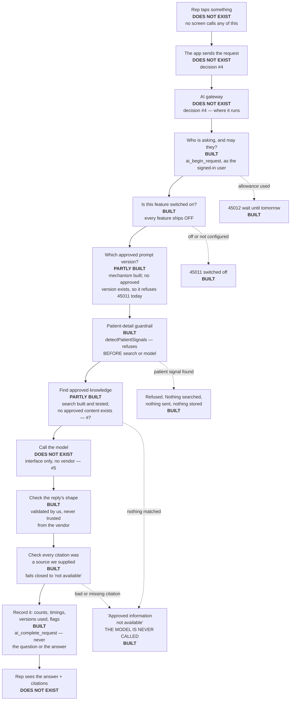
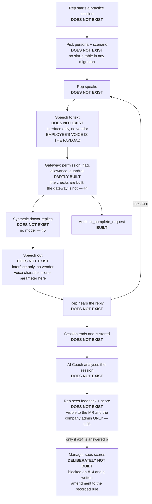

# The AI platform — specification for approval

**28 September 2026.** Written for a reader who is not an engineer.

This document describes **six AI capabilities** we propose to build, what each one does, what
information goes into it, what comes back, what leaves the country, and what each one is waiting
on. It is written to be **approved, amended or refused** — not to be admired.

**Two rules govern every page.**

1. **Nothing here is described as though it were built unless it is built.** Where a step does
   not exist, it says **does not exist**. Where something is built but has never been used by a
   real screen, it says so.
2. **The measurements in this document can be re-derived.** Where a claim rests on a file, the
   file is named. Where it rests on a decision, the decision is numbered.

---

# WHAT WE ARE ASKING YOU TO APPROVE

*This is page one. If you read nothing else, read this and the page after it.*

## The six things we want to build

| # | Capability | In one sentence | Can we start? |
| --- | --- | --- | --- |
| 1 | **Product Q&A** | An MR asks a question about a product and gets an answer built **only** from company-approved material, with the source shown — or the words "approved information not available" | **No.** Waiting on `#4` and `#5` |
| 2 | **MR Chat** | A general assistant for a rep — how the app works, what a process is, where to find something | **No.** Waiting on `#4` and `#5` |
| 3 | **Learning tutor** | A tutor inside a course that explains a lesson the learner did not follow | **No.** Waiting on `#4` and `#5` |
| 4 | **AI Doctor (practice)** | A rep practises a detailing conversation against a **synthetic doctor**. No real doctor is involved at any point | **No.** Waiting on `#4` and `#5` |
| 5 | **AI Coach (on practice only)** | After a practice session ends, the rep gets feedback on how they did | **No.** Waiting on `#4`, `#5`, and the score question below |
| 6 | **Voice in practice only** | The rep can **speak** to the practice doctor and **hear** it reply | **No.** Waiting on `#4`, `#5`, and a speech vendor |

**The honest summary of that column: none of the six can start today, and not one of them is
waiting on engineering.**

## The decisions that must be answered, ranked by how much each unblocks

| Rank | Decision | What it unblocks | Who answers |
| --- | --- | --- | --- |
| **1** | **`#4` — Where does the AI service run?** Inside the existing Supabase platform, or as a separate service | **All six capabilities.** Nothing AI can run at all without it. *Our recommendation: inside Supabase.* We tested this locally on 24 September; it works and it keeps every permission decision in the database where the rest of the app's security already lives | **Praverse + you**, in a meeting |
| **2** | **`#5` — Which AI provider, and may questions and answers leave India?** | **Every live answer.** Our data residency rule is India (Mumbai). Some providers cannot honour that. For capability 6, note carefully: **an employee's recorded voice is the thing being sent** | **You + Legal** |
| **3** | **Your own admin account.** Not a decision — a task | **The entire approval path.** The rule is that nobody may approve their own content. With one admin account, **every approval is refused.** Capabilities 1, 3 and 5 all depend on approved content existing | **You**, today |
| **4** | **`#7` — The product catalogue** — the products, the brand names, and **who supplies the approved labels and prescribing information** | All real product content. Capability 1 has nothing to answer *from* until this exists | **You** |
| **5** | **`#14` — May a manager see an MR's practice scores?** | The shape of capability 5. We have built the safe answer (**no**) and will not change it without a written amendment | **You + management** |
| 6 | **`#10` — Notifications.** Build them? Which channel? | Anything that needs to tell a rep something — a course is due, a certificate issued | **Praverse + you** |
| 7 | **`#11` — A PDF-reading component**, so approved documents can be uploaded rather than pasted | Document ingestion only. Text can be pasted today | **Praverse** |
| 8 | **`#6` — Vector search** (a database extension) | Search *quality* only. Keyword search works today and is the deliberate fallback. **Not blocking** | **Praverse** |

## The three things we are asking you to confirm, not decide

1. **Recording stays off** (`C20`). The consultation-recording feature stays built and switched
   off. Nothing in this document records a real doctor.
2. **No patient information, anywhere** (`C24`). Confirmed and already enforced in code.
3. **AI-generated training text is never approved automatically** (`C23`). It enters as a draft,
   labelled as machine-written, and only a second human can approve it. **We are asking you to
   confirm you understand that you are the second human** (`C25`).

---

# WHAT 4 OCTOBER CAN AND CANNOT INCLUDE

*The target is 4 October 2026 (`C27`). This page sets each capability against it. It is not
softened, because a target met on paper and not in the app is the exact failure this project
keeps recording about itself.*

**Today is 28 September. That is six days.**

| Capability | Verdict for 4 October |
| --- | --- |
| **Product Q&A** | **Buildable once `#4` and `#5` are answered — and not before.** The logic is already written and tested end to end against a scripted stand-in model. What is missing is the place it runs and the model it calls. Even with both answered on Monday, it also needs **approved product content** (`#7`), which is not an engineering task either |
| **MR Chat** | **Not buildable this week.** Beyond `#4` and `#5`, nothing of this feature exists — no flow, no screen, no prompt |
| **Learning tutor** | **Not buildable this week.** The courses, lessons and progress tracking underneath it are built. The tutor itself does not exist, and it needs `#4` and `#5` |
| **AI Doctor (practice)** | **Not buildable this week.** Nothing exists: no persona storage, no scenario storage, no session, no screen. This is the largest single piece of new building in the whole plan |
| **AI Coach (on practice)** | **Not buildable this week.** It has nothing to analyse until AI Doctor exists |
| **Voice in practice** | **Not buildable this week.** It needs AI Doctor first, plus a speech vendor that has not been chosen, plus a legal answer about an employee's voice leaving India |

## What IS buildable in six days, and what we did this session

**Buildable without any decision:**

- The **draft-labelling rule** — AI-written text can never be born approved. *Built this session.*
- The **console screen** where you review and approve a draft. *Built this session.*
- **Route wiring and contract guards**, so the AI and knowledge endpoints are declared and typed
  for the app team. *Done this session.*
- **Audit rows on the AI and learning tables**, so approvals and changes leave a trail. *Already
  existed.* We checked before building and found 15 of the 16 tables already had them — our own
  inventory, five days old, had recorded a gap that was already closed. The 16th is a derived table
  that should stay unaudited, and the reasoning is in `W1-A-recon.md`.

**What that adds up to, said plainly.** By 4 October the app can have a **working approval
pipeline with no AI in it**. That is genuinely useful — it is the thing that makes AI-generated
content safe later — but it is not an AI feature, and nobody should describe it as one.

## The one sentence a reader should take away

**The MR field app cannot be "functionally complete with AI" by 4 October, and the reason is not
engineering capacity. It is that `#4` and `#5` have been open since 24 September and neither can
be answered by us.**

If both are answered this week, the realistic first AI capability in the app is **Product Q&A**,
and it still needs approved product content to answer from.

---

# SCOPE

## In scope (after `C21`, `C22`, `C23`)

`product_qa` · `mr_chat` · `lms_tutor` · `ai_doctor` (simulation) · `ai_coach` (on simulations
only) · **voice for practice only** — speech in and speech out **inside a simulation**, never in a
real consultation.

## Out of scope, one line each

- **`transcript_analysis`** — analysing a recording of a real consultation. **Out:** there are no
  real recordings in this release (`C20`), so there is nothing to analyse. Flag stays off.
- **`pv_screening`** — scanning a real conversation for safety signals. **Out:** same reason, and
  it additionally needs the named PV/DPDP signatory (`#18`, deferred by `C28`). Flag stays off.
- **`complaint_screening`** — scanning a real conversation for product complaints. **Out:** same
  reason as `pv_screening`. Flag stays off.
- **`patient_education`** — a patient-facing assistant. **Out permanently, from this repository:**
  `C24` keeps all patient-facing AI in the separate clinical system. It is deliberately absent
  from the feature list in code (`packages/core/src/field/ai.ts:24`).

---

# 1. PRODUCT Q&A (`product_qa`)

## A1. What it does

A rep types a question about a product — "what is the dosing interval", "what does the label say
about renal impairment". The system searches **only** material the company has formally approved
for that rep's market, and shows an answer built from it with the source document and section
named underneath. **If nothing approved matches, it says so and stops** — it does not guess, and
it does not fall back to the model's own knowledge.

## A2. The flow, step by step

| # | What happens | The real function | Built? |
| --- | --- | --- | --- |
| 1 | Rep types a question on a screen | — | **Does not exist.** No screen in either app calls any of this |
| 2 | The app sends it to the AI gateway | — | **Does not exist** (`#4`) |
| 3 | The database is asked whether this feature may run at all — for this company, this user, today | `ai_begin_request` | **Built.** Tested by `ai-control-plane.spec.ts` |
| 4 | The question is checked for patient details **before it leaves the building** | `detectPatientSignals` | **Built** (`gateway/guardrails.ts:59`) |
| 5 | Approved knowledge is searched, limited to the rep's company, market and product | `search_approved_knowledge` | **Built.** Tested by `knowledge.spec.ts` |
| 6 | **If nothing matched, the model is never called** | `answerProductQuestion` step 4 | **Built** (`gateway/product-qa.ts:170`) |
| 7 | The model is given **only** the approved passages and told to answer from them alone | `generateStructured` | **Built as logic; the model itself does not exist** (`#5`) |
| 8 | The model's reply is checked: is it valid, does it cite passages it was actually given | `answerProductQuestion` step 6 | **Built** (`product-qa.ts:202-233`) |
| 9 | What happened is recorded — counts, timings, which approved versions were used. **Never the question or the answer** | `ai_complete_request` | **Built** |
| 10 | The rep sees the answer with its citations | — | **Does not exist** |

**Read that column honestly: the middle is built and both ends are missing.** The whole decision
chain exists and has never been reached from a screen.

## A3. What goes in

| Field | Where it comes from |
| --- | --- |
| The question text | Typed by the rep |
| Who is asking | The rep's signed-in session — the database reads it, the app cannot claim it |
| Which company | The rep's profile, read by the database |
| Which market | The screen, chosen from the company's markets |
| Which product | The screen, optional |
| The approved passages | The company's approved knowledge library |

**Can an input contain a doctor's name?** Yes — a rep could type one. Nothing prevents free text
from naming a doctor.

**Can an input contain an employee's voice?** No. This capability is text only.

**Patient data: refused, by name.** `C24` forbids patient information anywhere in this app. The
guardrail that enforces it is **`detectPatientSignals`**
(`packages/core/src/field/gateway/guardrails.ts:59`). It runs at **step 4 — before the search and
before any model call** — and looks for Indian phone numbers, dates of birth, patient-identifier
shapes and requests for advice about a specific person. When it fires, the request is closed as
**blocked**, the rep is shown a fixed sentence, and **no text is stored and nothing is sent
anywhere**.

**What that guardrail is not.** Its own source calls it *"deliberately conservative and
deliberately crude… they are not a guarantee, and nothing here claims to be."* It catches obvious
patterns. It is a safety net, not a wall, and it should not be described to anyone as a wall.

## A4. What comes back

Exactly one of four outcomes:

| Outcome | What the rep sees |
| --- | --- |
| **Answered** | The answer, **and every citation** — document, version, section. Never the answer without them |
| **Not available** | *"Approved information not available"* — shown word for word, with no substitute |
| **Patient-specific refusal** | A fixed sentence directing them to the Medical/Scientific team. **It does not repeat what they typed** |
| **Failed** | *"The assistant could not answer just now. Please try again, or refer the question to the Medical/Scientific team."* A retry is safe |

**Two refusals happen before anything else.** *"This AI feature is switched off"* (`45011`) and
*"you have used today's allowance"* (`45012`).

**Note what "not available" covers.** A model reply that fails validation, cites a passage it was
not given, or returns nothing, is **discarded and reported as not-available**. The worst outcome
of a bad model reply is an unhelpful answer — never an unsupported claim.

## A5. Which external model or API

**Undecided.** No vendor has been chosen and **no vendor is named anywhere in this system**. The
code is written against a neutral interface (`LlmProvider`, `providers.ts:43`) with **no adapter
behind it, on purpose** — writing one would be choosing a vendor.

The choice depends on: **`#5`** (which provider, and may data leave India), the residency rule
(Mumbai), and the approved budget (about $10–40/month, which fits text but **not** a voice
product).

## A6. What leaves India

**Today: nothing.** No model is called.

**Once `#5` is answered**, each request would send: the rep's question, the approved passages
found, and the company's approved prompt. It would **not** send the rep's identity, the company
name, or anything from the visit, consent or doctor records.

**Whether that leaves India is `#5` and nothing else.** Our residency rule is `ap-south-1`
(Mumbai). A provider outside India means approved company material and a rep's typed question
leave the country.

## A7. Future possibilities — not proposed now

Meaning-based search instead of keyword (`#6`); suggested follow-up questions; a *"was this
useful"* signal to find gaps in the approved library.

## A8. Blocked by

**`#4`** (where it runs) · **`#5`** (which model) · **`#7`** (nothing approved to answer from).

---

# 2. MR CHAT (`mr_chat`)

## A1. What it does

A general assistant for a rep inside the app: how a process works, where to find a screen, what a
policy says. **It is not a product-information tool** — a product question must go through Product
Q&A, which is constrained to approved material.

## A2. The flow

**Steps 1, 2, 7 and 10 of the Product Q&A table apply identically and are equally missing.** Of
the rest:

| Step | Function | Built? |
| --- | --- | --- |
| Permission, flag, allowance | `ai_begin_request` | **Built** — the feature id `mr_chat` already exists (`ai.ts:26`) |
| Patient-detail guardrail | `detectPatientSignals` | **Built**, and reusable as-is |
| The chat flow itself | — | **Does not exist.** There is no `mr_chat` equivalent of `answerProductQuestion` |
| Recording what happened | `ai_complete_request` | **Built** |

## A3. What goes in

The rep's typed message, their session, their company. **A doctor's name: possible** — it is free
text. **An employee's voice: no.**

**Patient data: refused by `detectPatientSignals`**, exactly as in Product Q&A, and this is the
capability where it matters most — a general chat box is the one an MR is most likely to type a
real situation into. The master prompt's own §10 warns that the MR chatbot *"must not become a
clinical decision-support system"*, and this guardrail is that warning's only enforcement.

## A4. What comes back

A text reply, or one of: switched off (`45011`), allowance used (`45012`), patient-specific
refusal, or a failure message. **Shape not yet designed** — it does not exist.

## A5. Which model — **undecided**, depends on `#5`.

## A6. What leaves India — the rep's typed message and the company's approved prompt. `#5` decides.

**This is the capability with the widest input.** Product Q&A sends a product question. MR Chat
sends whatever a rep types.

## A7. Future possibilities

Answering from the rep's own data ("what is my sample balance"), which would send company
operational data to a vendor and is deliberately **not** proposed now.

## A8. Blocked by

**`#4`** · **`#5`**. Plus: **it does not exist and has not been designed.**

---

# 3. LEARNING TUTOR (`lms_tutor`)

## A1. What it does

Inside a course, a learner who did not follow a lesson asks about it and gets an explanation
grounded in **that lesson's approved text**. It explains what is there; it does not add new claims.

## A2. The flow

| Step | Function | Built? |
| --- | --- | --- |
| Courses, versions, modules, lessons | tables from AI-B2 | **Built.** Tested by `lms-core.spec.ts` |
| A learner starts and progresses | `start_course_version`, `complete_lesson` | **Built** |
| The rep asks the tutor a question | — | **Does not exist** |
| Permission, flag, allowance | `ai_begin_request` | **Built** — `lms_tutor` exists as a feature id |
| Retrieving the lesson text as the source | — | **Does not exist.** `search_approved_knowledge` searches the knowledge library, not lesson bodies |
| The model | — | **Does not exist** (`#5`) |
| Recording | `ai_complete_request` | **Built** |

**The learning platform underneath the tutor is real and tested. The tutor is not.**

## A3. What goes in

The learner's question, the lesson they are on, the lesson's text, their session.
**Doctor's name: possible** (free text). **Employee's voice: no.**
**Patient data: refused** — the same guardrail applies and must be wired in when this is built.

## A4. What comes back

An explanation grounded in the lesson, or the standard refusals. **Shape not yet designed.**

## A5. Which model — **undecided**, `#5`.

## A6. What leaves India — the learner's question and the lesson text. `#5` decides.

**One thing to notice.** Under `C23` a lesson's text may itself have been **drafted by AI and then
approved by you**. That is allowed. What is *not* allowed is that draft reaching a learner without
your approval — see the hard rule below.

## A7. Future possibilities

Practice questions generated from a lesson; a *"explain this more simply"* control.

## A8. Blocked by

**`#4`** · **`#5`**. Plus: the tutor flow does not exist.

---

# 4. AI DOCTOR — PRACTICE SIMULATION (`ai_doctor`)

**This is the largest new build in the plan, and almost none of it exists.**

## A1. What it does

A rep chooses a practice scenario — a doctor persona, a specialty, an attitude, an objection to
handle — and has a detailing conversation with a **synthetic doctor**. No real doctor is involved
at any point. The rep can practise as often as they like. When they stop, the session ends and
(separately) AI Coach gives feedback.

## A2. The flow

| Step | Function | Built? |
| --- | --- | --- |
| Rep opens a practice screen and picks a scenario | — | **Does not exist** |
| Personas and scenarios, editable by an admin without a code release | — | **Does not exist.** No `sim_*` table exists in any migration — verified by search |
| A session is started and recorded | — | **Does not exist** |
| Permission, flag, allowance | `ai_begin_request` | **Built** — `ai_doctor` exists as a feature id (`ai.ts:30`) |
| The rep speaks or types | — | **Does not exist** |
| Speech in | `TranscriptionProvider` | **Interface only** (`providers.ts:53`). No vendor, no adapter |
| The synthetic doctor replies | — | **Does not exist** (`#4`, `#5`) |
| Speech out | `SpeechSynthesisProvider` | **Interface only** (`providers.ts:61`) |
| The session ends and is stored | — | **Does not exist** |
| Recording what happened | `ai_complete_request` | **Built** |

**Everything except the permission check and the audit record does not exist.**

## A3. What goes in

The chosen persona and scenario, what the rep says or types, the conversation so far, their
session and company.

**Can an input contain a doctor's name?** **It should not, and this is worth being precise
about.** The persona is synthetic and must be authored as synthetic — a scenario named after a
real doctor would put a real person's name into a practice corpus. That is an authoring rule for
whoever writes the scenarios, and it is the operator's to enforce, not something code can check.

**Can an input contain an employee's voice?** **Yes — this is the one that does.** If voice
practice is built, **the rep's recorded voice is the payload sent to a speech vendor.** See A6.

**Patient data: refused.** `C24` applies. The same guardrail must run on the rep's turns. **It
does not run today because none of this exists** — this is a requirement on the build, not a
description of one.

## A4. What comes back

The synthetic doctor's reply, as text and (if voice is built) as audio. Refusals: switched off
(`45011`), allowance used (`45012`), or a failure message. **Shape not yet designed.**

## A5. Which external model or API

**Undecided, and this capability needs up to three separate vendors:** a language model (`#5`),
a speech-to-text vendor, and a text-to-speech vendor. **None is chosen and none is named.**

**A note on the speech vendor.** `#19` in the register is the speech vendor for **real visits**,
and `C28` defers it. **A speech vendor for practice is a different question with a different
answer**, because the payload is an employee's voice rather than a doctor's — a much lighter
consent problem, but not a zero one.

**A note on cost, because it changes the budget conversation.** The approved AI budget is about
$10–40 a month. That figure was set for text. **A live voice conversation costs substantially more
than text per minute, across all three vendors at once.** We are not putting a number on it,
because we have not chosen vendors and an invented figure is worse than none — but the existing
budget should not be assumed to cover this.

## A6. What leaves India

**Text practice:** the scenario, the conversation, the approved prompt.

**Voice practice: the employee's recorded voice is the payload.** Said plainly, because it is the
single most consequential sentence in this document: **if voice practice uses an overseas vendor,
recordings of your employees' voices leave India.** A voice recording is personal data about an
identifiable person under DPDP. This needs an explicit answer under `#5`, and it needs the
employee to be told — this is the same class of question as `#20` (consent from employees whose
voices join the speech-vendor bake-off corpus), which is deferred but **not answered**.

## A7. Future possibilities — not proposed now

Scenarios generated from real objections; a difficulty that adapts to the rep; letting a manager
assign a specific scenario (**note: that last one touches `#14`** — assignment is not a score, but
it is a manager seeing a rep's practice activity).

## A8. Blocked by

**`#4`** · **`#5`** · a speech vendor for practice (not `#19`, which is the real-visit vendor) ·
an employee-voice answer under `#5`. Plus: **it does not exist**, and it is the biggest build here.

---

# 5. AI COACH — ON SIMULATIONS ONLY (`ai_coach`)

## A1. What it does

After a **practice** session ends, the rep gets feedback: what they covered, what they missed, how
they handled the objection, how clearly they communicated. **It never analyses a real doctor
visit** — that is coaching on real visits, which `C4` puts out of v1 and `C20` makes impossible
anyway.

## A2. The flow

| Step | Function | Built? |
| --- | --- | --- |
| A practice session exists to analyse | — | **Does not exist** (capability 4) |
| Permission, flag, allowance | `ai_begin_request` | **Built** — `ai_coach` exists as a feature id (`ai.ts:31`) |
| The session is sent for analysis | — | **Does not exist** |
| Feedback is produced and stored | — | **Does not exist** |
| The rep sees their feedback | — | **Does not exist** |
| A manager sees it | — | **Deliberately not built.** See below |

## A3. What goes in

The practice conversation, the scenario's objectives, the rep's session.
**Doctor's name: should not** — same authoring rule as capability 4.
**Employee's voice: only if voice practice is built**, and then the transcript rather than the
audio would normally be what is analysed.
**Patient data: refused**, same guardrail, same caveat that it does not run today.

## A4. What comes back

Written feedback, and a **score** — under the strict limits below. Plus the standard refusals.
**Shape not yet designed.**

## A5. Which model — **undecided**, `#5`.

## A6. What leaves India — the practice conversation and the approved prompt. `#5` decides.

## The scores rule, which is the part to read twice

**`C26`, built to the safe default.** A score may exist on a **practice simulation** and on an
**LMS assessment**. It is visible to **the MR themselves** and to the **company admin**.

**It is NOT visible on any manager surface. There are no team averages and no rankings.**

**Why, and it is not caution for its own sake.** The recorded rule is *"never add a ranking,
score, rank, percentile or grade to `analyses` or the manager surface"*, and there are tests that
fail the build if those column names appear. The rule exists because scoring an employee and
showing it to their manager **is employee monitoring**, which carries a different legal basis and
a different conversation with staff.

**The question we are putting to you (`#14`):** *may a manager see an MR's practice scores?*

- **(a) No — MR and admin only.** The rule stands. Nothing to amend. **This is what is built.**
- **(b) Yes.** The recorded rule must be **formally amended in writing**, and it becomes employee
  monitoring, with an HR and legal question attached.

**We did not build a manager-facing score surface this session, and will not under either answer
until the amendment exists.**

## A8. Blocked by

**`#4`** · **`#5`** · **capability 4 must exist first** · **`#14`** for the manager half.

---

# 6. VOICE — PRACTICE ONLY

## A1. What it does

Inside a practice simulation, the rep **speaks** instead of typing and **hears** the synthetic
doctor reply. **Only inside a simulation. Never in a real consultation** (`C20`).

## A2. The flow

Rep speaks → audio captured on the phone → sent to a speech-to-text vendor → text goes into the
AI Doctor flow → the reply text is sent to a text-to-speech vendor → audio plays back.

| Step | Function | Built? |
| --- | --- | --- |
| Capturing audio on the phone | the existing recording code | **Built, and switched off** (`C20`). It was built for real consultations and is guarded accordingly — see the warning below |
| Speech to text | `TranscriptionProvider` | **Interface only** (`providers.ts:53`) |
| Speech to speech reply | `SpeechSynthesisProvider` | **Interface only** (`providers.ts:61`) |
| Everything between | — | **Does not exist** |

**A warning about reusing the recording code.** The existing capture path is wired to the
consultation-recording feature, which is deliberately behind **two independent switches** and
throws an error if enabled against anything but a local server. Practice audio is a **different
purpose** with a different legal basis and a different retention rule. It must not be made to work
by loosening that guard — that would switch consultation recording back on as a side effect.

## A3. What goes in

**The employee's recorded voice.** That is the payload, stated plainly.

**A doctor's name: no** — there is no doctor. **Patient data: refused** — but note that a
guardrail on typed text does not read audio; the check would run on the **transcript**, after the
audio has already been sent to a vendor. That ordering is a real limitation and should be
understood before approving.

## A4. What comes back

The synthetic doctor's spoken reply. Refusals fall back to text.

## A5. Which external model or API

**Undecided. Two vendors, neither chosen, neither named.** Whichever is chosen must accept
**no-training and deletion terms** — the same requirement `#19` carries for the real-visit vendor.

**On "voice modulation".** If that means changing the *character* of the synthetic doctor's
voice — older, female, brusque, a different accent — **that is a parameter on the text-to-speech
vendor, not a separate capability.** It is one field in a request. It is worth saying because it
is easy to present as a distinct feature and it is not one.

## A6. What leaves India

**The employee's recorded voice leaves the device and goes to a speech vendor. If that vendor is
outside India, an employee's voice leaves the country.**

This is the sharpest residency question in the document and it needs an explicit answer under
`#5`, plus an employee-facing notice. It is the same class of question as `#20`, which is deferred
and unanswered.

## A7. Future possibilities

Pronunciation feedback; pace and filler-word analysis. Both would need `#14` answered first —
they are measurements of an employee.

## A8. Blocked by

**`#4`** · **`#5`** · **capability 4 must exist first** · a speech vendor pair · an employee-voice
residency and notice answer · **cost**, which the current budget was not sized for.

---

# DIAGRAM ONE — how any AI request is supposed to work

Every box is marked **BUILT**, **PARTLY BUILT** or **DOES NOT EXIST**.

**How to read that diagram.** The **middle is built** — every permission, flag, guardrail,
validation and audit step. The **two ends are missing** — the screen a rep taps and the model that
answers. And two built boxes are **inert**: the prompt check refuses today because no approved
prompt exists, and the search finds nothing because no approved content exists.

**Evidence for each BUILT box.** `ai_begin_request` / `ai_complete_request` —
`20260924000700_ai_control_plane.sql`, exercised by `ai-control-plane.spec.ts`. Feature flags and
allowance — same migration; the allowance **refuses when unset**, an unlimited default is never
granted. Guardrail — `gateway/guardrails.ts:59`, exercised by `product-qa.test.ts`. Reply and
citation checks — `gateway/product-qa.ts:202-233`. Audit — `product-qa.test.ts:147` asserts *"the
log never receives the question"*.

---

# DIAGRAM TWO — the AI Doctor practice loop

**Every box in this loop says DOES NOT EXIST except the audit record and the permission checks
inside a gateway that itself does not exist.** That is the accurate picture of AI Doctor on 28
September 2026.

**On voice modulation**, marked on the speech-out box: changing the synthetic voice's character is
**a parameter on the text-to-speech vendor's request**. It is not a separate capability and should
not be planned as one.

---

# THE HARD RULE — AI-generated text is never born approved

**This is `C23`, and it is the one place this release could go badly wrong.**

`C23` permits AI-generated text to be used extensively in the learning platform. That is a
reasonable decision and it is also the decision most capable of putting unreviewed machine-written
claims in front of a rep who will repeat them to a doctor.

**The rule, in four parts:**

1. AI-generated text enters as a **draft** version. Never as approved.
2. It is **labelled** with the fact that a model produced it, and which model.
3. It becomes approved **only** through the existing four-eyes path — a named admin who is
   **neither the author nor the submitter** approves it and signs a written attestation.
4. **No seed, script or migration may insert approved knowledge.** This is enforced in the
   database, not by convention.

## Where the line sits between training text and a product claim

| A model may draft | A model may **never** be the source of |
| --- | --- |
| How to explain a concept | What a product is indicated for |
| How to handle an objection | Dosing, contraindications, interactions |
| Communication and questioning technique | Anything from a label or prescribing information |
| Process and policy explanations | Any comparative or efficacy claim |

**The right-hand column is regulated promotional content and must come from the client (`#7`).**
A model drafting it is not a shortcut with extra review — it is fabricating regulated material and
then asking a human to rubber-stamp it.

**How the screen enforces this.** The review screen shows **which market and which product** a
draft claims to be about. A draft that names a product is a draft that has walked toward the
right-hand column, and the reviewer sees that before approving rather than after.

## The account problem you must solve before any of this works

**Four eyes means two people.** The operator is the approver (`C25`). The author is whoever — or
whatever — drafted. **They cannot be the same account.**

| Account | Held by | Does |
| --- | --- | --- |
| **Drafting admin** | Whoever writes or generates content | Creates drafts, submits them for review. **Cannot approve** |
| **Approving admin** | **The operator, personally** | Reviews, signs the attestation, approves or rejects. **Should not draft** |

**With one admin account, every approval is refused `42501`, and the entire content pipeline is
dead.** This is not an engineering task and we cannot do it for you.

---

# APPENDIX — what "built" has meant in this project

**A word of caution about every BUILT marking in this document.**

This project uses a status vocabulary in which *nothing is done because an endpoint, a migration
or a test exists*. By that standard, **the AI platform's own build labelled itself UNVERIFIED**,
and the measurement behind that is blunt: of the eight pieces built so far, **zero have ever been
called by either app.** Every one is reached only by its own tests.

So **BUILT in this document means: the code exists, it is tested, and no screen has ever used
it.** That is a real and useful state — it is why Product Q&A could be live within days of `#4`
and `#5` being answered — but it is not the same as working in the app, and this document will not
pretend otherwise.

The full measurement is in `docs/ai-platform/INVENTORY.md`.
