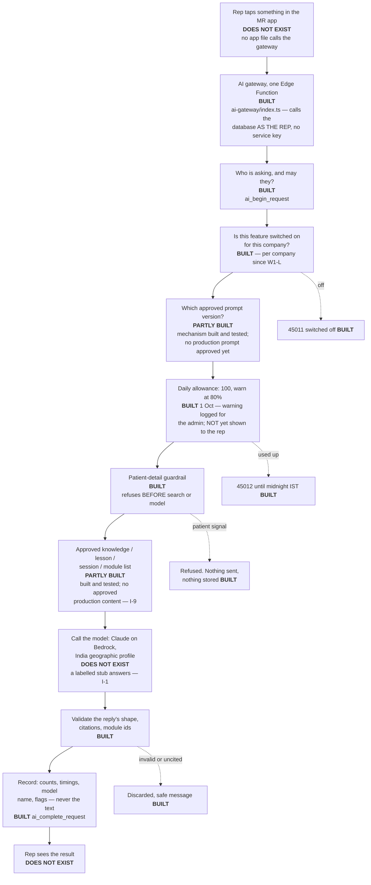
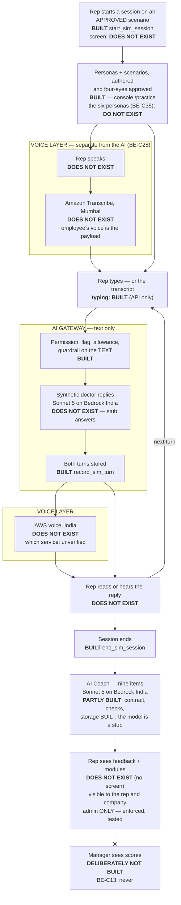

# The AI platform — specification for approval

**Updated 1 October 2026 (W1-M). First written 28 September.** Written for a reader who is not an
engineer.

**You asked for a flow and diagram to approve before major AI work (`BE-C40`). This is it.** It
describes six AI capabilities, what each does, what goes in, what comes back, what leaves the
country, and what each is still waiting on.

**Two rules govern every page.**

1. **Nothing here is described as though it were built unless it is built.** Every box in both
   diagrams is marked **BUILT**, **PARTLY BUILT** or **DOES NOT EXIST**, and every BUILT box names the
   file or test that proves it.
2. **"BUILT" never means "a rep can use it".** As of today **no screen in the MR app calls any AI
   feature** (checked: no file under `apps/` sends a request to `ai-gateway`). See the appendix.

**What changed since 28 September, in one paragraph.** You chose the provider (**Claude on AWS
Bedrock, India geographic inference profile** — `BE-C26`), the model split (**Sonnet 5 / Haiku 4.5**
— `BE-C27`), and made **voice a separate layer** (**Amazon Transcribe in Mumbai** plus an AWS voice —
`BE-C28`). Meanwhile engineering built the gateway and every flow behind it, **all answering from a
labelled stub**, because no AWS account has been provided to call a real model with. The coach
analysis now covers **your nine items** (`BE-C34`).

---

# WHAT REMAINS FOR YOU TO APPROVE OR SUPPLY

*Page one. The decisions the 28 September version asked for are answered; this is what is left.*

## The six capabilities, today

| # | Capability | Logic built and tested? | Real model? | A screen a rep can use? |
| --- | --- | --- | --- | --- |
| 1 | **Product Q&A** (`product_qa`) | **Yes** | **No — stub** | **No** |
| 2 | **MR Chat** (`mr_chat`) | **Yes** | **No — stub** | **No** |
| 3 | **Learning tutor** (`lms_tutor`) | **Yes** | **No — stub** | **No** |
| 4 | **AI Doctor, practice** (`ai_doctor`) | **Yes**, text only. Personas and scenarios are authored and approved in the console | **No — stub** | **No** (console authoring only) |
| 5 | **AI Coach, practice only** (`ai_coach`) | **Yes**, all nine items | **No — stub**, scores are all zero on purpose | **No** |
| 6 | **Voice, practice only** | **No.** Two empty interfaces | — | **No** |

## What only you can unblock

| What | Unblocks | Where it is tracked |
| --- | --- | --- |
| **An AWS account with Bedrock access to Sonnet 5 and Haiku 4.5 through the India geographic inference profile** | **Capabilities 1–5 answering for real.** Engineering stopped rather than build an adapter it could not test | `docs/operator-inputs.md` **I-1** |
| **Approved product content, and who signs it off** | Capability 1 has nothing to answer from; capability 3 has no product lessons | **I-9** |
| **The second admin, provisioned** | Every approval — prompts, personas, knowledge, lessons | **I-10** |
| ~~Approval of THIS document~~ | **APPROVED 1 October (`BE-C41`, operator A-1)** — "do not hold AI implementation further" | — |

## What we are asking you to confirm, not decide

1. **Recording of real doctors stays off** (`C21`, `BE-C17`). Nothing here records a real doctor.
2. **No patient information reaches AI Doctor or coaching** (`BE-C36`). Enforced by the guardrail
   before any model call, which is a safety net and not a wall — see §1 A3.
3. **AI-written training text is never approved automatically** (`C24`, `BE-C37`), and **a model is
   never the source of a product claim.**

---

# PROVIDER, MODELS AND REGION — decided, not built

## The decision (`BE-C26`, `BE-C27`)

| | |
| --- | --- |
| **Provider** | **Claude through AWS Bedrock**, using the **India geographic inference profile**, so processing stays in India |
| **Reasoning-heavy work** | **Claude Sonnet 5** — AI Doctor, AI Coach, Product Q&A |
| **Light work** | **Claude Haiku 4.5** — classification, routing, short summaries |
| **Gemini** | Not used. May be added later **only with written confirmation from Google, including voice.** The earlier Gemini choice (`BE-C6`) is **superseded, not satisfied** — its residency check was never passed. The evidence is kept in `GEMINI-RESIDENCY.md` |

## Which feature gets which model — proposed where you did not say

| Feature | Model | Source |
| --- | --- | --- |
| `ai_doctor` | Sonnet 5 | **Your decision** |
| `ai_coach` | Sonnet 5 | **Your decision** |
| `product_qa` | Sonnet 5 | **Your decision** ("reasoning-heavy product Q&A") |
| `mr_chat` | **Haiku 4.5** | **Confirmed by the operator (`BE-C41`).** Its first job is deciding whether a question is in scope, which is classification |
| `lms_tutor` | **Haiku 4.5** | **Confirmed by the operator (`BE-C41`).** It explains one lesson's text and nothing else — short, grounded work |

**The last two rows were engineering proposals and are now confirmed — "lighter model for chat and learning" (`BE-C41`).**

## Where routing will live (PROPOSED), and how anyone will be able to tell which model answered

* **Where — proposed, not built:** in the approved prompt version for each feature (`ai_prompt_versions.model_config`),
  which is already per feature, per company, four-eyes approved, and read by `ai_begin_request` on
  every request. Changing a feature's model is then an approval, not a code release. **Not yet
  built:** the provider does not yet read a model from it, because there is no provider.
* **How to tell:** every request already records `model_provider` and `model_name` on its
  `ai_requests` row, **taken from the provider's own reply, never from configuration** — so a routing
  mistake shows up in the record instead of being hidden by it. The coach analysis carries the same
  two fields. Proved for the coach flow against a scripted model
  (`packages/core/src/field/gateway/sim-doctor.test.ts`, "the model that answered is what is
  recorded"); **not yet proved against Bedrock.**

## The region is an assertion, not a setting

The adapter, when built, **refuses to start for any region or inference profile that is not the India
one.** A provider that reads its region from configuration and would quietly accept another is not
what you decided.

---

# VOICE — a separate layer (`BE-C28`)

**Voice is no longer "the AI model, but with audio".** Speech is turned into text **before** the AI
gateway and text is turned into speech **after** it:

* **Speech to text: Amazon Transcribe, Mumbai (`ap-south-1`).**
* **Speech out: an India-compatible AWS voice.** Which service and which voice is a provisioning
  question we have not verified.
* **The consequence that matters:** the patient guardrail, the approved prompt and the audit record
  apply to the **transcript** exactly as they apply to typed text, because the gateway only ever sees
  text. **The limitation that remains:** the guardrail reads the transcript, so the **audio has
  already reached Transcribe** before any check runs. Transcribe is in India, which is what makes
  that ordering acceptable — it should still be understood before approving.
* **AI Doctor voice stays simulation only.** No real doctor's voice, ever.

**Status: DOES NOT EXIST.** Two empty interfaces (`TranscriptionProvider`, `SpeechSynthesisProvider`,
`packages/core/src/field/gateway/providers.ts:53` and `:61`). Nothing calls a speech service.

---

# SCOPE

## In scope (after `C22`, `C23`, `C24`)

`product_qa` · `mr_chat` · `lms_tutor` · `ai_doctor` (simulation) · `ai_coach` (on simulations
only) · **voice for practice only** — speech in and speech out **inside a simulation**, never in a
real consultation.

## Out of scope, one line each

- **`transcript_analysis`** — analysing a recording of a real consultation. **Out:** there are no
  real recordings in this release (`C21`), so there is nothing to analyse. Flag stays off.
- **`pv_screening`** — scanning a real conversation for safety signals. **Out:** same reason, and
  it additionally needs the named PV/DPDP signatory (`#18`, deferred by `C29`). Flag stays off.
- **`complaint_screening`** — scanning a real conversation for product complaints. **Out:** same
  reason as `pv_screening`. Flag stays off.
- **`patient_education`** — a patient-facing assistant. **Out permanently, from this repository:**
  `C25` keeps all patient-facing AI in the separate clinical system. It is deliberately absent
  from the feature list in code (`packages/core/src/field/ai.ts:24`).

---

# THE FIVE TEXT CAPABILITIES — one table each

**Common to all five, so it is said once.** Every request goes through **one** AI gateway
(`services/api/supabase/functions/ai-gateway/index.ts`), which calls the database **as the signed-in
rep** — never with a service key — so the database makes every permission decision. In order:
switched on for this company? (`45011` if not) → an approved prompt? → today's allowance? (`45012`
when used up; **a warning at 80%** from 1 October, `BE-C30`) → **the patient-detail guardrail,
before anything leaves the building** → the model → **we validate the reply; the vendor is never
trusted** → a record of counts, timings, model and flags, **never the question or the answer**.

**"Real model?" is NO for all five.** The gateway answers from a stub that labels itself as a stub in
the text a human reads, and refuses to run anywhere but a local machine. The swap to Bedrock is one
line in the gateway (`index.ts`, `createStubProvider`) — and it is waiting on **I-1**, not on code.

| # | Capability | What it does | What goes in | What comes back | Evidence it is built |
| --- | --- | --- | --- | --- | --- |
| **1** | **Product Q&A** | Answers a product question **only** from company-approved material, with the source shown — or says *"approved information not available"* and stops | The question; the rep's company and market (read by the database, not claimed by the app); the approved passages found | An answer **with every citation**, or "not available", or the patient refusal, or a failure message | `gateway/product-qa.ts`; `product-qa.test.ts`; over HTTP in `services/api/tests/ai-product-qa.spec.ts` and `ai-gateway.spec.ts` |
| **2** | **MR Chat** | A general assistant. **A product question is redirected to Product Q&A**, decided from the company's own product names | The rep's message and recent history | A reply, or the redirect, or the standard refusals | `gateway/mr-chat.ts`; `mr-chat.test.ts`; `services/api/tests/mr-chat.spec.ts`; scope terms from `20260930000100_mr_chat_scope_terms.sql` |
| **3** | **Learning tutor** | Explains **one** lesson the learner is enrolled in, from that lesson's published text and nothing else | The question; the lesson's text, fetched by the database only if the learner is enrolled and the version is published | An explanation, or a referral to a person when the lesson does not cover it | `gateway/lms-tutor.ts`; `lms-tutor.test.ts`; `services/api/tests/lms-tutor.spec.ts`; `20260930000200_lms_tutor_lesson_context.sql` |
| **4** | **AI Doctor, practice** | The rep practises against a **synthetic** doctor persona on an approved scenario. **No real doctor, no recording, no patient data** — asserted against the database catalogue, not by reading | The persona brief, the scenario's objection, the conversation so far, the rep's turn | The synthetic doctor's reply; each turn stored in the rep's own practice history | `gateway/sim-doctor.ts` (`takeDoctorTurn`); `20260929000100_simulation_core.sql`, `…0200_simulation_rpcs.sql`; `services/api/tests/sim-gateway.spec.ts` (start → turn → end → analysis over HTTP; cross-company refusals; B6 no-patient assertions) |
| **5** | **AI Coach, practice only** | After a session ends, feedback on **your nine items** — see the next section | The ended session's turns, its objective and objection, **and the list of learning modules the rep could open today** | Seven scores, strengths and areas for improvement (each citing a turn), up to three suggested modules, a summary | `gateway/sim-doctor.ts` (`analyseSimSession`); `20261001000100_coach_nine_dimensions.sql`; `sim-doctor.test.ts`; `sim-gateway.spec.ts` "W1-M C" |

**What leaves India once I-1 is provided: nothing**, if the India geographic inference profile does
what its name says — the question, the passages or conversation, and the approved prompt go to
Bedrock **in India**. Never the rep's identity, the company name, or any visit, consent or doctor
record. **Not yet verified against AWS's own documentation by engineering; I-1 asks for it to be
confirmed in the console.**

**What can still leave a rep's hands in an unexpected way: free text.** A rep can type a doctor's
name into any of the five. The guardrail refuses patient details by pattern (`gateway/guardrails.ts`)
and its own source calls itself *"deliberately conservative and deliberately crude"*. **It is a
safety net, not a wall.**

---

# THE COACH'S NINE ITEMS (`BE-C34`) — built 1 October

| Your item | What it is in the analysis | Its shape | What refuses a bad one |
| --- | --- | --- | --- |
| Product knowledge | `product_knowledge` | score 0–100 | the database, if missing or out of range |
| **Scientific accuracy** | **`scientific_accuracy`** — new | score 0–100 | same |
| Communication | `communication` | score 0–100 | same |
| Opening / pitch quality | `opening` | score 0–100 | same. **One item in your list, one score** — not split in two |
| Objection handling | `objection_handling` | score 0–100 | same |
| **Relevance of response** | **`response_relevance`** — new | score 0–100 | same |
| Closing / follow-up | `closing` | score 0–100 | same |
| Areas for improvement | `improvements` | **a list, at least one**; each names one of the seven, a title, the detail, **and the turn it is about** | the database refuses a finding citing a turn that is not in the session |
| **Suggested learning modules** | **`suggestedModules`** — new | **a list of 0 to 3**; each names a module, which of the seven it addresses, and why | **the database refuses any module that is not in a PUBLISHED version of an ACTIVE course in the rep's OWN company** — so never a draft, a retired course, a deactivated course, another company's course, or one that does not exist. Also refused: more than three, the same module twice, no reason given |

**Why a suggestion is checked so hard.** A suggestion that points at a course the rep cannot open is
worse than none — it sends them to a dead end with the system's authority behind it. The model is
**shown only** the modules the rep could open, and the gateway **refuses** an answer that names
anything else before the database is asked to store it.

**Why an empty list is allowed.** When nothing published fits, "none" is the honest answer. Requiring
one would make a model suggest something irrelevant whenever the catalogue is thin.

**Who sees it — unchanged, and proved for the new fields** (`C27`, `BE-C13`, `BE-C34`): **the rep and
their company admin. Never a manager. No averages, no ranking.** The new fields live on the same row
as the old ones, so they inherit the same rule rather than needing a new one; a test reads them as
the rep (sees it), the company admin (sees it), the rep's manager (sees nothing) and another company's
admin (sees nothing). Nothing else in the database reads that table — checked against the catalogue,
not by memory.

---

# DIAGRAM ONE — how any AI request works, 1 October 2026

Every box is marked **BUILT**, **PARTLY BUILT** or **DOES NOT EXIST**.

**How to read it.** **Everything between the rep and the model is built, and both ends are not**: no
screen calls it, and no real model answers it. The two PARTLY BUILT boxes are working machinery with
nothing approved inside them yet.

**Evidence for each BUILT box.** Gateway — `services/api/supabase/functions/ai-gateway/index.ts`,
exercised over HTTP by `services/api/tests/ai-gateway.spec.ts`. Permission, flag, prompt and
allowance — `20260924000700_ai_control_plane.sql` and `20260930000300_organisation_thresholds.sql`,
`services/api/tests/ai-control-plane.spec.ts`. The 80% warning —
`20261001000200_ai_allowance_warning.sql`, `ai-control-plane.spec.ts` "W1-M D1". Guardrail —
`packages/core/src/field/gateway/guardrails.ts`, `guardrails.test.ts`. Validation — each flow's
`*.test.ts` in `packages/core/src/field/gateway/`. Record — `product-qa.test.ts` asserts the log never
receives the question.

---

# DIAGRAM TWO — the AI Doctor practice loop, with voice as a SEPARATE layer

**The structural change from 28 September:** speech in and speech out are now **outside** the AI
gateway, on either side of it. The gateway only ever handles text.

**Read the voice boxes carefully.** Because speech is outside the gateway, **every check runs on the
transcript** — which is the strength (one set of checks for typed and spoken practice) and the limit
(the audio has already reached Transcribe in Mumbai before the check runs).

**Evidence for each BUILT box.** Session start, turn, end, analysis storage —
`20260929000200_simulation_rpcs.sql` and `20261001000100_coach_nine_dimensions.sql`, all driven over
HTTP by `services/api/tests/sim-gateway.spec.ts`. Persona and scenario approval — the same suite,
"W1-D B2", and the console page `apps/console/src/app/practice/page.tsx`. Visibility — the same
suite, "C27" and "W1-M C4".

---

# THE HARD RULE — AI-generated text is never born approved

**This is `C24`, and it is the one place this release could go badly wrong.**

`C24` permits AI-generated text to be used extensively in the learning platform. That is a
reasonable decision and it is also the decision most capable of putting unreviewed machine-written
claims in front of a rep who will repeat them to a doctor.

**The rule, in four parts:**

1. AI-generated text enters as a **draft** version. Never as approved.
2. It is **labelled** with the fact that a model produced it, and which model.
3. It becomes approved **only** through the existing four-eyes path — a named admin who is
   **neither the author nor the submitter** approves it and signs a written attestation.
4. **No seed, script or migration may insert approved knowledge.** This is enforced in the
   database, not by convention.

## Where the line sits between training text and a product claim

| A model may draft | A model may **never** be the source of |
| --- | --- |
| How to explain a concept | What a product is indicated for |
| How to handle an objection | Dosing, contraindications, interactions |
| Communication and questioning technique | Anything from a label or prescribing information |
| Process and policy explanations | Any comparative or efficacy claim |

**The right-hand column is regulated promotional content and must come from the client (`#7`).**
A model drafting it is not a shortcut with extra review — it is fabricating regulated material and
then asking a human to rubber-stamp it.

**How the screen enforces this.** The review screen shows **which market and which product** a
draft claims to be about. A draft that names a product is a draft that has walked toward the
right-hand column, and the reviewer sees that before approving rather than after.

## The account problem you must solve before any of this works

**Four eyes means two people.** The operator is the approver (`C26`). The author is whoever — or
whatever — drafted. **They cannot be the same account.**

| Account | Held by | Does |
| --- | --- | --- |
| **Drafting admin** | Whoever writes or generates content | Creates drafts, submits them for review. **Cannot approve** |
| **Approving admin** | **The operator, personally** | Reviews, signs the attestation, approves or rejects. **Should not draft** |

**With one admin account, every approval is refused `42501`, and the entire content pipeline is
dead.** This is not an engineering task and we cannot do it for you.

---

# APPENDIX — what "built" has meant in this project

**A word of caution about every BUILT marking in this document.**

This project uses a status vocabulary in which *nothing is done because an endpoint, a migration
or a test exists*. By that standard, **the AI platform's own build labelled itself UNVERIFIED**,
and the measurement behind that is blunt: of the eight pieces built so far, **zero have ever been
called by either app.** Every one is reached only by its own tests.

So **BUILT in this document means: the code exists, it is tested, and no screen has ever used
it.** That is a real and useful state — it is why Product Q&A could be live within days of `#4`
and `#5` being answered — but it is not the same as working in the app, and this document will not
pretend otherwise.

The full measurement is in `docs/ai-platform/INVENTORY.md`.
